# AUDIT-3.0A-4 Human Screen Review

## How to Review

This file is a persistent review ledger. Codex prepared evidence; a human makes every product/design decision.

1. View the Implementation screenshot.
2. View the Figma screenshot.
3. Read the objective structural observations.
4. Check Product/Domain intentional deviations.
5. Select one Decision.
6. Set Priority.
7. Add Notes.
8. Continue to the next screen; do not batch-decide a whole area.

Allowed Decision values: `KEEP IMPLEMENTATION`, `MATCH FIGMA`, `HYBRID`, `UPDATE FIGMA`, `DEFER`, `REMOVE / LEGACY`, `NEEDS DESIGN`.

Priority scale: `P0` critical usability/broken core workflow; `P1` major screen/UX discrepancy; `P2` visual or interaction consistency; `P3` minor polish; `NONE` intentional or accepted difference.

Suggested Notes categories: Visual, Information Architecture, Interaction, Responsive, Accessibility, Product/Domain.

## Review Status Summary

- Total review items: 67 (2 shared shell + 51 implementation targets + 12 Figma-only + 2 legacy candidates)
- Reviewed: 0
- Not reviewed: 66
- Pending evidence: 1
- Available Implementation screenshots: 50
- Figma PNG exports: 55 raw, unmodified files; shared nodes are reused across targets

| Review ID | Area | Screen | Mapping | Status | Decision | Priority |
| --- | --- | --- | --- | --- | --- | --- |
| SHELL-ADMIN | Shared Shell | Admin shell | Shared | NOT REVIEWED | - | - |
| SHELL-WORKER | Shared Shell | Worker shell | Shared | NOT REVIEWED | - | - |
| SCR-A-001/populated | Shared Shell | 管理ホーム / Dashboard — populated | Strong | NOT REVIEWED | - | - |
| SCR-A-002/default | Projects | 案件一覧 — default | Strong | NOT REVIEWED | - | - |
| SCR-A-002/empty-filtered | Projects | 案件一覧 — empty/filtered | Partial | NOT REVIEWED | - | - |
| SCR-A-003/default | Projects | 新規案件作成 — default | Strong | NOT REVIEWED | - | - |
| SCR-A-004/populated-hub | Projects | 案件詳細 / Management Hub — populated hub | Strong | NOT REVIEWED | - | - |
| SCR-A-004/edit-drawer | Projects | 案件詳細 / Management Hub — edit drawer | Partial | NOT REVIEWED | - | - |
| SCR-A-005/default-fallback | Projects | 業務・勤務先追加 — default fallback | Partial | NOT REVIEWED | - | - |
| SCR-A-006/preview | Shift | シフト作成 — preview | Strong | NOT REVIEWED | - | - |
| SCR-A-008/list | Shift | シフト一覧 — list | Strong | NOT REVIEWED | - | - |
| SCR-A-008/calendar | Shift | シフト一覧 — calendar | Strong | NOT REVIEWED | - | - |
| SCR-A-009/staffing-detail | Shift | シフト詳細 — staffing detail | Strong | NOT REVIEWED | - | - |
| SCR-A-009/edit-drawer | Shift | シフト詳細 — edit drawer | Partial | NOT REVIEWED | - | - |
| SCR-A-010/board | Placement | 配置・休憩回し — board | Strong | NOT REVIEWED | - | - |
| SCR-A-010/editor-open | Placement | 配置・休憩回し — editor open | Strong | NOT REVIEWED | - | - |
| SCR-A-010/conflict-error | Placement | 配置・休憩回し — conflict/error | Partial | PENDING EVIDENCE | - | - |
| SCR-A-011/mixed-statuses | Pre-shift / Day-of / Attendance | 前日確認 — mixed statuses | Strong | NOT REVIEWED | - | - |
| SCR-A-011/drawer-open | Pre-shift / Day-of / Attendance | 前日確認 — drawer open | Strong | NOT REVIEWED | - | - |
| SCR-A-012/mixed-operations | Pre-shift / Day-of / Attendance | 当日運用 — mixed operations | Strong | NOT REVIEWED | - | - |
| SCR-A-012/drawer-incident | Pre-shift / Day-of / Attendance | 当日運用 — drawer/Incident | Partial | NOT REVIEWED | - | - |
| SCR-A-013/mixed-states | Pre-shift / Day-of / Attendance | 勤怠一覧 — mixed states | Strong | NOT REVIEWED | - | - |
| SCR-A-014/confirmed-history | Pre-shift / Day-of / Attendance | 勤怠詳細・確定・訂正 — confirmed + history | Strong | NOT REVIEWED | - | - |
| SCR-A-014/revision-dialog | Pre-shift / Day-of / Attendance | 勤怠詳細・確定・訂正 — revision dialog | Partial | NOT REVIEWED | - | - |
| SCR-A-015/default | Worker Management | スタッフ一覧 — default | Strong | NOT REVIEWED | - | - |
| SCR-A-016/overview | Worker Management | スタッフ詳細 — overview | Strong | NOT REVIEWED | - | - |
| SCR-A-016/history | Worker Management | スタッフ詳細 — history | Strong | NOT REVIEWED | - | - |
| SCR-A-017/unresolved-list | Incident | ヘルプリクエスト一覧・対応 — unresolved list | Partial | NOT REVIEWED | - | - |
| SCR-A-017/drawer-open | Incident | ヘルプリクエスト一覧・対応 — drawer open | Partial | NOT REVIEWED | - | - |
| SCR-A-018/mixed-lifecycle | Announcement / Notification | お知らせ一覧 — mixed lifecycle | Partial | NOT REVIEWED | - | - |
| SCR-A-018/empty | Announcement / Notification | お知らせ一覧 — empty | Partial | NOT REVIEWED | - | - |
| SCR-A-019/completed-preview | Announcement / Notification | お知らせ下書き作成 — completed preview | Partial | NOT REVIEWED | - | - |
| SCR-A-020/published-read-only | Announcement / Notification | お知らせ詳細・下書き編集 — published read-only | Legacy / Obsolete Candidate | NOT REVIEWED | - | - |
| SCR-A-020/draft-edit | Announcement / Notification | お知らせ詳細・下書き編集 — draft edit | Partial | NOT REVIEWED | - | - |
| SCR-A-020/archived-read-only | Announcement / Notification | お知らせ詳細・下書き編集 — archived read-only | Implementation-only | NOT REVIEWED | - | - |
| SCR-W-003/mixed-unread-read | Announcement / Notification | 通知一覧・詳細 — mixed unread/read | Partial | NOT REVIEWED | - | - |
| SCR-W-003/incident-detail-open | Announcement / Notification | 通知一覧・詳細 — Incident detail open | Partial | NOT REVIEWED | - | - |
| SCR-W-003/announcement-detail-open | Announcement / Notification | 通知一覧・詳細 — Announcement detail open | Partial | NOT REVIEWED | - | - |
| SCR-W-003/source-unavailable | Announcement / Notification | 通知一覧・詳細 — source unavailable | Implementation-only | NOT REVIEWED | - | - |
| SCR-W-004/published-list | Announcement / Notification | お知らせ一覧 — published list | Partial | NOT REVIEWED | - | - |
| SCR-W-004/empty | Announcement / Notification | お知らせ一覧 — empty | Implementation-only | NOT REVIEWED | - | - |
| SCR-W-005/important-detail | Announcement / Notification | お知らせ詳細 — important detail | Strong | NOT REVIEWED | - | - |
| SCR-W-005/safe-unavailable | Announcement / Notification | お知らせ詳細 — safe unavailable | Implementation-only | NOT REVIEWED | - | - |
| SCR-A-021/default | Master Data | 取引先一覧・編集 — default | Strong | NOT REVIEWED | - | - |
| SCR-A-021/editor-open | Master Data | 取引先一覧・編集 — editor open | Strong | NOT REVIEWED | - | - |
| SCR-A-022/default | Master Data | 勤務先一覧・編集 — default | Strong | NOT REVIEWED | - | - |
| SCR-A-022/editor-open | Master Data | 勤務先一覧・編集 — editor open | Strong | NOT REVIEWED | - | - |
| SCR-W-001/assignments | Worker | ワーカーホーム / 次の勤務 — assignments | Strong | NOT REVIEWED | - | - |
| SCR-W-001/desktop-spot-check | Worker | ワーカーホーム / 次の勤務 — desktop spot-check | Strong | NOT REVIEWED | - | - |
| SCR-W-002/actionable-detail | Worker | 勤務詳細・前日確認・勤怠・Help Request — actionable detail | Strong | NOT REVIEWED | - | - |
| SCR-W-002/help-request-open | Worker | 勤務詳細・前日確認・勤怠・Help Request — Help Request open | Partial | NOT REVIEWED | - | - |
| SCR-AUTH-001/default | Implementation-only | ログイン — default | Implementation-only | NOT REVIEWED | - | - |
| SCR-AUTH-002/inactive | Implementation-only | アカウントエラー — inactive | Implementation-only | NOT REVIEWED | - | - |
| FIG-001 | Figma-only / Shift | [State] シフト一覧｜Desktop / View=Week | Figma-only | NOT REVIEWED | - | - |
| FIG-002 | Figma-only / Placement | [State] 配置・休憩回し｜Staff Picker=Open | Figma-only | NOT REVIEWED | - | - |
| FIG-003 | Figma-only / Communication | [Page] 連絡｜一斉通知作成 / Final | Figma-only | NOT REVIEWED | - | - |
| FIG-004 | Figma-only / Communication | [Page] 連絡｜配信履歴 / Final | Figma-only | NOT REVIEWED | - | - |
| FIG-005 | Figma-only / Knowledge | [Page] ナレッジ｜一覧 / Final | Figma-only | NOT REVIEWED | - | - |
| FIG-006 | Figma-only / Aggregation | [Page] 月次集計｜Desktop / Final | Figma-only | NOT REVIEWED | - | - |
| FIG-007 | Figma-only / Settings | [Page] 設定｜Desktop / Tab=管理者・権限 | Figma-only | NOT REVIEWED | - | - |
| FIG-008 | Figma-only / Audit | [Page] 監査ログ | Figma-only | NOT REVIEWED | - | - |
| FIG-009 | Figma-only / Worker Recruitment | [Page] 募集一覧｜Mobile | Figma-only | NOT REVIEWED | - | - |
| FIG-010 | Figma-only / Worker Shift List | [Page] 勤務一覧｜Mobile / View=今日 | Figma-only | NOT REVIEWED | - | - |
| FIG-011 | Figma-only / Worker My Page | [Page] マイページ｜Mobile | Figma-only | NOT REVIEWED | - | - |
| FIG-012 | Figma-only / Worker Help Content | [Page] FAQ｜Mobile | Figma-only | NOT REVIEWED | - | - |
| LEGACY-001 | Legacy Candidate | [Archive] シフト｜Mode=Edit / Legacy | Legacy / Obsolete Candidate | NOT REVIEWED | - | - |
| LEGACY-002 | Legacy Candidate | [Editor] 連絡｜お知らせ / Mode=Edit | Legacy / Obsolete Candidate | NOT REVIEWED | - | - |

## 1. Shared Shell

### SHELL-ADMIN — Shared Admin Shell

Review Order: 1

#### Implementation

Representative screenshot:

#### Figma

Page: `03 Admin`  
Primary node: `459:3284`  
Frame: `[Page] ホーム｜Desktop / Sidebar=Collapsed`  
Dimensions: `1440×1024`

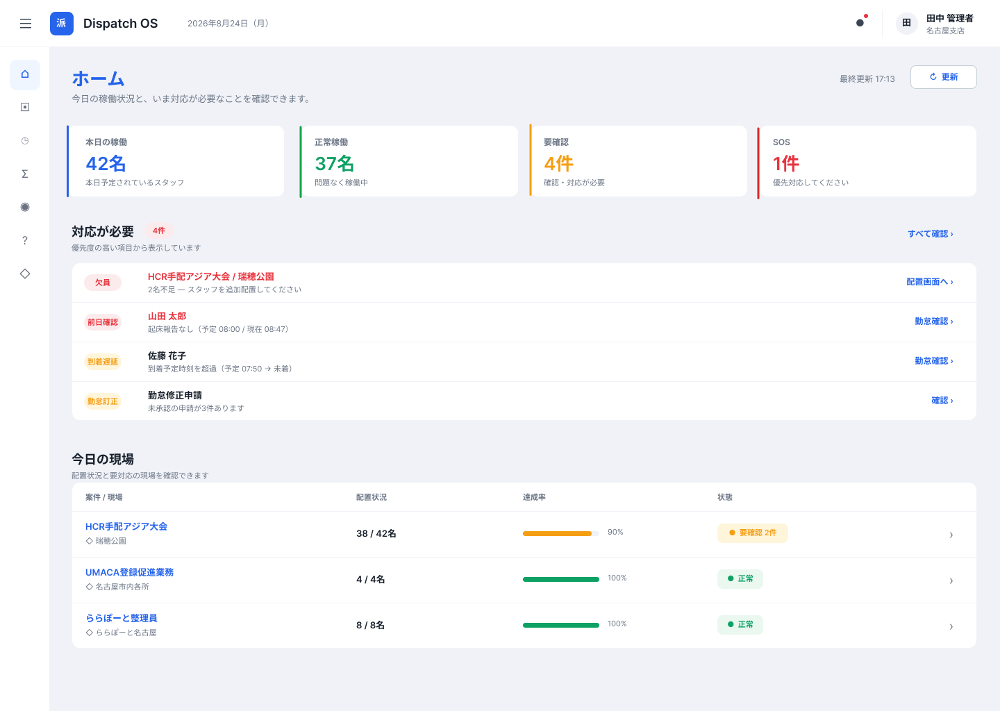

#### Structural observations

- Both use a left Admin navigation, top header, and bounded main content region.
- The representative Figma frame uses a collapsed sidebar; the implementation baseline uses an expanded sidebar.
- Figma also defines expanded variants and shared Sidebar/Header component sets; screen-level shell variants are not uniform.
- Review sidebar, header, content container, hierarchy, and expanded/collapsed behavior here; later Admin sections state “Uses shared Admin shell.”

#### Human Review

Status: NOT REVIEWED  
Decision: -  
Priority: -  
Notes: -

### SHELL-WORKER — Shared Worker Shell

Review Order: 2

#### Implementation

Representative screenshot:

#### Figma

Page: `04 Worker`  
Primary node: `225:2`  
Frame: `[Page] Workerホーム｜Mobile`  
Dimensions: `390×844`

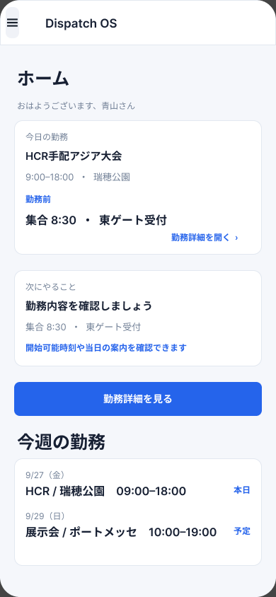

#### Structural observations

- Both are mobile-first and reserve a compact top region for identity/navigation.
- Implementation keeps Announcement entry and Notification Bell as distinct responsibilities.
- Figma also provides Mobile Full-screen Navigation and desktop Worker adaptations.
- Review header, navigation, Announcement entry, Notification Bell, mobile composition, and desktop adaptation here.

#### Human Review

Status: NOT REVIEWED  
Decision: -  
Priority: -  
Notes: -

## 2. Projects

### SCR-A-002/default — 案件一覧

#### Implementation

Route: `/admin/projects`  
State: default  
Viewport: `1440×900`  

#### Figma

Primary reference:  
Page: `03 Admin`  
Node: `469:2`  
Frame: `[Page] 案件一覧｜Desktop / Sidebar=Expanded / Final`  
Dimensions: `1440×1024`  

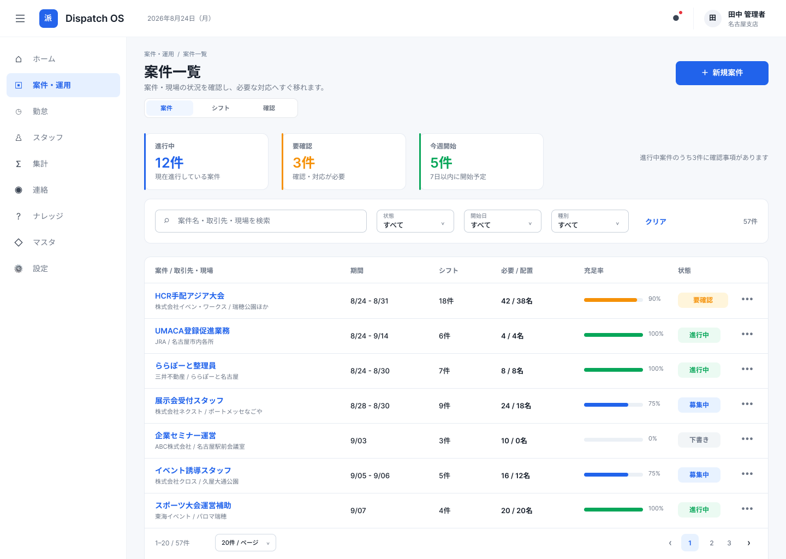

Mapping: Strong  
Confidence: High

#### Structural observations

- Implementation: Both organize Projects as a filterable collection; the empty target combines the same list shell with a separate generic empty-state reference.
- Figma: Refer to the named frame and image above; content fixtures are illustrative and are not compared as production data.
- Uses shared Admin shell.

#### Known intentional deviations

- none recorded for this review item.

#### Human Review

Status: NOT REVIEWED  
Decision: -  
Priority: -  
Notes: -

### SCR-A-002/empty-filtered — 案件一覧

#### Implementation

Route: `/admin/projects`  
State: empty/filtered  
Viewport: `1440×900`  

#### Figma

Primary reference:  
Page: `03 Admin`  
Node: `469:2`  
Frame: 案件一覧 + common Empty  
Dimensions: `1440×1024`  

Supporting reference:  
Page: `03 Admin`  
Node: `602:12`  
Frame: Supporting state reference  
Dimensions: `800×240`  

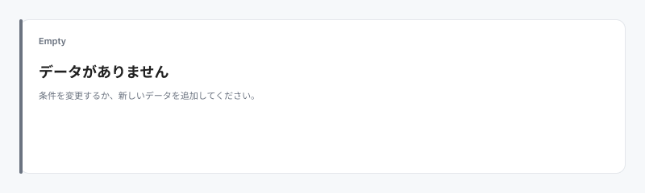

Mapping: Partial  
Confidence: Medium

Mapping limitation: The Figma reference provides only the nearest structural or domain concept; it is not the same complete production state.

#### Structural observations

- Implementation: Both organize Projects as a filterable collection; the empty target combines the same list shell with a separate generic empty-state reference.
- Figma: Refer to the named frame and image above; content fixtures are illustrative and are not compared as production data.
- Uses shared Admin shell.

#### Known intentional deviations

- none recorded for this review item.

#### Human Review

Status: NOT REVIEWED  
Decision: -  
Priority: -  
Notes: -

### SCR-A-003/default — 新規案件作成

#### Implementation

Route: `/admin/projects/new`  
State: default  
Viewport: `1440×900`  

#### Figma

Primary reference:  
Page: `03 Admin`  
Node: `489:310`  
Frame: `[Editor] 案件｜Mode=Create`  
Dimensions: `1440×1024`  

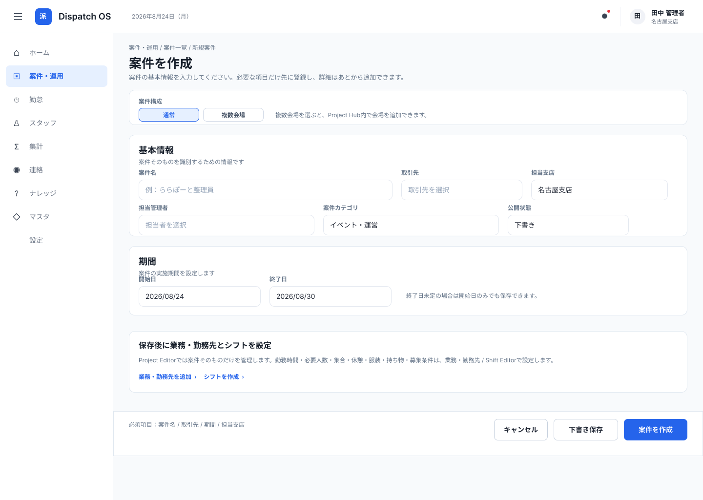

Mapping: Strong  
Confidence: High

#### Structural observations

- Implementation: Both place Project authoring in the Admin shell with grouped fields and a primary save action.
- Figma: Refer to the named frame and image above; content fixtures are illustrative and are not compared as production data.
- Uses shared Admin shell.

#### Known intentional deviations

- none recorded for this review item.

#### Human Review

Status: NOT REVIEWED  
Decision: -  
Priority: -  
Notes: -

### SCR-A-004/populated-hub — 案件詳細 / Management Hub

#### Implementation

Route: `/admin/projects/[projectId]`  
State: populated hub  
Viewport: `1440×900`  

#### Figma

Primary reference:  
Page: `03 Admin`  
Node: `383:3183`  
Frame: `[Hub] 案件詳細｜通常案件`  
Dimensions: `1440×1120`  

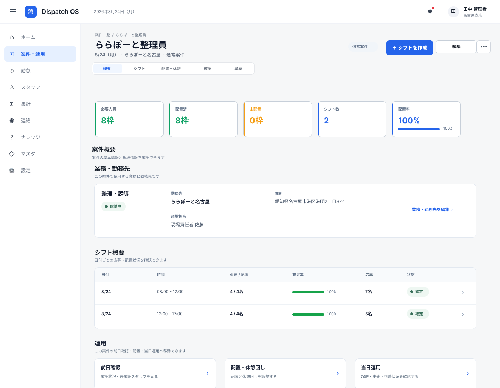

Mapping: Strong  
Confidence: High

#### Structural observations

- Implementation: The populated state is a management hub; the edit target compares an in-context implementation drawer with a broader Figma editor composition.
- Figma: Refer to the named frame and image above; content fixtures are illustrative and are not compared as production data.
- Uses shared Admin shell.

#### Known intentional deviations

- none recorded for this review item.

#### Human Review

Status: NOT REVIEWED  
Decision: -  
Priority: -  
Notes: -

### SCR-A-004/edit-drawer — 案件詳細 / Management Hub

#### Implementation

Route: `/admin/projects/[projectId]`  
State: edit drawer  
Viewport: `1440×900`  

#### Figma

Primary reference:  
Page: `03 Admin`  
Node: `492:6`  
Frame: `[Editor] 案件｜Mode=Edit`  
Dimensions: `1440×1024`  

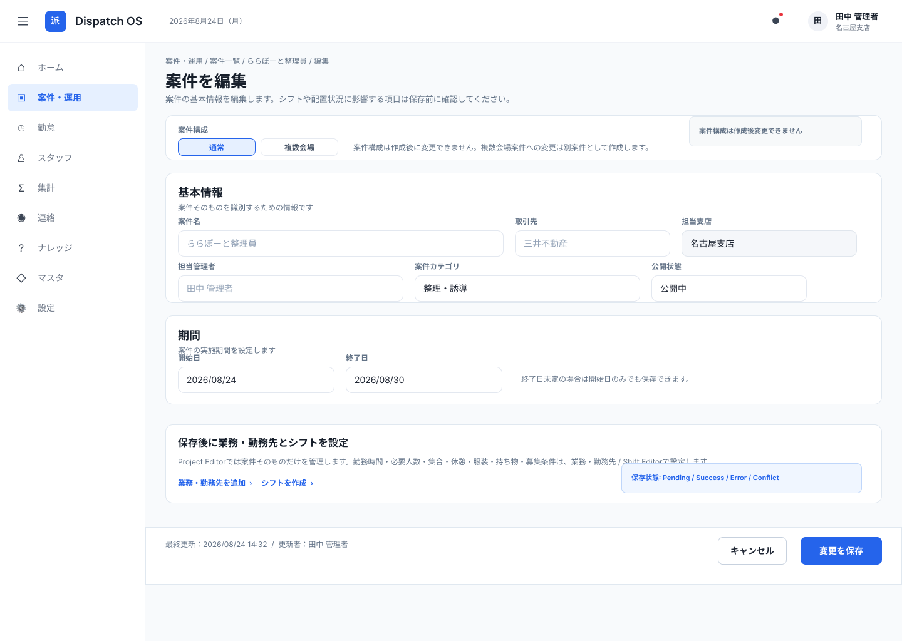

Mapping: Partial  
Confidence: Medium

Mapping limitation: The Figma reference provides only the nearest structural or domain concept; it is not the same complete production state.

#### Structural observations

- Implementation: The populated state is a management hub; the edit target compares an in-context implementation drawer with a broader Figma editor composition.
- Figma: Refer to the named frame and image above; content fixtures are illustrative and are not compared as production data.
- Uses shared Admin shell.

#### Known intentional deviations

- none recorded for this review item.

#### Human Review

Status: NOT REVIEWED  
Decision: -  
Priority: -  
Notes: -

### SCR-A-005/default-fallback — 業務・勤務先追加

#### Implementation

Route: `/admin/projects/[projectId]/jobs/new`  
State: default fallback  
Viewport: `1440×900`  

#### Figma

Primary reference:  
Page: `03 Admin`  
Node: `599:5`  
Frame: `[Drawer] 業務・勤務先｜Mode=Create`  
Dimensions: `1440×1024`  

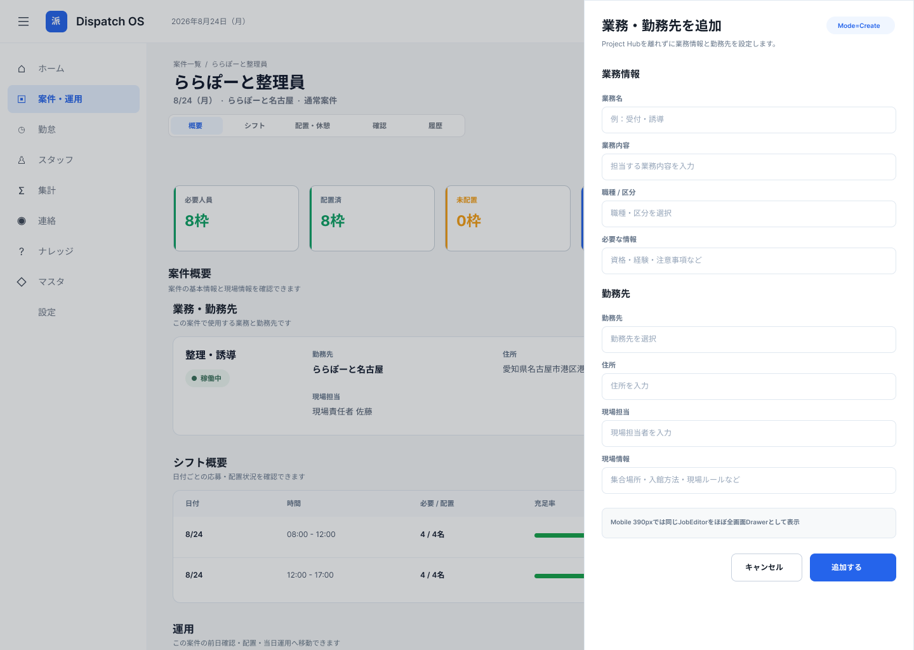

Mapping: Partial  
Confidence: High

Mapping limitation: The Figma reference provides only the nearest structural or domain concept; it is not the same complete production state.

#### Structural observations

- Implementation: Figma presents job/workplace creation as a right drawer, while the captured fallback uses the dedicated fallback route.
- Figma: Refer to the named frame and image above; content fixtures are illustrative and are not compared as production data.
- Uses shared Admin shell.

#### Known intentional deviations

- none recorded for this review item.

#### Human Review

Status: NOT REVIEWED  
Decision: -  
Priority: -  
Notes: -

## 3. Shift

### SCR-A-006/preview — シフト作成

#### Implementation

Route: `/admin/projects/[projectId]/jobs/[jobId]/shifts/new`  
State: preview  
Viewport: `1440×900`  

#### Figma

Primary reference:  
Page: `03 Admin`  
Node: `501:2821`  
Frame: `[Editor] シフト｜Mode=Create / Unified Dates`  
Dimensions: `1440×1120`  

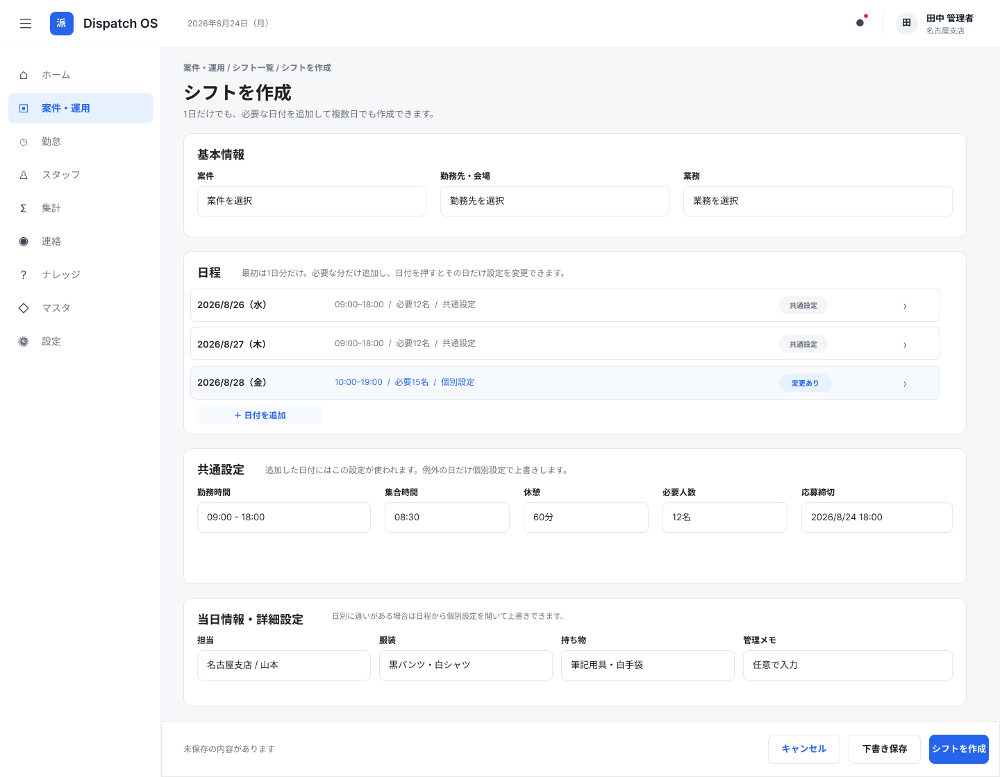

Mapping: Strong  
Confidence: High

#### Structural observations

- Implementation: Both use a unified multi-section Shift authoring surface; implementation evidence includes its preview state.
- Figma: Refer to the named frame and image above; content fixtures are illustrative and are not compared as production data.
- Uses shared Admin shell.

#### Known intentional deviations

- none recorded for this review item.

#### Human Review

Status: NOT REVIEWED  
Decision: -  
Priority: -  
Notes: -

### SCR-A-008/list — シフト一覧

#### Implementation

Route: `/admin/shifts`  
State: list  
Viewport: `1440×900`  

#### Figma

Primary reference:  
Page: `03 Admin`  
Node: `496:2900`  
Frame: `[Page] シフト一覧｜Desktop / View=List`  
Dimensions: `1440×1024`  

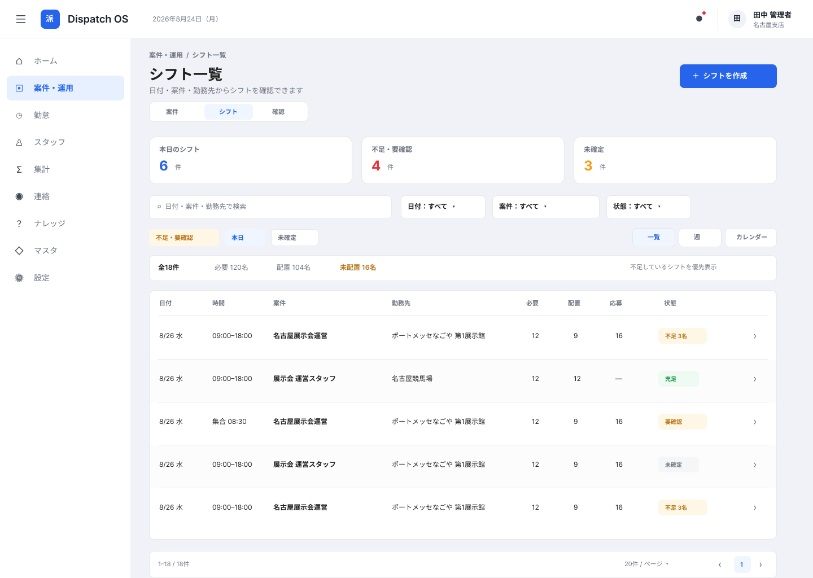

Mapping: Strong  
Confidence: High

#### Structural observations

- Implementation: List and calendar are separate view states within the same Shift collection workflow.
- Figma: Refer to the named frame and image above; content fixtures are illustrative and are not compared as production data.
- Uses shared Admin shell.

#### Known intentional deviations

- none recorded for this review item.

#### Human Review

Status: NOT REVIEWED  
Decision: -  
Priority: -  
Notes: -

### SCR-A-008/calendar — シフト一覧

#### Implementation

Route: `/admin/shifts?view=calendar`  
State: calendar  
Viewport: `1440×900`  

#### Figma

Primary reference:  
Page: `03 Admin`  
Node: `505:512`  
Frame: `[State] シフト一覧｜Desktop / View=Calendar`  
Dimensions: `1440×1024`  

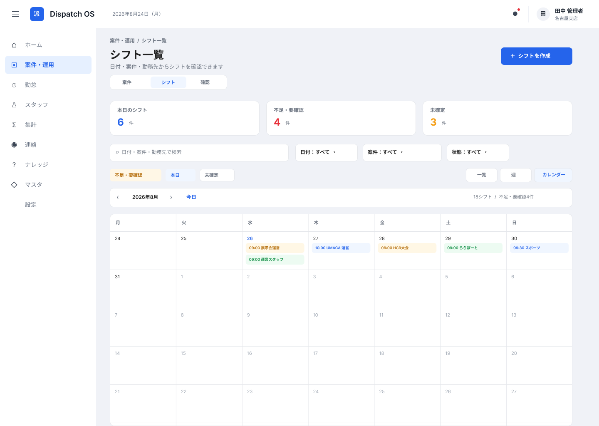

Mapping: Strong  
Confidence: High

#### Structural observations

- Implementation: List and calendar are separate view states within the same Shift collection workflow.
- Figma: Refer to the named frame and image above; content fixtures are illustrative and are not compared as production data.
- Uses shared Admin shell.

#### Known intentional deviations

- none recorded for this review item.

#### Human Review

Status: NOT REVIEWED  
Decision: -  
Priority: -  
Notes: -

### SCR-A-009/staffing-detail — シフト詳細

#### Implementation

Route: `/admin/shifts/[shiftId]`  
State: staffing detail  
Viewport: `1440×900`  

#### Figma

Primary reference:  
Page: `03 Admin`  
Node: `496:3034`  
Frame: `[Hub] シフト詳細｜Desktop`  
Dimensions: `1440×1024`  

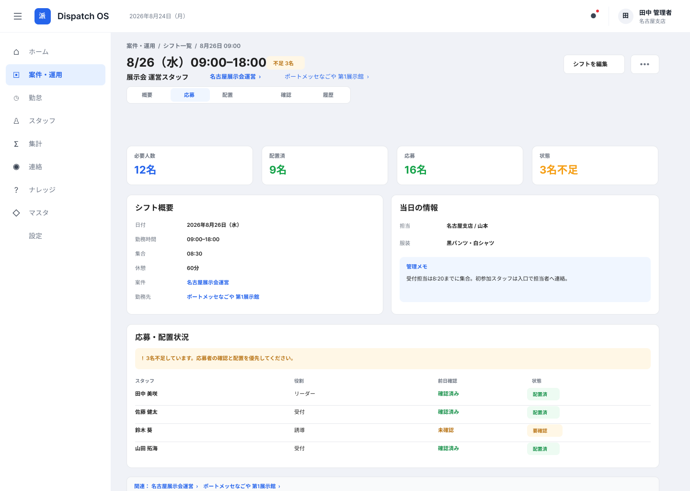

Mapping: Strong  
Confidence: High

#### Structural observations

- Implementation: The detail is a staffing hub; edit compares the implementation drawer with Figma’s unified full editor.
- Figma: Refer to the named frame and image above; content fixtures are illustrative and are not compared as production data.
- Uses shared Admin shell.

#### Known intentional deviations

- none recorded for this review item.

#### Human Review

Status: NOT REVIEWED  
Decision: -  
Priority: -  
Notes: -

### SCR-A-009/edit-drawer — シフト詳細

#### Implementation

Route: `/admin/shifts/[shiftId]`  
State: edit drawer  
Viewport: `1440×900`  

#### Figma

Primary reference:  
Page: `03 Admin`  
Node: `823:218`  
Frame: `[Editor] シフト｜Mode=Edit / Unified Layout v2`  
Dimensions: `1440×1120`  

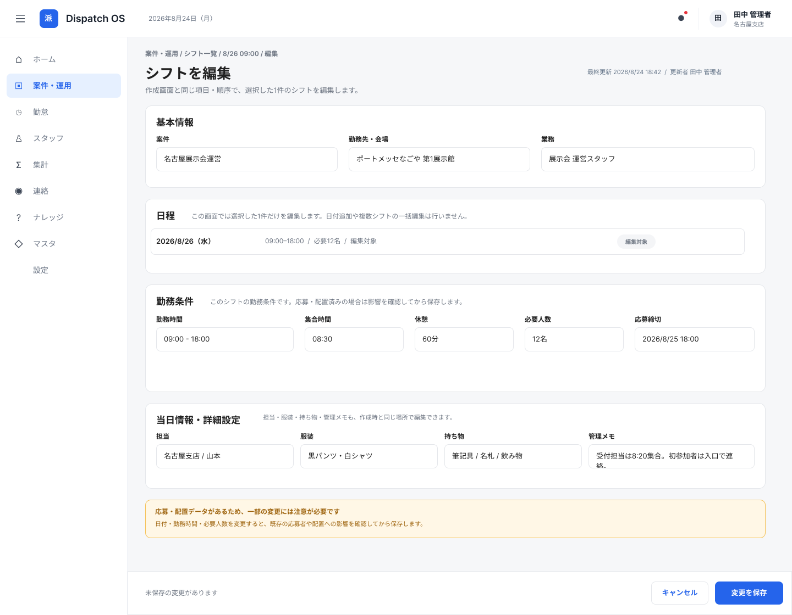

Mapping: Partial  
Confidence: Medium

Mapping limitation: The Figma reference provides only the nearest structural or domain concept; it is not the same complete production state.

#### Structural observations

- Implementation: The detail is a staffing hub; edit compares the implementation drawer with Figma’s unified full editor.
- Figma: Refer to the named frame and image above; content fixtures are illustrative and are not compared as production data.
- Uses shared Admin shell.

#### Known intentional deviations

- none recorded for this review item.

#### Human Review

Status: NOT REVIEWED  
Decision: -  
Priority: -  
Notes: -

## 4. Placement

### SCR-A-010/board — 配置・休憩回し

#### Implementation

Route: `/admin/placement`  
State: board  
Viewport: `1440×900`  

#### Figma

Primary reference:  
Page: `03 Admin`  
Node: `515:2`  
Frame: `[Page] 配置・休憩回し｜Desktop / Unified / Final v2`  
Dimensions: `1440×1024`  

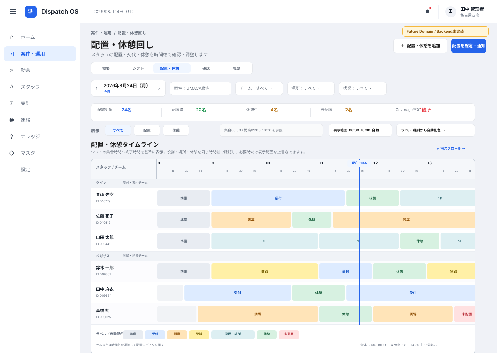

Mapping: Strong  
Confidence: High

#### Structural observations

- Implementation: Both use a timeline-oriented placement board and a right-side editor; conflict treatment is represented separately by a generic Figma state.
- Figma: Refer to the named frame and image above; content fixtures are illustrative and are not compared as production data.
- Uses shared Admin shell.

#### Known intentional deviations

- none recorded for this review item.

#### Human Review

Status: NOT REVIEWED  
Decision: -  
Priority: -  
Notes: -

### SCR-A-010/editor-open — 配置・休憩回し

#### Implementation

Route: `/admin/placement?shift=[shiftId]`  
State: editor open  
Viewport: `1440×900`  

#### Figma

Primary reference:  
Page: `03 Admin`  
Node: `515:431`  
Frame: `[State] 配置・休憩回し｜Drawer=Edit`  
Dimensions: `1440×1024`  

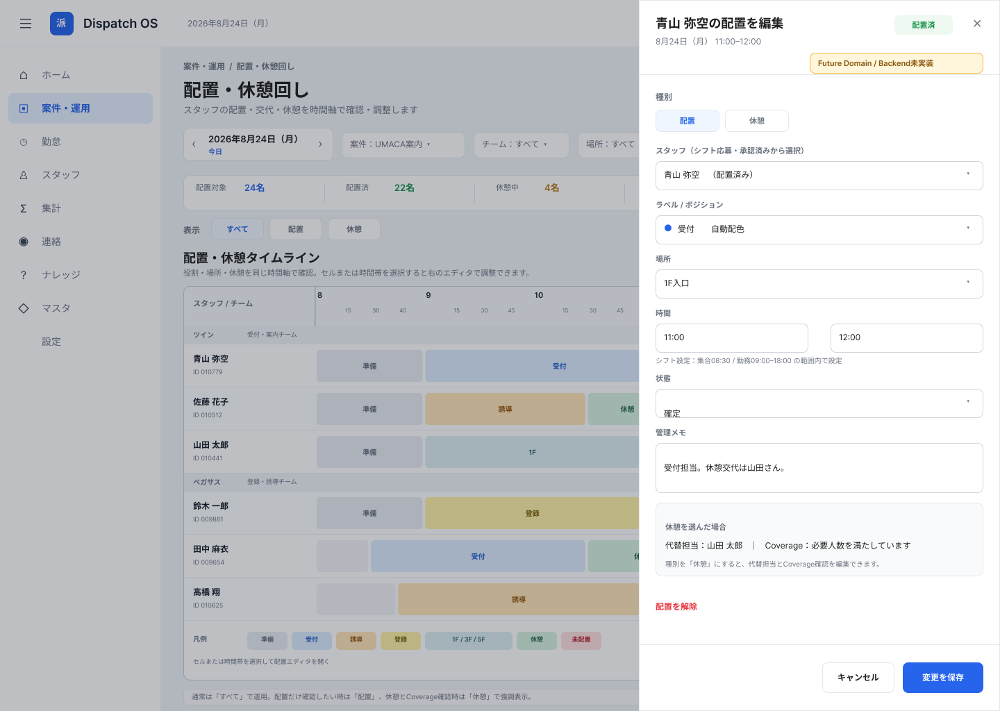

Mapping: Strong  
Confidence: High

#### Structural observations

- Implementation: Both use a timeline-oriented placement board and a right-side editor; conflict treatment is represented separately by a generic Figma state.
- Figma: Refer to the named frame and image above; content fixtures are illustrative and are not compared as production data.
- Uses shared Admin shell.

#### Known intentional deviations

- none recorded for this review item.

#### Human Review

Status: NOT REVIEWED  
Decision: -  
Priority: -  
Notes: -

### SCR-A-010/conflict-error — 配置・休憩回し

#### Implementation

Route: `/admin/placement?shift=[shiftId]`  
State: conflict/error  
Viewport: `1440×900`  

Implementation image: **NOT AVAILABLE — PENDING EVIDENCE**

#### Figma

Primary reference:  
Page: `03 Admin`  
Node: `515:431`  
Frame: Placement editor + common Conflict  
Dimensions: `1440×1024`  

Supporting reference:  
Page: `03 Admin`  
Node: `602:48`  
Frame: Supporting state reference  
Dimensions: `800×240`  

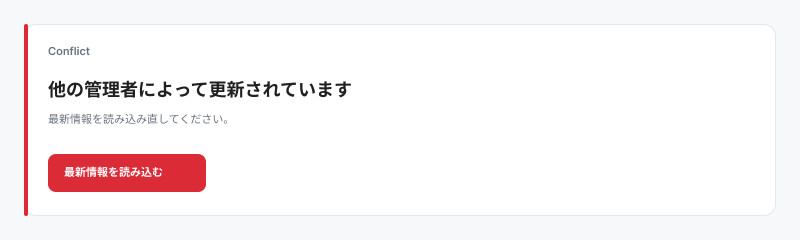

Mapping: Partial  
Confidence: Medium

Mapping limitation: The Figma reference provides only the nearest structural or domain concept; it is not the same complete production state.

#### Structural observations

- Implementation: Both use a timeline-oriented placement board and a right-side editor; conflict treatment is represented separately by a generic Figma state.
- Figma: Refer to the named frame and image above; content fixtures are illustrative and are not compared as production data.
- Uses shared Admin shell.

#### Known intentional deviations

- none recorded for this review item.

#### Human Review

Status: PENDING EVIDENCE  
Decision: -  
Priority: -  
Notes: -

## 5. Pre-shift / Day-of / Attendance

### SCR-A-011/mixed-statuses — 前日確認

#### Implementation

Route: `/admin/pre-shift`  
State: mixed statuses  
Viewport: `1440×900`  

#### Figma

Primary reference:  
Page: `03 Admin`  
Node: `523:2`  
Frame: `[Page] 前日確認｜Desktop`  
Dimensions: `1440×1024`  

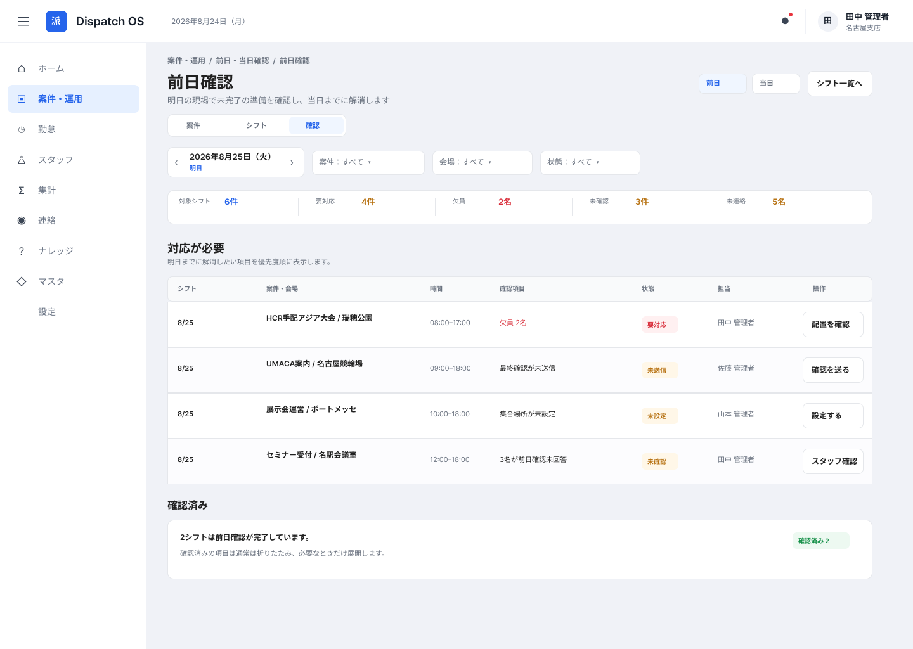

Mapping: Strong  
Confidence: High

#### Structural observations

- Implementation: Both present a status matrix and use a right-side staff detail surface.
- Figma: Refer to the named frame and image above; content fixtures are illustrative and are not compared as production data.
- Uses shared Admin shell.

#### Known intentional deviations

- none recorded for this review item.

#### Human Review

Status: NOT REVIEWED  
Decision: -  
Priority: -  
Notes: -

### SCR-A-011/drawer-open — 前日確認

#### Implementation

Route: `/admin/pre-shift?assignment=[assignmentId]`  
State: drawer open  
Viewport: `1440×900`  

#### Figma

Primary reference:  
Page: `03 Admin`  
Node: `525:2`  
Frame: `[Drawer] 前日確認｜スタッフ詳細`  
Dimensions: `1440×1024`  

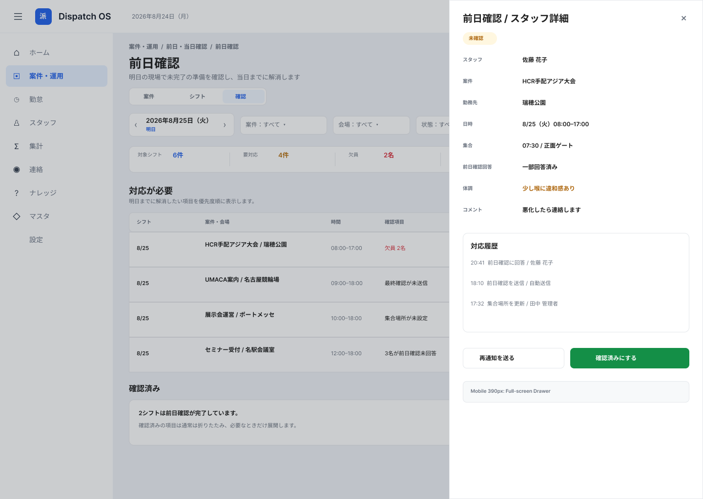

Mapping: Strong  
Confidence: High

#### Structural observations

- Implementation: Both present a status matrix and use a right-side staff detail surface.
- Figma: Refer to the named frame and image above; content fixtures are illustrative and are not compared as production data.
- Uses shared Admin shell.

#### Known intentional deviations

- none recorded for this review item.

#### Human Review

Status: NOT REVIEWED  
Decision: -  
Priority: -  
Notes: -

### SCR-A-012/mixed-operations — 当日運用

#### Implementation

Route: `/admin/day-of`  
State: mixed operations  
Viewport: `1440×900`  

#### Figma

Primary reference:  
Page: `03 Admin`  
Node: `523:257`  
Frame: `[Page] 当日確認｜Desktop`  
Dimensions: `1440×1024`  

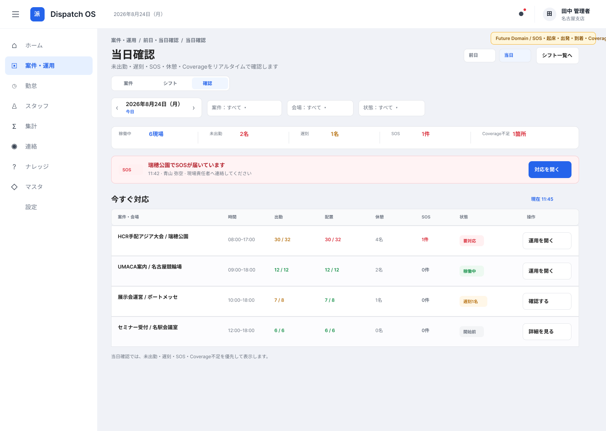

Mapping: Strong  
Confidence: High

#### Structural observations

- Implementation: Both present same-day operational status; the implementation drawer additionally carries the current Incident context.
- Figma: Refer to the named frame and image above; content fixtures are illustrative and are not compared as production data.
- Uses shared Admin shell.

#### Known intentional deviations

- none recorded for this review item.

#### Human Review

Status: NOT REVIEWED  
Decision: -  
Priority: -  
Notes: -

### SCR-A-012/drawer-incident — 当日運用

#### Implementation

Route: `/admin/day-of?assignment=[assignmentId]`  
State: drawer/Incident  
Viewport: `1440×900`  

#### Figma

Primary reference:  
Page: `03 Admin`  
Node: `525:229`  
Frame: `[Drawer] 当日確認｜スタッフ詳細`  
Dimensions: `1440×1024`  

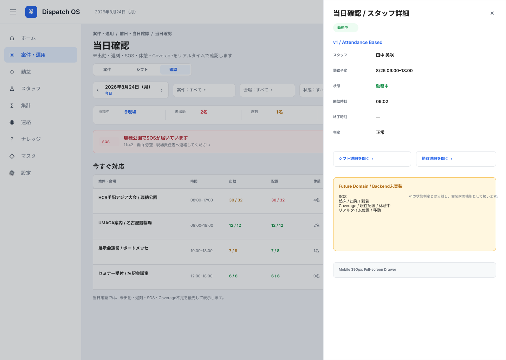

Mapping: Partial  
Confidence: Medium

Mapping limitation: The Figma reference provides only the nearest structural or domain concept; it is not the same complete production state.

#### Structural observations

- Implementation: Both present same-day operational status; the implementation drawer additionally carries the current Incident context.
- Figma: Refer to the named frame and image above; content fixtures are illustrative and are not compared as production data.
- Uses shared Admin shell.

#### Known intentional deviations

- none recorded for this review item.

#### Human Review

Status: NOT REVIEWED  
Decision: -  
Priority: -  
Notes: -

### SCR-A-013/mixed-states — 勤怠一覧

#### Implementation

Route: `/admin/attendance`  
State: mixed states  
Viewport: `1440×900`  

#### Figma

Primary reference:  
Page: `03 Admin`  
Node: `530:2122`  
Frame: `[Page] 勤怠一覧｜Desktop / Sidebar=Expanded / Final`  
Dimensions: `1440×1024`  

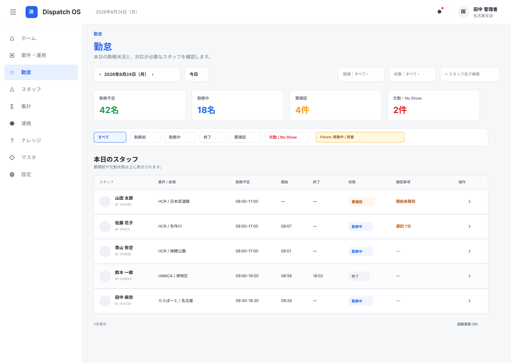

Mapping: Strong  
Confidence: High

#### Structural observations

- Implementation: Both are dense, filterable attendance lists with state summaries.
- Figma: Refer to the named frame and image above; content fixtures are illustrative and are not compared as production data.
- Uses shared Admin shell.

#### Known intentional deviations

- none recorded for this review item.

#### Human Review

Status: NOT REVIEWED  
Decision: -  
Priority: -  
Notes: -

### SCR-A-014/confirmed-history — 勤怠詳細・確定・訂正

#### Implementation

Route: `/admin/attendance/[assignmentId]`  
State: confirmed + history  
Viewport: `1440×900`  

#### Figma

Primary reference:  
Page: `03 Admin`  
Node: `533:2044`  
Frame: confirmed / revised attendance states  
Dimensions: `1440×1024`  

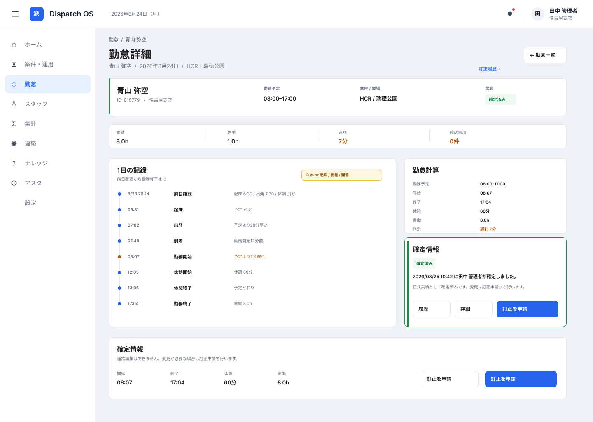

Supporting reference:  
Page: `03 Admin`  
Node: `533:2197`  
Frame: Supporting state reference  
Dimensions: `1440×1024`  

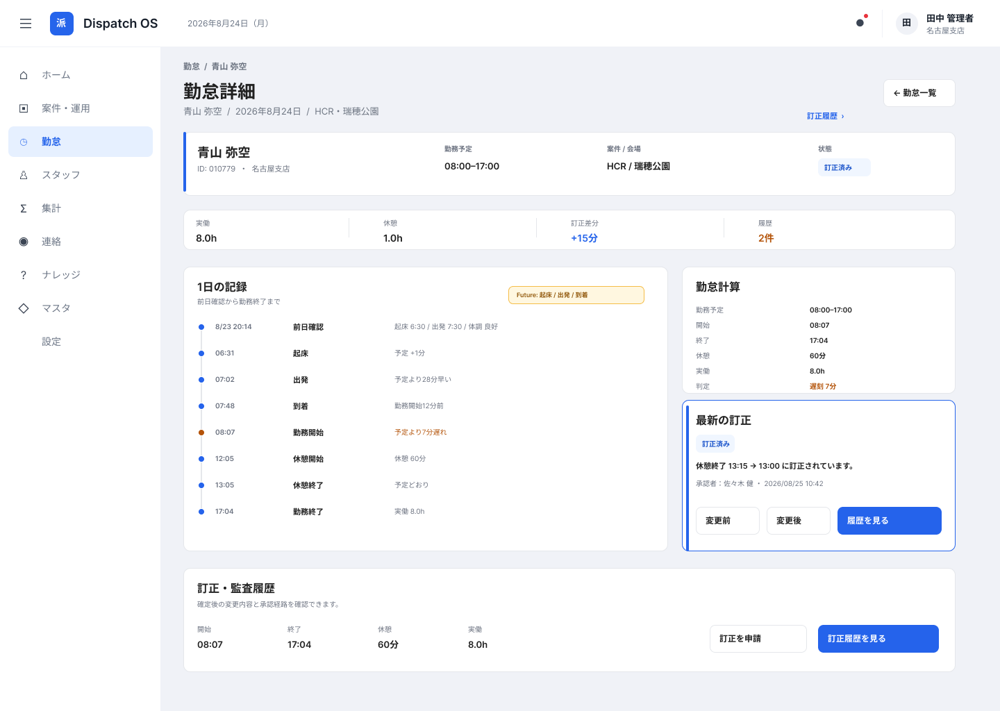

Mapping: Strong  
Confidence: High

#### Structural observations

- Implementation: Figma has confirmed and revised result frames; the implementation revision-dialog target captures the transition UI rather than only the result.
- Figma: Refer to the named frame and image above; content fixtures are illustrative and are not compared as production data.
- Uses shared Admin shell.

#### Known intentional deviations

- none recorded for this review item.

#### Human Review

Status: NOT REVIEWED  
Decision: -  
Priority: -  
Notes: -

### SCR-A-014/revision-dialog — 勤怠詳細・確定・訂正

#### Implementation

Route: `/admin/attendance/[assignmentId]`  
State: revision dialog  
Viewport: `1440×900`  

#### Figma

Primary reference:  
Page: `03 Admin`  
Node: `533:2197`  
Frame: `[State] 勤怠詳細｜訂正済み`  
Dimensions: `1440×1024`  

Mapping: Partial  
Confidence: Low

Mapping limitation: The Figma reference provides only the nearest structural or domain concept; it is not the same complete production state.

#### Structural observations

- Implementation: Figma has confirmed and revised result frames; the implementation revision-dialog target captures the transition UI rather than only the result.
- Figma: Refer to the named frame and image above; content fixtures are illustrative and are not compared as production data.
- Uses shared Admin shell.

#### Known intentional deviations

- none recorded for this review item.

#### Human Review

Status: NOT REVIEWED  
Decision: -  
Priority: -  
Notes: -

## 6. Worker Management

### SCR-A-015/default — スタッフ一覧

#### Implementation

Route: `/admin/workers`  
State: default  
Viewport: `1440×900`  

#### Figma

Primary reference:  
Page: `03 Admin`  
Node: `544:2`  
Frame: `[Page] スタッフ一覧｜Desktop / Final`  
Dimensions: `1440×1024`  

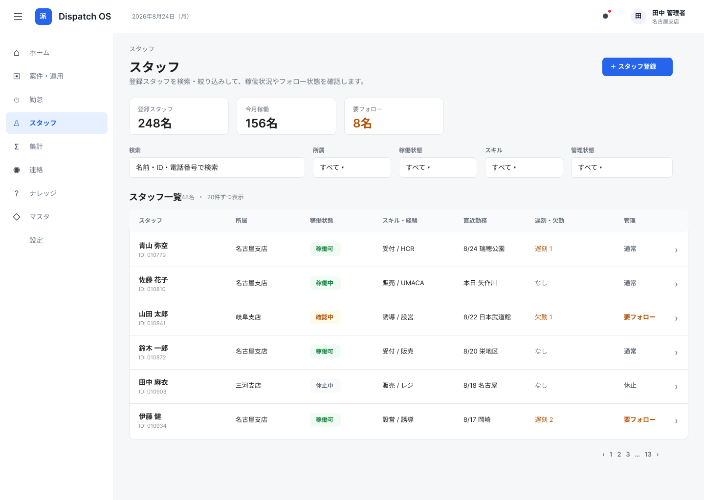

Mapping: Strong  
Confidence: High

#### Structural observations

- Implementation: Both use a searchable Worker collection inside the Admin shell.
- Figma: Refer to the named frame and image above; content fixtures are illustrative and are not compared as production data.
- Uses shared Admin shell.

#### Known intentional deviations

- none recorded for this review item.

#### Human Review

Status: NOT REVIEWED  
Decision: -  
Priority: -  
Notes: -

### SCR-A-016/overview — スタッフ詳細

#### Implementation

Route: `/admin/workers/[workerId]`  
State: overview  
Viewport: `1440×900`  

#### Figma

Primary reference:  
Page: `03 Admin`  
Node: `544:271`  
Frame: `[Hub] スタッフ詳細｜概要`  
Dimensions: `1440×1024`  

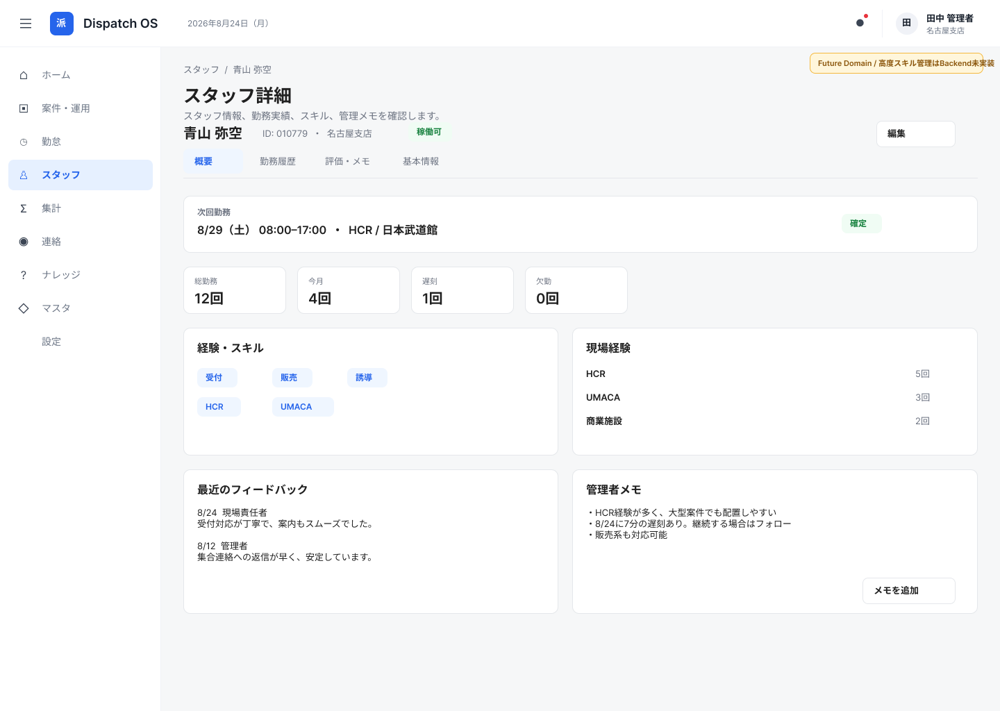

Mapping: Strong  
Confidence: High

#### Structural observations

- Implementation: Both use a Worker detail hub with an overview and a dedicated history tab.
- Figma: Refer to the named frame and image above; content fixtures are illustrative and are not compared as production data.
- Uses shared Admin shell.

#### Known intentional deviations

- none recorded for this review item.

#### Human Review

Status: NOT REVIEWED  
Decision: -  
Priority: -  
Notes: -

### SCR-A-016/history — スタッフ詳細

#### Implementation

Route: `/admin/workers/[workerId]?tab=history`  
State: history  
Viewport: `1440×900`  

#### Figma

Primary reference:  
Page: `03 Admin`  
Node: `546:2`  
Frame: `[Tab] スタッフ詳細｜勤務履歴`  
Dimensions: `1440×1024`  

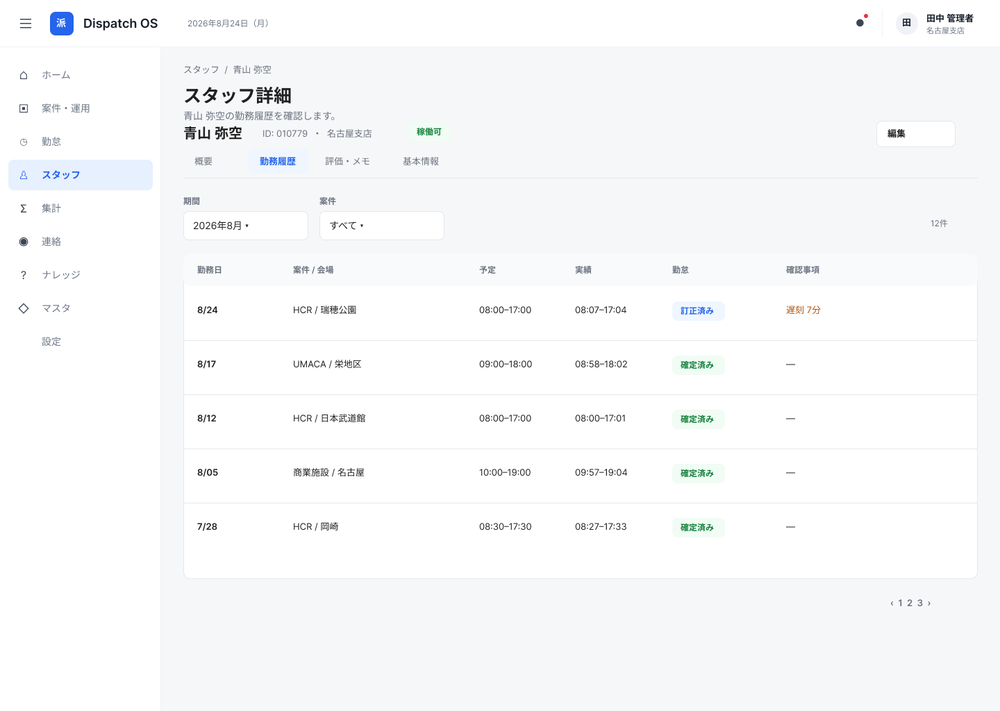

Mapping: Strong  
Confidence: High

#### Structural observations

- Implementation: Both use a Worker detail hub with an overview and a dedicated history tab.
- Figma: Refer to the named frame and image above; content fixtures are illustrative and are not compared as production data.
- Uses shared Admin shell.

#### Known intentional deviations

- none recorded for this review item.

#### Human Review

Status: NOT REVIEWED  
Decision: -  
Priority: -  
Notes: -

## 7. Incident

### SCR-A-017/unresolved-list — ヘルプリクエスト一覧・対応

#### Implementation

Route: `/admin/incidents`  
State: unresolved list  
Viewport: `1440×900`  

#### Figma

Primary reference:  
Page: `03 Admin`  
Node: `109:2`  
Frame: `[Page] 連絡｜受信トレイ / Final`  
Dimensions: `1440×1024`  

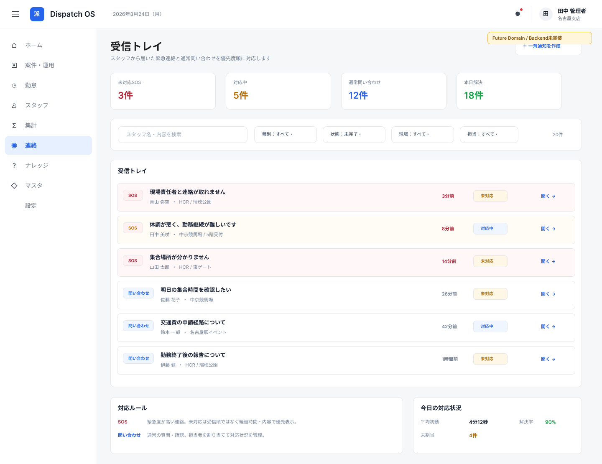

Mapping: Partial  
Confidence: Medium

Mapping limitation: The Figma reference provides only the nearest structural or domain concept; it is not the same complete production state.

#### Structural observations

- Implementation: Figma uses a broad communication inbox/detail model; implementation uses the narrower Incident list and drawer.
- Figma: Refer to the named frame and image above; content fixtures are illustrative and are not compared as production data.
- Uses shared Admin shell.

#### Known intentional deviations

- none recorded for this review item.

#### Human Review

Status: NOT REVIEWED  
Decision: -  
Priority: -  
Notes: -

### SCR-A-017/drawer-open — ヘルプリクエスト一覧・対応

#### Implementation

Route: `/admin/incidents?incident=[incidentId]`  
State: drawer open  
Viewport: `1440×900`  

#### Figma

Primary reference:  
Page: `03 Admin`  
Node: `110:2`  
Frame: `[Page] 連絡｜詳細 / Final`  
Dimensions: `1440×1024`  

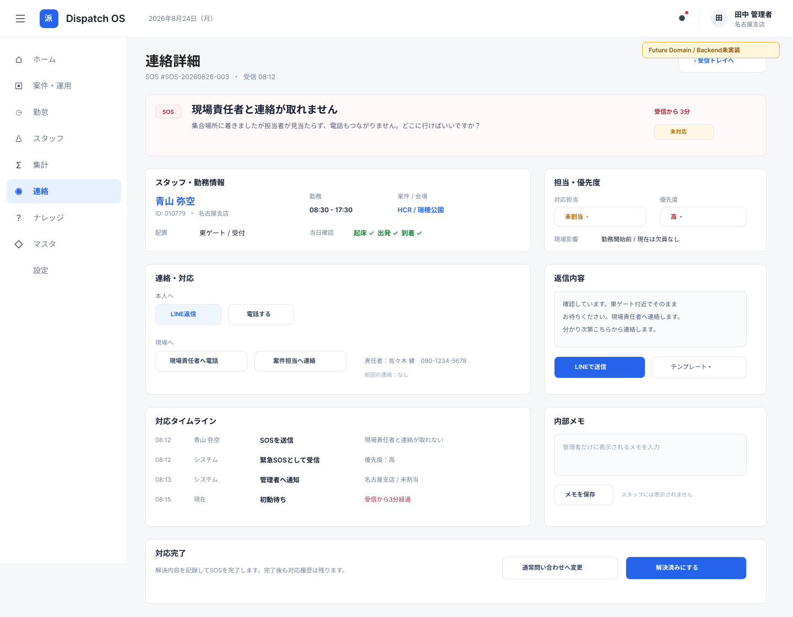

Mapping: Partial  
Confidence: Medium

Mapping limitation: The Figma reference provides only the nearest structural or domain concept; it is not the same complete production state.

#### Structural observations

- Implementation: Figma uses a broad communication inbox/detail model; implementation uses the narrower Incident list and drawer.
- Figma: Refer to the named frame and image above; content fixtures are illustrative and are not compared as production data.
- Uses shared Admin shell.

#### Known intentional deviations

- none recorded for this review item.

#### Human Review

Status: NOT REVIEWED  
Decision: -  
Priority: -  
Notes: -

## 8. Announcement / Notification

### SCR-A-018/mixed-lifecycle — お知らせ一覧

#### Implementation

Route: `/admin/announcements`  
State: mixed lifecycle  
Viewport: `1440×900`  

#### Figma

Primary reference:  
Page: `03 Admin`  
Node: `119:2`  
Frame: `[Page] 連絡｜お知らせ一覧 / Final`  
Dimensions: `1440×1154`  

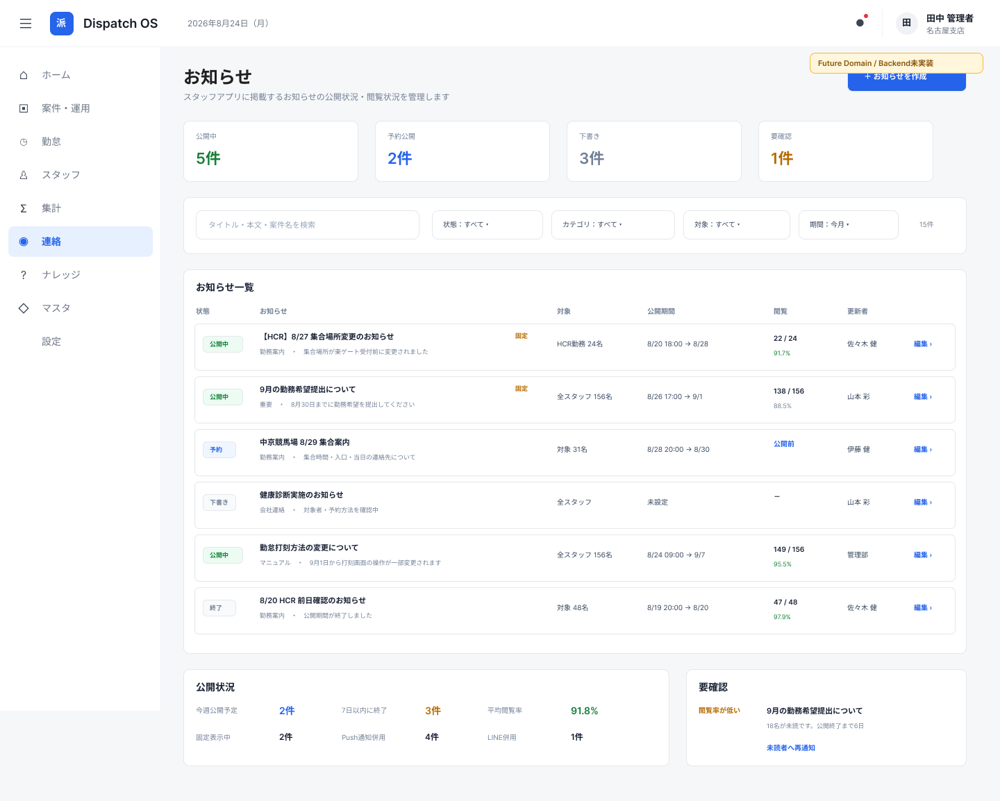

Mapping: Partial  
Confidence: High

Mapping limitation: The Figma reference provides only the nearest structural or domain concept; it is not the same complete production state.

#### Structural observations

- Implementation: Both expose an Admin Announcement collection; implementation organizes the frozen draft/published/archived lifecycle explicitly.
- Figma: Refer to the named frame and image above; content fixtures are illustrative and are not compared as production data.
- Uses shared Admin shell.

#### Known intentional deviations

- Published editing, scheduled publish, expiration, mandatory read, read/view analytics, Push, LINE, sender ownership, category, pin, and broad targeting are outside or narrowed by the frozen production contract.
- Notification is recipient attention; Announcement is canonical content. Absence of a mixed Figma Notification Inbox is not classified here as a visual defect.

#### Human Review

Status: NOT REVIEWED  
Decision: -  
Priority: -  
Notes: -

### SCR-A-018/empty — お知らせ一覧

#### Implementation

Route: `/admin/announcements`  
State: empty  
Viewport: `1440×900`  

#### Figma

Primary reference:  
Page: `03 Admin`  
Node: `119:2`  
Frame: Announcement list + common Empty  
Dimensions: `1440×1154`  

Supporting reference:  
Page: `03 Admin`  
Node: `602:12`  
Frame: Supporting state reference  
Dimensions: `800×240`  

Mapping: Partial  
Confidence: Medium

Mapping limitation: The Figma reference provides only the nearest structural or domain concept; it is not the same complete production state.

#### Structural observations

- Implementation: Both expose an Admin Announcement collection; implementation organizes the frozen draft/published/archived lifecycle explicitly.
- Figma: Refer to the named frame and image above; content fixtures are illustrative and are not compared as production data.
- Uses shared Admin shell.

#### Known intentional deviations

- Published editing, scheduled publish, expiration, mandatory read, read/view analytics, Push, LINE, sender ownership, category, pin, and broad targeting are outside or narrowed by the frozen production contract.
- Notification is recipient attention; Announcement is canonical content. Absence of a mixed Figma Notification Inbox is not classified here as a visual defect.

#### Human Review

Status: NOT REVIEWED  
Decision: -  
Priority: -  
Notes: -

### SCR-A-019/completed-preview — お知らせ下書き作成

#### Implementation

Route: `/admin/announcements/new`  
State: completed preview  
Viewport: `1440×900`  

#### Figma

Primary reference:  
Page: `03 Admin`  
Node: `117:2`  
Frame: `[Editor] 連絡｜お知らせ / Mode=Create`  
Dimensions: `1440×1122`  

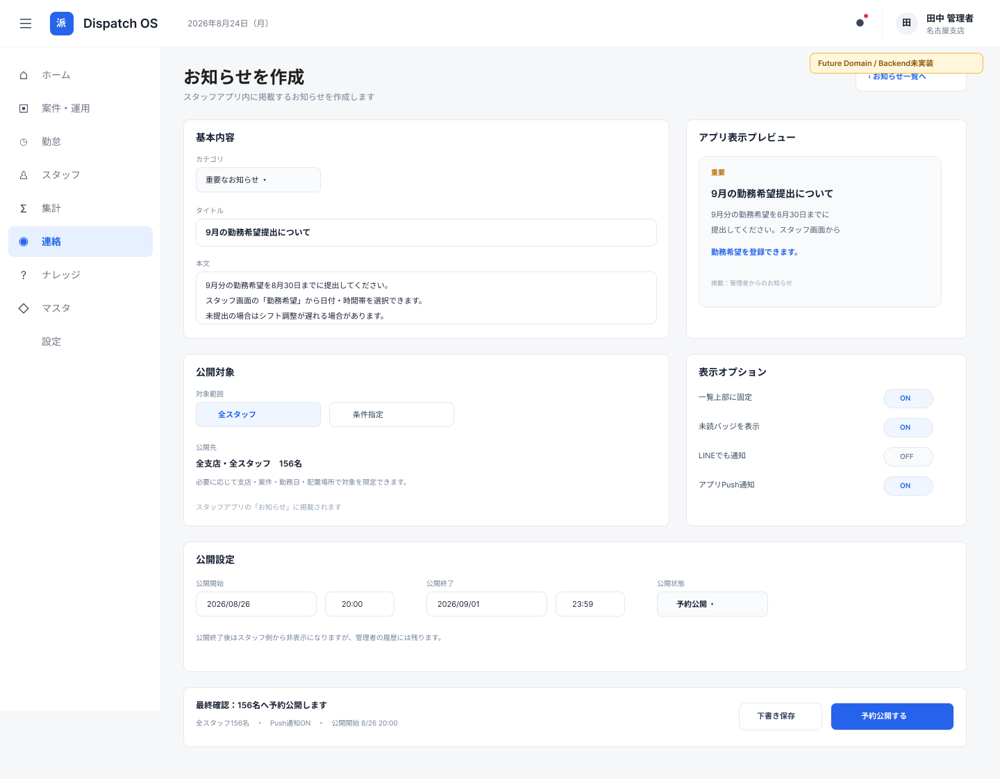

Mapping: Partial  
Confidence: High

Mapping limitation: The Figma reference provides only the nearest structural or domain concept; it is not the same complete production state.

#### Structural observations

- Implementation: Both provide title/body/importance-oriented Announcement authoring and preview; channel and scheduling concepts differ intentionally.
- Figma: Refer to the named frame and image above; content fixtures are illustrative and are not compared as production data.
- Uses shared Admin shell.

#### Known intentional deviations

- Published editing, scheduled publish, expiration, mandatory read, read/view analytics, Push, LINE, sender ownership, category, pin, and broad targeting are outside or narrowed by the frozen production contract.
- Notification is recipient attention; Announcement is canonical content. Absence of a mixed Figma Notification Inbox is not classified here as a visual defect.

#### Human Review

Status: NOT REVIEWED  
Decision: -  
Priority: -  
Notes: -

### SCR-A-020/published-read-only — お知らせ詳細・下書き編集

#### Implementation

Route: `/admin/announcements/[announcementId]`  
State: published read-only  
Viewport: `1440×900`  

#### Figma

Primary reference:  
Page: `03 Admin`  
Node: `117:233`  
Frame: `[Editor] 連絡｜お知らせ / Mode=Edit`  
Dimensions: `1440×1154`  

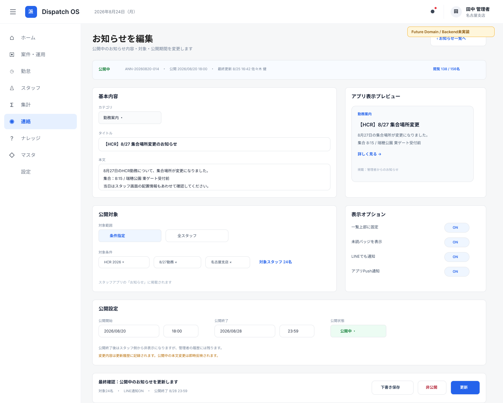

Mapping: Legacy / Obsolete Candidate  
Confidence: High

#### Structural observations

- Implementation: Figma’s edit composition is reused only as structural evidence; production separates draft edit from immutable published/archived read-only states.
- Figma: Refer to the named frame and image above; content fixtures are illustrative and are not compared as production data.
- Uses shared Admin shell.

#### Known intentional deviations

- Published editing, scheduled publish, expiration, mandatory read, read/view analytics, Push, LINE, sender ownership, category, pin, and broad targeting are outside or narrowed by the frozen production contract.
- Notification is recipient attention; Announcement is canonical content. Absence of a mixed Figma Notification Inbox is not classified here as a visual defect.

#### Human Review

Status: NOT REVIEWED  
Decision: -  
Priority: -  
Notes: -

### SCR-A-020/draft-edit — お知らせ詳細・下書き編集

#### Implementation

Route: `/admin/announcements/[announcementId]?edit=1`  
State: draft edit  
Viewport: `1440×900`  

#### Figma

Primary reference:  
Page: `03 Admin`  
Node: `117:233`  
Frame: `[Editor] 連絡｜お知らせ / Mode=Edit`  
Dimensions: `1440×1154`  

Mapping: Partial  
Confidence: Medium

Mapping limitation: The Figma reference provides only the nearest structural or domain concept; it is not the same complete production state.

#### Structural observations

- Implementation: Figma’s edit composition is reused only as structural evidence; production separates draft edit from immutable published/archived read-only states.
- Figma: Refer to the named frame and image above; content fixtures are illustrative and are not compared as production data.
- Uses shared Admin shell.

#### Known intentional deviations

- Published editing, scheduled publish, expiration, mandatory read, read/view analytics, Push, LINE, sender ownership, category, pin, and broad targeting are outside or narrowed by the frozen production contract.
- Notification is recipient attention; Announcement is canonical content. Absence of a mixed Figma Notification Inbox is not classified here as a visual defect.

#### Human Review

Status: NOT REVIEWED  
Decision: -  
Priority: -  
Notes: -

### SCR-A-020/archived-read-only — お知らせ詳細・下書き編集

#### Implementation

Route: `/admin/announcements/[announcementId]`  
State: archived read-only  
Viewport: `1440×900`  

#### Figma

Direct counterpart: **NONE**  
Reason: No matching product frame was found.
Mapping: Implementation-only  
Confidence: High

#### Structural observations

- Implementation: Figma’s edit composition is reused only as structural evidence; production separates draft edit from immutable published/archived read-only states.
- Figma: Refer to the named frame and image above; content fixtures are illustrative and are not compared as production data.
- Uses shared Admin shell.

#### Known intentional deviations

- Published editing, scheduled publish, expiration, mandatory read, read/view analytics, Push, LINE, sender ownership, category, pin, and broad targeting are outside or narrowed by the frozen production contract.
- Notification is recipient attention; Announcement is canonical content. Absence of a mixed Figma Notification Inbox is not classified here as a visual defect.

#### Human Review

Status: NOT REVIEWED  
Decision: -  
Priority: -  
Notes: -

### SCR-W-003/mixed-unread-read — 通知一覧・詳細

#### Implementation

Route: `/worker/notifications`  
State: mixed unread/read  
Viewport: `390×844`  

#### Figma

Primary reference:  
Page: `04 Worker`  
Node: `229:4`  
Frame: Support hub mobile / desktop  
Dimensions: `390×844`  

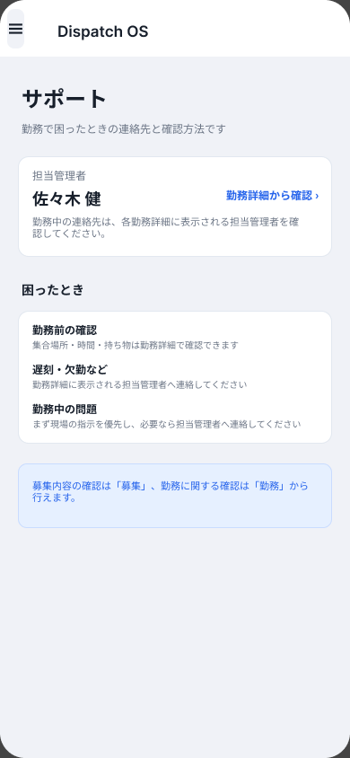

Supporting reference:  
Page: `04 Worker`  
Node: `339:193`  
Frame: Supporting state reference  
Dimensions: `1440×900`  

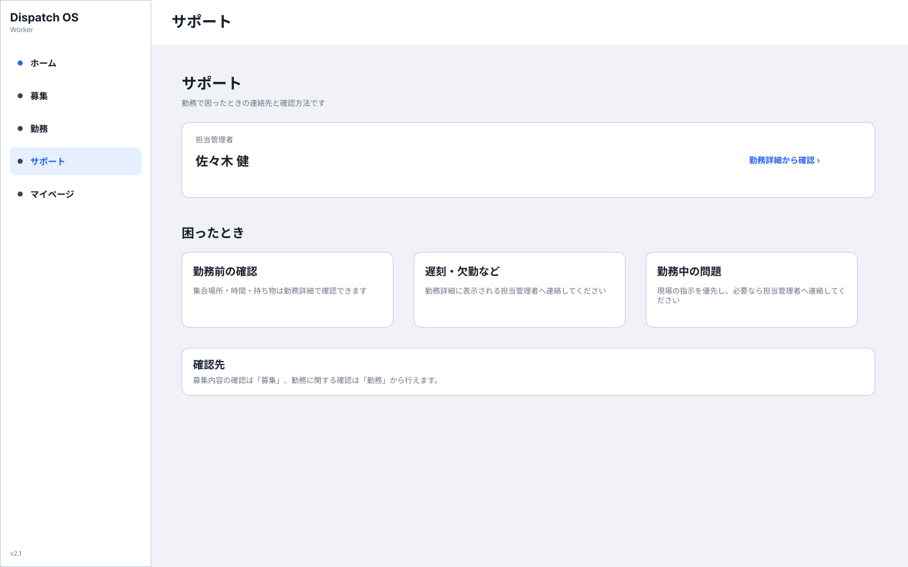

Mapping: Partial  
Confidence: Low

Mapping limitation: The Figma reference provides only the nearest structural or domain concept; it is not the same complete production state.

#### Structural observations

- Implementation: Implementation is a mixed recipient-owned attention inbox; Figma references are content/support screens rather than the same inbox.
- Figma: Refer to the named frame and image above; content fixtures are illustrative and are not compared as production data.
- Uses shared Worker shell.

#### Known intentional deviations

- Published editing, scheduled publish, expiration, mandatory read, read/view analytics, Push, LINE, sender ownership, category, pin, and broad targeting are outside or narrowed by the frozen production contract.
- Notification is recipient attention; Announcement is canonical content. Absence of a mixed Figma Notification Inbox is not classified here as a visual defect.

#### Human Review

Status: NOT REVIEWED  
Decision: -  
Priority: -  
Notes: -

### SCR-W-003/incident-detail-open — 通知一覧・詳細

#### Implementation

Route: `/worker/notifications`  
State: Incident detail open  
Viewport: `390×844`  

#### Figma

Primary reference:  
Page: `04 Worker`  
Node: `229:84`  
Frame: `[Page] SOS・問い合わせ｜Mobile`  
Dimensions: `390×844`  

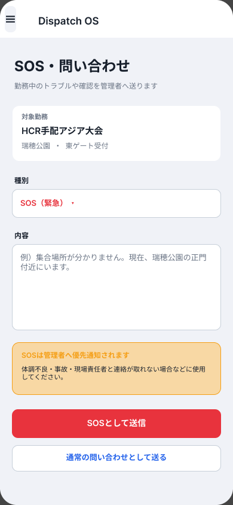

Mapping: Partial  
Confidence: Low

Mapping limitation: The Figma reference provides only the nearest structural or domain concept; it is not the same complete production state.

#### Structural observations

- Implementation: Implementation is a mixed recipient-owned attention inbox; Figma references are content/support screens rather than the same inbox.
- Figma: Refer to the named frame and image above; content fixtures are illustrative and are not compared as production data.
- Uses shared Worker shell.

#### Known intentional deviations

- Published editing, scheduled publish, expiration, mandatory read, read/view analytics, Push, LINE, sender ownership, category, pin, and broad targeting are outside or narrowed by the frozen production contract.
- Notification is recipient attention; Announcement is canonical content. Absence of a mixed Figma Notification Inbox is not classified here as a visual defect.

#### Human Review

Status: NOT REVIEWED  
Decision: -  
Priority: -  
Notes: -

### SCR-W-003/announcement-detail-open — 通知一覧・詳細

#### Implementation

Route: `/worker/notifications`  
State: Announcement detail open  
Viewport: `390×844`  

#### Figma

Primary reference:  
Page: `04 Worker`  
Node: `229:37`  
Frame: `[Page] お知らせ詳細｜Mobile`  
Dimensions: `390×844`  

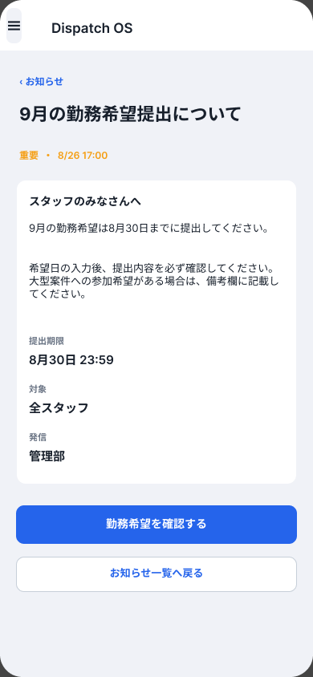

Mapping: Partial  
Confidence: Medium

Mapping limitation: The Figma reference provides only the nearest structural or domain concept; it is not the same complete production state.

#### Structural observations

- Implementation: Implementation is a mixed recipient-owned attention inbox; Figma references are content/support screens rather than the same inbox.
- Figma: Refer to the named frame and image above; content fixtures are illustrative and are not compared as production data.
- Uses shared Worker shell.

#### Known intentional deviations

- Published editing, scheduled publish, expiration, mandatory read, read/view analytics, Push, LINE, sender ownership, category, pin, and broad targeting are outside or narrowed by the frozen production contract.
- Notification is recipient attention; Announcement is canonical content. Absence of a mixed Figma Notification Inbox is not classified here as a visual defect.

#### Human Review

Status: NOT REVIEWED  
Decision: -  
Priority: -  
Notes: -

### SCR-W-003/source-unavailable — 通知一覧・詳細

#### Implementation

Route: `/worker/notifications`  
State: source unavailable  
Viewport: `390×844`  

#### Figma

Direct counterpart: **NONE**  
Reason: No matching product frame was found.
Mapping: Implementation-only  
Confidence: High

#### Structural observations

- Implementation: Implementation is a mixed recipient-owned attention inbox; Figma references are content/support screens rather than the same inbox.
- Figma: Refer to the named frame and image above; content fixtures are illustrative and are not compared as production data.
- Uses shared Worker shell.

#### Known intentional deviations

- Published editing, scheduled publish, expiration, mandatory read, read/view analytics, Push, LINE, sender ownership, category, pin, and broad targeting are outside or narrowed by the frozen production contract.
- Notification is recipient attention; Announcement is canonical content. Absence of a mixed Figma Notification Inbox is not classified here as a visual defect.

#### Human Review

Status: NOT REVIEWED  
Decision: -  
Priority: -  
Notes: -

### SCR-W-004/published-list — お知らせ一覧

#### Implementation

Route: `/worker/announcements`  
State: published list  
Viewport: `390×844`  

#### Figma

Primary reference:  
Page: `04 Worker`  
Node: `229:4`  
Frame: Support hub + `Quick / Announcements`  
Dimensions: `390×844`  

Supporting reference:  
Page: `04 Worker`  
Node: `338:85`  
Frame: Supporting state reference  
Dimensions: `166×92`  

Mapping: Partial  
Confidence: Medium

Mapping limitation: The Figma reference provides only the nearest structural or domain concept; it is not the same complete production state.

#### Structural observations

- Implementation: Implementation has a standalone Announcement list; Figma exposes Announcement discovery from the Support hub and quick entry.
- Figma: Refer to the named frame and image above; content fixtures are illustrative and are not compared as production data.
- Uses shared Worker shell.

#### Known intentional deviations

- Published editing, scheduled publish, expiration, mandatory read, read/view analytics, Push, LINE, sender ownership, category, pin, and broad targeting are outside or narrowed by the frozen production contract.
- Notification is recipient attention; Announcement is canonical content. Absence of a mixed Figma Notification Inbox is not classified here as a visual defect.

#### Human Review

Status: NOT REVIEWED  
Decision: -  
Priority: -  
Notes: -

### SCR-W-004/empty — お知らせ一覧

#### Implementation

Route: `/worker/announcements`  
State: empty  
Viewport: `390×844`  

#### Figma

Direct counterpart: **NONE**  
Reason: No matching product frame was found.
Mapping: Implementation-only  
Confidence: High

#### Structural observations

- Implementation: Implementation has a standalone Announcement list; Figma exposes Announcement discovery from the Support hub and quick entry.
- Figma: Refer to the named frame and image above; content fixtures are illustrative and are not compared as production data.
- Uses shared Worker shell.

#### Known intentional deviations

- Published editing, scheduled publish, expiration, mandatory read, read/view analytics, Push, LINE, sender ownership, category, pin, and broad targeting are outside or narrowed by the frozen production contract.
- Notification is recipient attention; Announcement is canonical content. Absence of a mixed Figma Notification Inbox is not classified here as a visual defect.

#### Human Review

Status: NOT REVIEWED  
Decision: -  
Priority: -  
Notes: -

### SCR-W-005/important-detail — お知らせ詳細

#### Implementation

Route: `/worker/announcements/[announcementId]`  
State: important detail  
Viewport: `390×844`  

#### Figma

Primary reference:  
Page: `04 Worker`  
Node: `229:37`  
Frame: `[Page] お知らせ詳細｜Mobile`  
Dimensions: `390×844`  

Mapping: Strong  
Confidence: High

#### Structural observations

- Implementation: Both use a mobile reading surface for one Announcement; the unavailable implementation state has no dedicated Figma frame.
- Figma: Refer to the named frame and image above; content fixtures are illustrative and are not compared as production data.
- Uses shared Worker shell.

#### Known intentional deviations

- Published editing, scheduled publish, expiration, mandatory read, read/view analytics, Push, LINE, sender ownership, category, pin, and broad targeting are outside or narrowed by the frozen production contract.
- Notification is recipient attention; Announcement is canonical content. Absence of a mixed Figma Notification Inbox is not classified here as a visual defect.

#### Human Review

Status: NOT REVIEWED  
Decision: -  
Priority: -  
Notes: -

### SCR-W-005/safe-unavailable — お知らせ詳細

#### Implementation

Route: `/worker/announcements/[announcementId]`  
State: safe unavailable  
Viewport: `390×844`  

#### Figma

Direct counterpart: **NONE**  
Reason: No matching product frame was found.
Mapping: Implementation-only  
Confidence: High

#### Structural observations

- Implementation: Both use a mobile reading surface for one Announcement; the unavailable implementation state has no dedicated Figma frame.
- Figma: Refer to the named frame and image above; content fixtures are illustrative and are not compared as production data.
- Uses shared Worker shell.

#### Known intentional deviations

- Published editing, scheduled publish, expiration, mandatory read, read/view analytics, Push, LINE, sender ownership, category, pin, and broad targeting are outside or narrowed by the frozen production contract.
- Notification is recipient attention; Announcement is canonical content. Absence of a mixed Figma Notification Inbox is not classified here as a visual defect.

#### Human Review

Status: NOT REVIEWED  
Decision: -  
Priority: -  
Notes: -

## 9. Master Data

### SCR-A-021/default — 取引先一覧・編集

#### Implementation

Route: `/admin/clients`  
State: default  
Viewport: `1440×900`  

#### Figma

Primary reference:  
Page: `03 Admin`  
Node: `286:401`  
Frame: `[Page] マスタ｜取引先一覧`  
Dimensions: `1440×1024`  

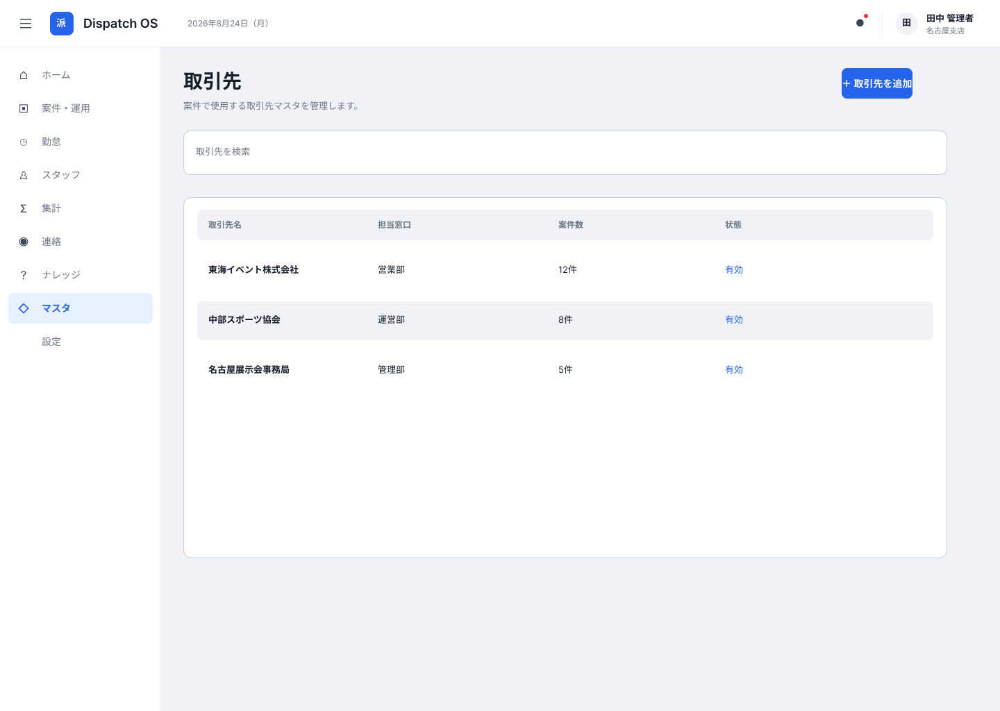

Mapping: Strong  
Confidence: High

#### Structural observations

- Implementation: Both show a master-data list and an in-context Client editor.
- Figma: Refer to the named frame and image above; content fixtures are illustrative and are not compared as production data.
- Uses shared Admin shell.

#### Known intentional deviations

- none recorded for this review item.

#### Human Review

Status: NOT REVIEWED  
Decision: -  
Priority: -  
Notes: -

### SCR-A-021/editor-open — 取引先一覧・編集

#### Implementation

Route: `/admin/clients`  
State: editor open  
Viewport: `1440×900`  

#### Figma

Primary reference:  
Page: `03 Admin`  
Node: `286:569`  
Frame: `[Drawer] 取引先｜Mode=Create / Edit`  
Dimensions: `1440×1024`  

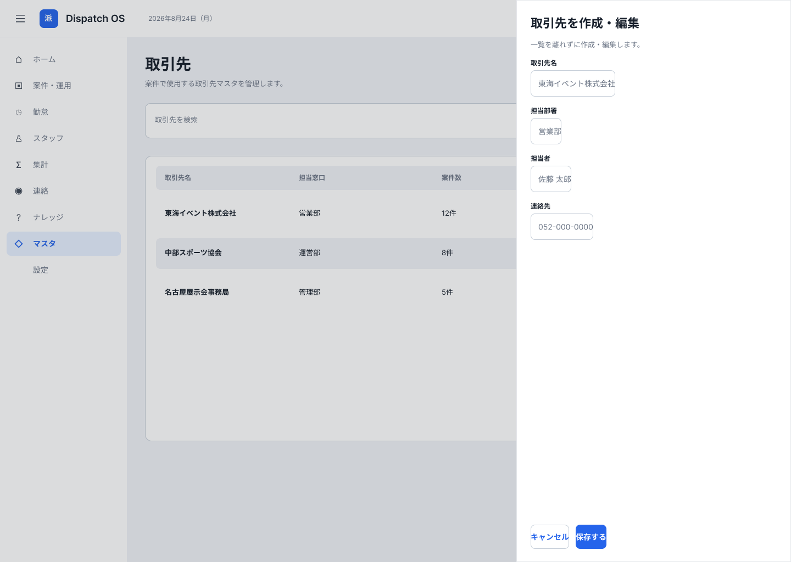

Mapping: Strong  
Confidence: High

#### Structural observations

- Implementation: Both show a master-data list and an in-context Client editor.
- Figma: Refer to the named frame and image above; content fixtures are illustrative and are not compared as production data.
- Uses shared Admin shell.

#### Known intentional deviations

- none recorded for this review item.

#### Human Review

Status: NOT REVIEWED  
Decision: -  
Priority: -  
Notes: -

### SCR-A-022/default — 勤務先一覧・編集

#### Implementation

Route: `/admin/workplaces`  
State: default  
Viewport: `1440×900`  

#### Figma

Primary reference:  
Page: `03 Admin`  
Node: `286:763`  
Frame: `[Page] マスタ｜勤務先一覧`  
Dimensions: `1440×1024`  

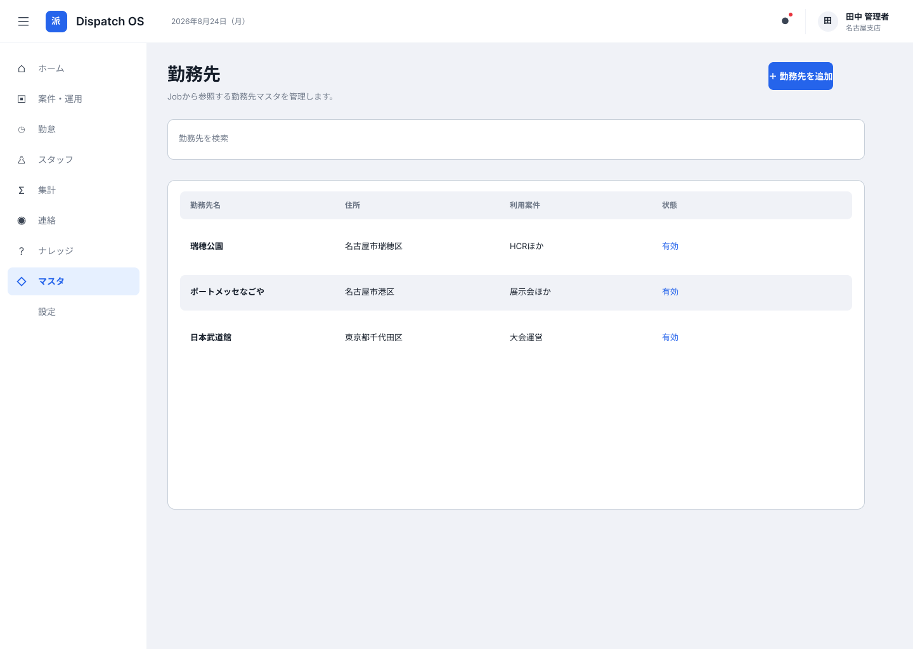

Mapping: Strong  
Confidence: High

#### Structural observations

- Implementation: Both show a master-data list and an in-context Workplace editor.
- Figma: Refer to the named frame and image above; content fixtures are illustrative and are not compared as production data.
- Uses shared Admin shell.

#### Known intentional deviations

- none recorded for this review item.

#### Human Review

Status: NOT REVIEWED  
Decision: -  
Priority: -  
Notes: -

### SCR-A-022/editor-open — 勤務先一覧・編集

#### Implementation

Route: `/admin/workplaces`  
State: editor open  
Viewport: `1440×900`  

#### Figma

Primary reference:  
Page: `03 Admin`  
Node: `286:931`  
Frame: `[Drawer] 勤務先｜Mode=Create / Edit`  
Dimensions: `1440×1024`  

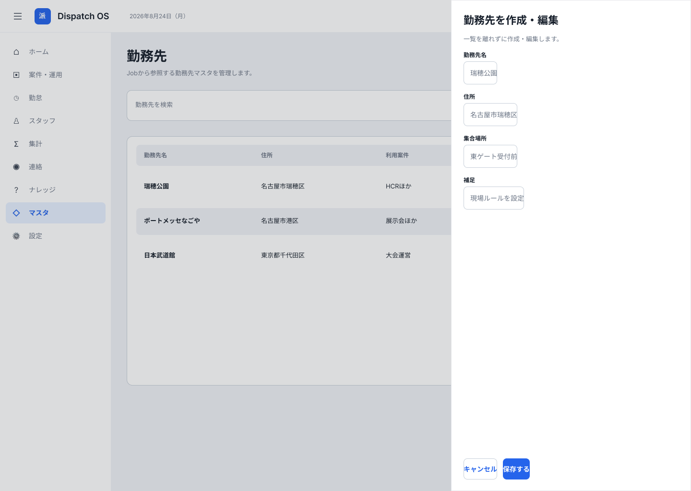

Mapping: Strong  
Confidence: High

#### Structural observations

- Implementation: Both show a master-data list and an in-context Workplace editor.
- Figma: Refer to the named frame and image above; content fixtures are illustrative and are not compared as production data.
- Uses shared Admin shell.

#### Known intentional deviations

- none recorded for this review item.

#### Human Review

Status: NOT REVIEWED  
Decision: -  
Priority: -  
Notes: -

## 10. Worker

### SCR-W-001/assignments — ワーカーホーム / 次の勤務

#### Implementation

Route: `/worker`  
State: assignments  
Viewport: `390×844`  

#### Figma

Primary reference:  
Page: `04 Worker`  
Node: `225:2`  
Frame: `[Page] Workerホーム｜Mobile`  
Dimensions: `390×844`  

Mapping: Strong  
Confidence: High

#### Structural observations

- Implementation: Both use a mobile-first Worker home centered on the next actionable assignment; a distinct desktop adaptation is also available.
- Figma: Refer to the named frame and image above; content fixtures are illustrative and are not compared as production data.
- Uses shared Worker shell.

#### Known intentional deviations

- none recorded for this review item.

#### Human Review

Status: NOT REVIEWED  
Decision: -  
Priority: -  
Notes: -

### SCR-W-001/desktop-spot-check — ワーカーホーム / 次の勤務

#### Implementation

Route: `/worker`  
State: desktop spot-check  
Viewport: `1440×900`  

#### Figma

Primary reference:  
Page: `04 Worker`  
Node: `282:118`  
Frame: `[Page] Workerホーム｜Desktop`  
Dimensions: `1440×900`  

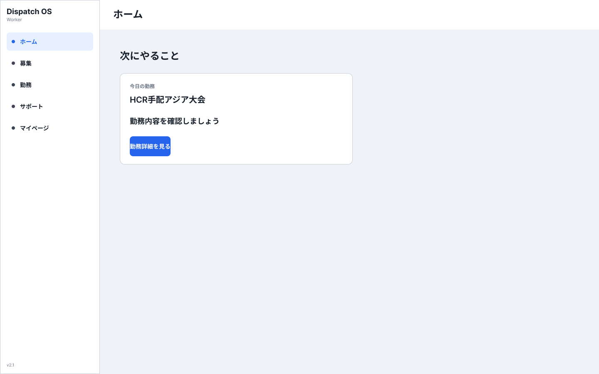

Mapping: Strong  
Confidence: High

#### Structural observations

- Implementation: Both use a mobile-first Worker home centered on the next actionable assignment; a distinct desktop adaptation is also available.
- Figma: Refer to the named frame and image above; content fixtures are illustrative and are not compared as production data.
- Uses shared Worker shell.

#### Known intentional deviations

- none recorded for this review item.

#### Human Review

Status: NOT REVIEWED  
Decision: -  
Priority: -  
Notes: -

### SCR-W-002/actionable-detail — 勤務詳細・前日確認・勤怠・Help Request

#### Implementation

Route: `/worker/assignments/[assignmentId]`  
State: actionable detail  
Viewport: `390×844`  

#### Figma

Primary reference:  
Page: `04 Worker`  
Node: `188:52`  
Frame: `[Hub] 勤務詳細｜Mobile / Overview`  
Dimensions: `390×844`  

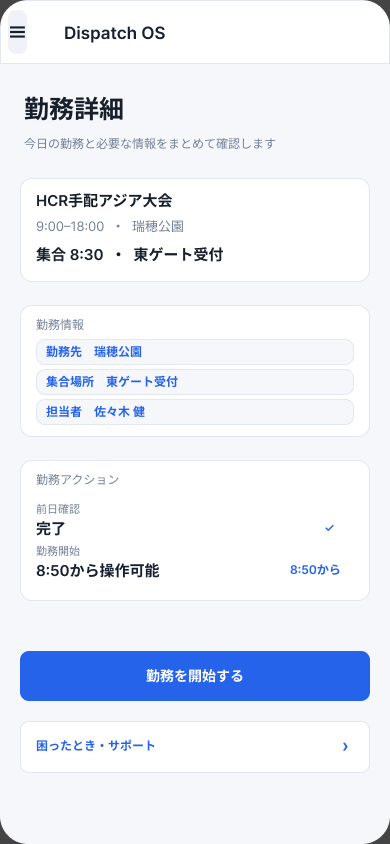

Mapping: Strong  
Confidence: High

#### Structural observations

- Implementation: The core detail maps directly to Worker勤務 detail; Help Request is embedded in implementation while Figma models SOS/inquiry as a standalone support screen.
- Figma: Refer to the named frame and image above; content fixtures are illustrative and are not compared as production data.
- Uses shared Worker shell.

#### Known intentional deviations

- none recorded for this review item.

#### Human Review

Status: NOT REVIEWED  
Decision: -  
Priority: -  
Notes: -

### SCR-W-002/help-request-open — 勤務詳細・前日確認・勤怠・Help Request

#### Implementation

Route: `/worker/assignments/[assignmentId]`  
State: Help Request open  
Viewport: `390×844`  

#### Figma

Primary reference:  
Page: `04 Worker`  
Node: `229:84`  
Frame: `[Page] SOS・問い合わせ｜Mobile`  
Dimensions: `390×844`  

Mapping: Partial  
Confidence: Low

Mapping limitation: The Figma reference provides only the nearest structural or domain concept; it is not the same complete production state.

#### Structural observations

- Implementation: The core detail maps directly to Worker勤務 detail; Help Request is embedded in implementation while Figma models SOS/inquiry as a standalone support screen.
- Figma: Refer to the named frame and image above; content fixtures are illustrative and are not compared as production data.
- Uses shared Worker shell.

#### Known intentional deviations

- none recorded for this review item.

#### Human Review

Status: NOT REVIEWED  
Decision: -  
Priority: -  
Notes: -

## 11. Implementation-only

### SCR-AUTH-001/default — ログイン

#### Implementation

Route: `/login`  
State: default  
Viewport: `1440×900`  

#### Figma

Direct counterpart: **NONE**  
Reason: No matching product frame was found.
Mapping: Implementation-only  
Confidence: High

#### Structural observations

- Implementation: Implementation evidence contains the product login form; no matching Figma product frame was found.
- Figma: Refer to the named frame and image above; content fixtures are illustrative and are not compared as production data.
- No shared product shell counterpart.

#### Known intentional deviations

- none recorded for this review item.

#### Human Review

Status: NOT REVIEWED  
Decision: -  
Priority: -  
Notes: -

### SCR-AUTH-002/inactive — アカウントエラー

#### Implementation

Route: `/auth/error?reason=inactive`  
State: inactive  
Viewport: `1440×900`  

#### Figma

Direct counterpart: **NONE**  
Reason: No matching product frame was found.
Mapping: Implementation-only  
Confidence: High

#### Structural observations

- Implementation: Implementation evidence contains the generic account-state error; no matching Figma product frame was found.
- Figma: Refer to the named frame and image above; content fixtures are illustrative and are not compared as production data.
- No shared product shell counterpart.

#### Known intentional deviations

- none recorded for this review item.

#### Human Review

Status: NOT REVIEWED  
Decision: -  
Priority: -  
Notes: -

## 12. Figma-only

These concepts have no matching implementation target in the audited route inventory. The question is roadmap/product scope, not an assumed implementation defect.

### FIG-001 — Shift

Figma page: `03 Admin`  
Node: `505:352`  
Frame: `[State] シフト一覧｜Desktop / View=Week`  
Dimensions: `1440×1024`

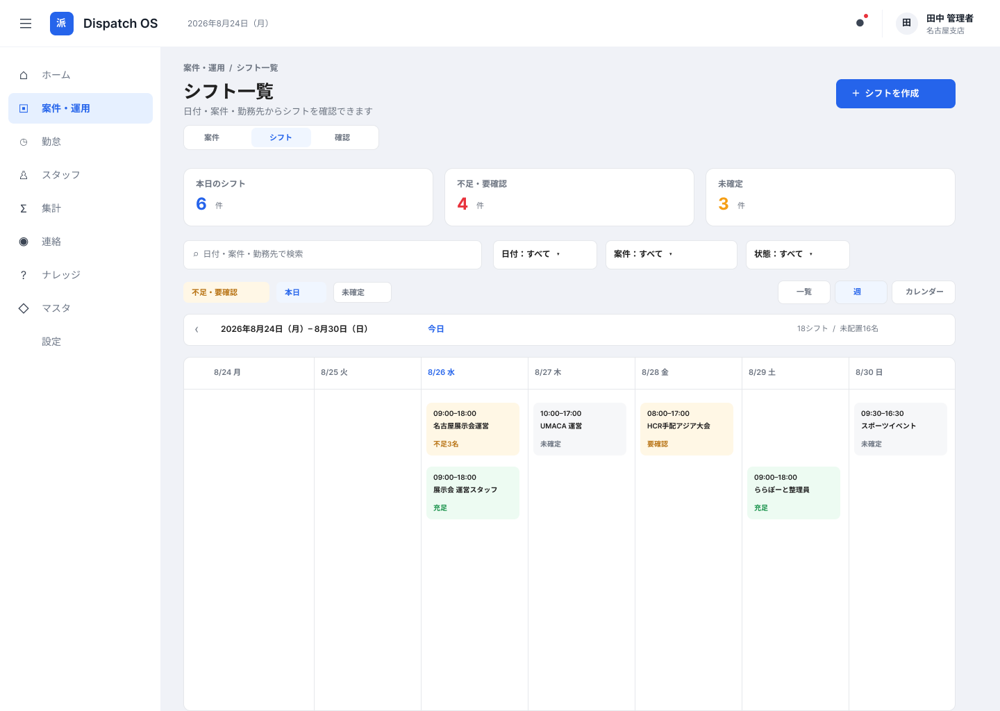

Implementation: **NONE**

Status: NOT REVIEWED  
Decision: -  
Priority: -  
Notes: -  
Question: Should the Week view exist in the current product roadmap?

### FIG-002 — Placement

Figma page: `03 Admin`  
Node: `517:14`  
Frame: `[State] 配置・休憩回し｜Staff Picker=Open`  
Dimensions: `1440×1024`

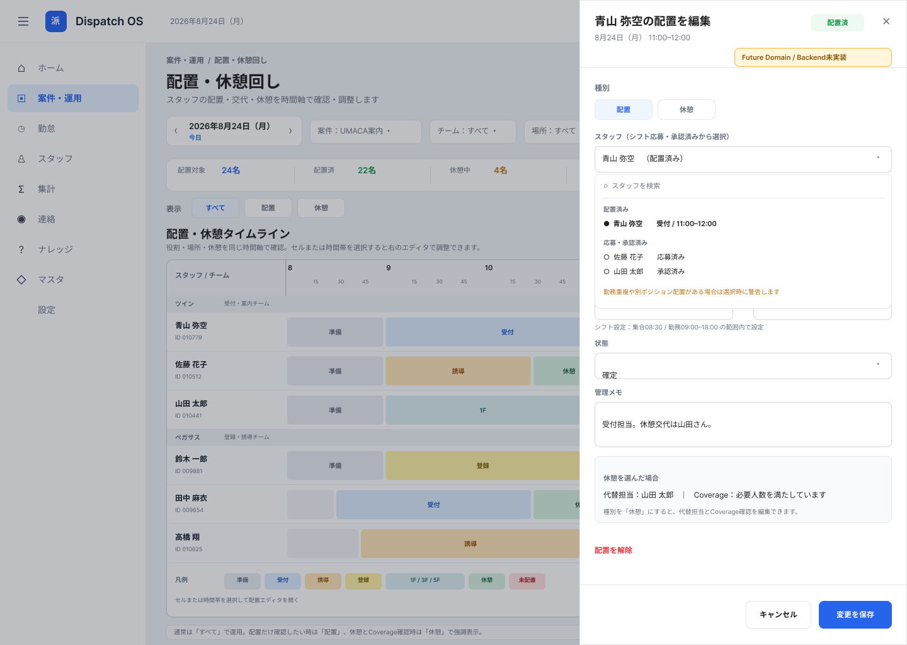

Implementation: **NONE**

Status: NOT REVIEWED  
Decision: -  
Priority: -  
Notes: -  
Question: Should this Staff Picker state be retained as a future interaction reference?

### FIG-003 — Communication

Figma page: `03 Admin`  
Node: `116:2`  
Frame: `[Page] 連絡｜一斉通知作成 / Final`  
Dimensions: `1440×1024`

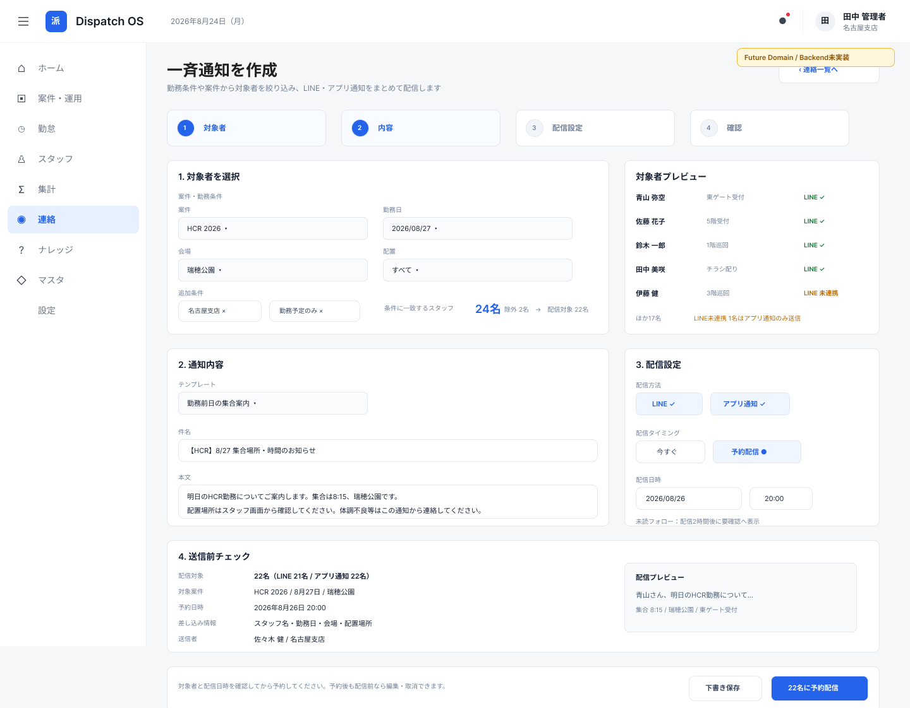

Implementation: **NONE**

Status: NOT REVIEWED  
Decision: -  
Priority: -  
Notes: -  
Question: Should Broadcast remain outside the current Announcement product boundary?

### FIG-004 — Communication

Figma page: `03 Admin`  
Node: `118:2`  
Frame: `[Page] 連絡｜配信履歴 / Final`  
Dimensions: `1440×1024`

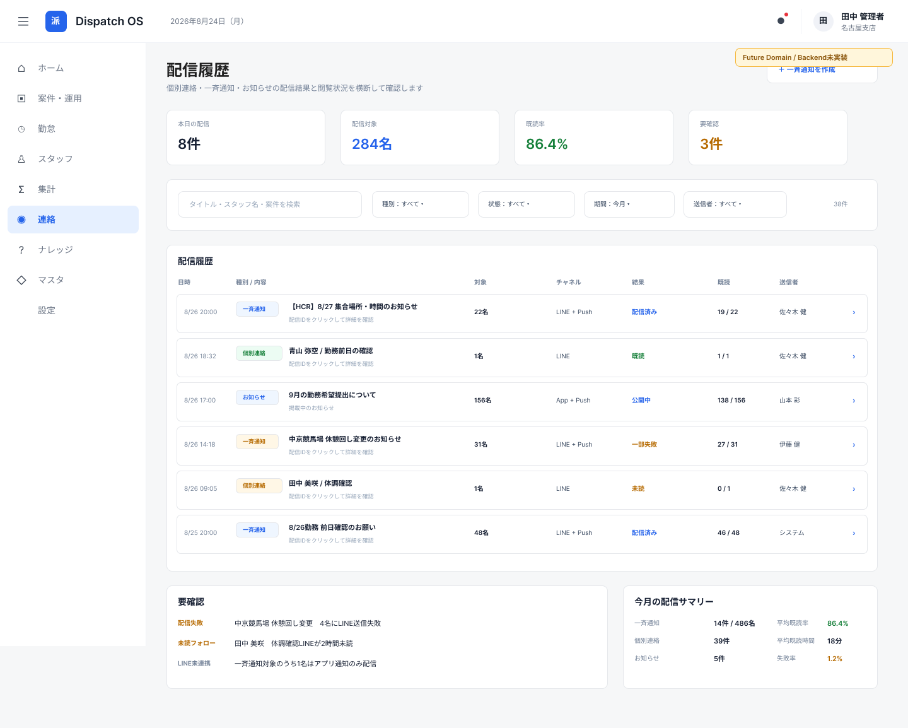

Implementation: **NONE**

Status: NOT REVIEWED  
Decision: -  
Priority: -  
Notes: -  
Question: Should Delivery History exist in the current product roadmap?

### FIG-005 — Knowledge

Figma page: `03 Admin`  
Node: `121:2`  
Frame: `[Page] ナレッジ｜一覧 / Final`  
Dimensions: `1440×1024`

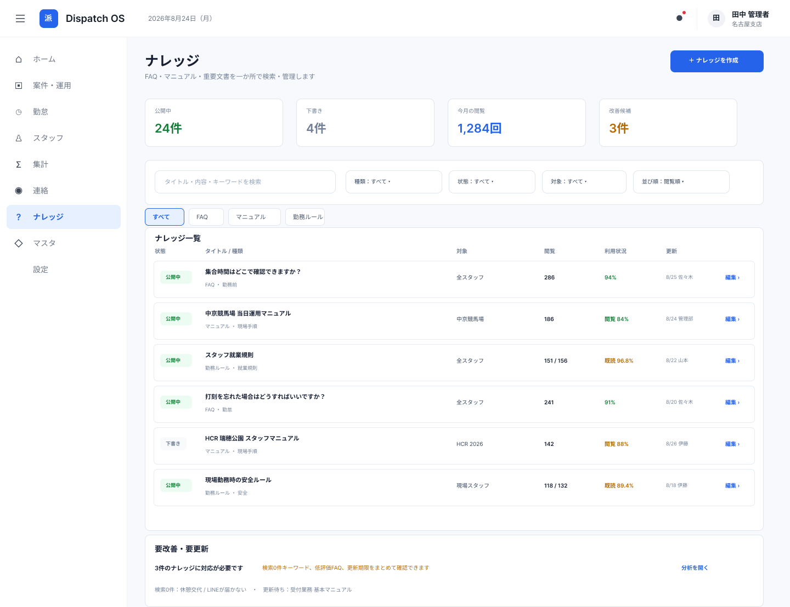

Implementation: **NONE**

Status: NOT REVIEWED  
Decision: -  
Priority: -  
Notes: -  
Question: Should Knowledge exist in the current product roadmap?

### FIG-006 — Aggregation

Figma page: `03 Admin`  
Node: `553:1363`  
Frame: `[Page] 月次集計｜Desktop / Final`  
Dimensions: `1440×1024`

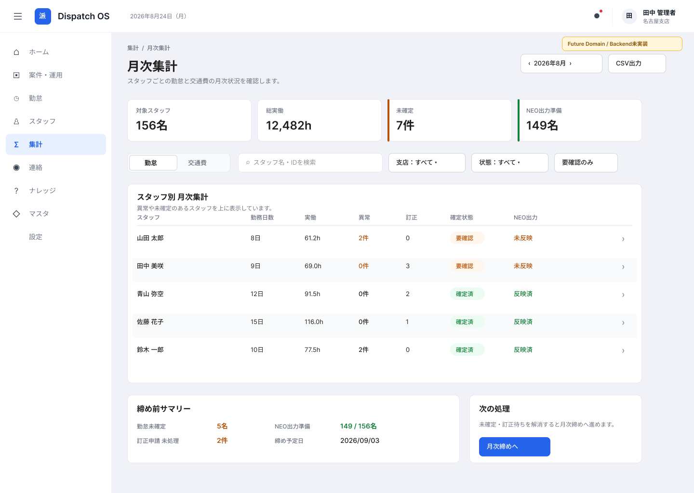

Implementation: **NONE**

Status: NOT REVIEWED  
Decision: -  
Priority: -  
Notes: -  
Question: Should aggregation, expense, and closing screens enter the current roadmap?

### FIG-007 — Settings

Figma page: `03 Admin`  
Node: `123:2`  
Frame: `[Page] 設定｜Desktop / Tab=管理者・権限`  
Dimensions: `1440×1024`

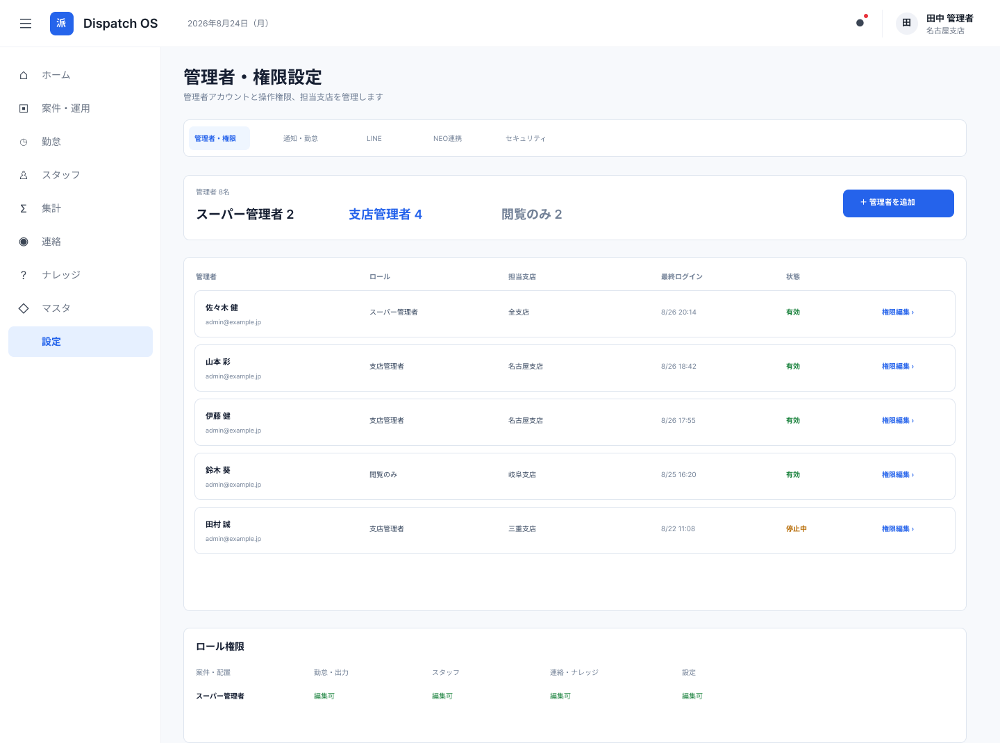

Implementation: **NONE**

Status: NOT REVIEWED  
Decision: -  
Priority: -  
Notes: -  
Question: Should full Settings replace the current placeholder route?

### FIG-008 — Audit

Figma page: `03 Admin`  
Node: `123:1022`  
Frame: `[Page] 監査ログ`  
Dimensions: `1440×1024`

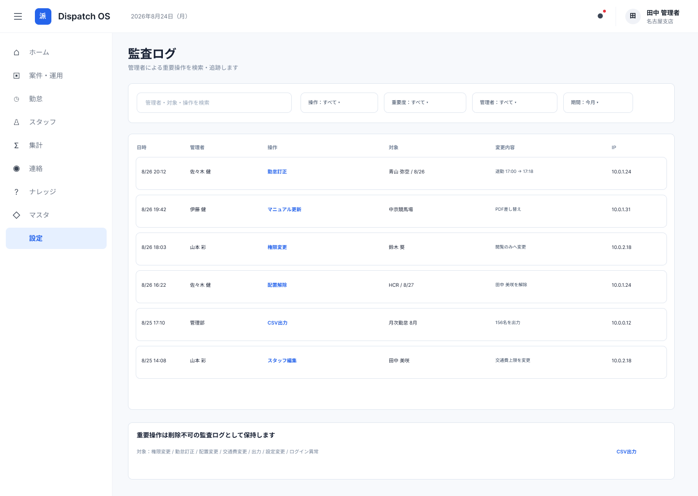

Implementation: **NONE**

Status: NOT REVIEWED  
Decision: -  
Priority: -  
Notes: -  
Question: Should Audit Log exist in the current product roadmap?

### FIG-009 — Worker Recruitment

Figma page: `04 Worker`  
Node: `245:83`  
Frame: `[Page] 募集一覧｜Mobile`  
Dimensions: `390×844`

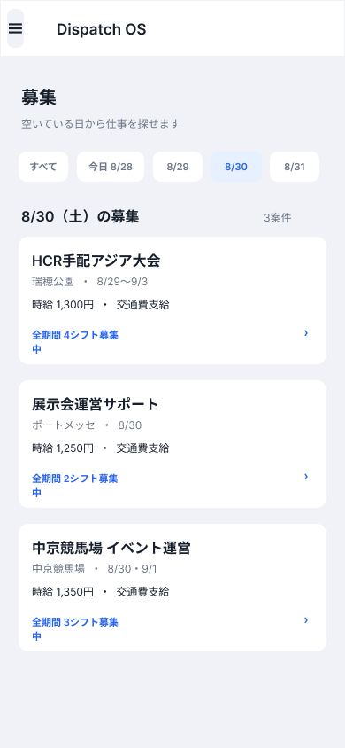

Implementation: **NONE**

Status: NOT REVIEWED  
Decision: -  
Priority: -  
Notes: -  
Question: Should Worker recruitment exist in the current product roadmap?

### FIG-010 — Worker Shift List

Figma page: `04 Worker`  
Node: `188:2`  
Frame: `[Page] 勤務一覧｜Mobile / View=今日`  
Dimensions: `390×844`

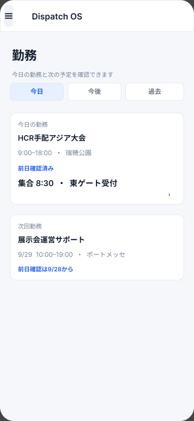

Implementation: **NONE**

Status: NOT REVIEWED  
Decision: -  
Priority: -  
Notes: -  
Question: Should a standalone Worker shift list exist beside Worker home?

### FIG-011 — Worker My Page

Figma page: `04 Worker`  
Node: `230:4`  
Frame: `[Page] マイページ｜Mobile`  
Dimensions: `390×844`

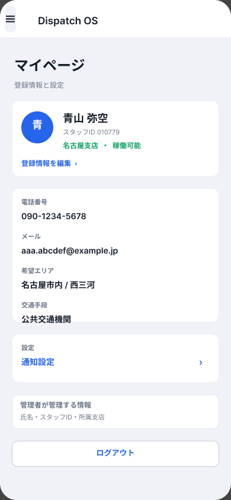

Implementation: **NONE**

Status: NOT REVIEWED  
Decision: -  
Priority: -  
Notes: -  
Question: Should My Page exist in the current product roadmap?

### FIG-012 — Worker Help Content

Figma page: `04 Worker`  
Node: `281:14`  
Frame: `[Page] FAQ｜Mobile`  
Dimensions: `390×844`

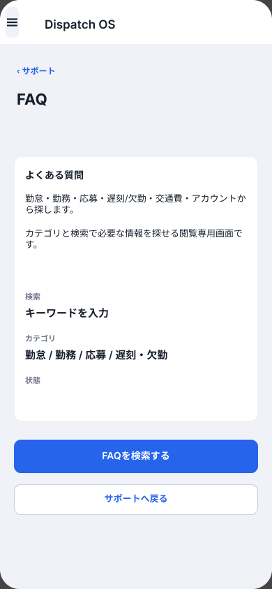

Implementation: **NONE**

Status: NOT REVIEWED  
Decision: -  
Priority: -  
Notes: -  
Question: Should FAQ/manual/rules content exist in the current product roadmap?

## 13. Legacy Candidates

### LEGACY-001

Figma page: `03 Admin`  
Node: `501:2974`  
Frame: `[Archive] シフト｜Mode=Edit / Legacy`  
Dimensions: `1440×1024`

Status: NOT REVIEWED  
Decision: -  
Priority: -  
Notes: -  
Question: Keep as reference, ignore, or update Figma?

### LEGACY-002

Figma page: `03 Admin`  
Node: `117:233`  
Frame: `[Editor] 連絡｜お知らせ / Mode=Edit`  
Dimensions: `1440×1154`

Status: NOT REVIEWED  
Decision: -  
Priority: -  
Notes: -  
Question: Keep only as draft-edit reference, ignore published-edit intent, or update Figma?

## 14. Pending Evidence

### SCR-A-010/conflict-error — Placement conflict

- Implementation screenshot: `admin-placement-conflict-desktop.png` — **PENDING EVIDENCE / NOT AVAILABLE**.
- Primary Figma node: `515:431`, `[State] 配置・休憩回し｜Drawer=Edit`, 1440×1024.
- Supporting Figma node: `602:48`, `[State] Conflict`, 800×240.
- Human comparison remains deferred until isolated, safely captured implementation evidence exists.

## Review Ledger Integrity

- Mapping classifications are copied from AUDIT-3.0A-3 and were not reclassified.
- Existing Implementation screenshots are referenced in place and remain immutable.
- Figma PNGs are raw frame exports: no crop, resize, annotation, blur, or compression was applied.
- Objective observations cover structure, information hierarchy, navigation, primary surfaces, and responsive composition; no pixel-level or quality verdict is assigned.
- Product UI/code, Figma document, DB, Auth, packages, and remote product state were not changed.
