# AUDIT-3.0A-2 Visual Baseline

## Executive Summary

- Status: **AUDIT-3.0A-2: COMPLETE WITH CAPTURE GAPS**
- Planned: 51
- Captured: 50
- Skipped: 0
- Blocked: 1
- Required captured: 28 / 28
- Conditional captured: 22 / 23
- Supplemental: 0
- Source of truth: [route-inventory.md](./route-inventory.md)

## Capture Environment

- Application: Next.js local app at `http://localhost:3000`
- Data: Local Supabase at loopback only
- Browser: installed Google Chrome, headless real-browser session, extensions disabled
- Browser zoom: 100%
- Device scale factor: 1
- Desktop content viewport: `1440x900`
- Mobile content viewport: `390x844`
- Format: original PNG from Chrome `Page.captureScreenshot`
- Roles: Public, Manager, Worker; credentials are not recorded
- Capture date: 2026-09-11 (Asia/Tokyo)

## Capture Summary

| Screen ID | Route | State | Viewport | Filename | Status |
| --- | --- | --- | --- | --- | --- |
| SCR-AUTH-001 | `/login` | default | 1440x900 | `login-desktop.png` | CAPTURED |
| SCR-AUTH-002 | `/auth/error?reason=inactive` | inactive | 1440x900 | `auth-error-inactive-desktop.png` | CAPTURED |
| SCR-A-001 | `/admin` | populated | 1440x900 | `admin-dashboard-desktop.png` | CAPTURED |
| SCR-A-002 | `/admin/projects` | default | 1440x900 | `admin-projects-list-desktop.png` | CAPTURED |
| SCR-A-002 | `/admin/projects` | empty/filtered | 1440x900 | `admin-projects-empty-desktop.png` | CAPTURED |
| SCR-A-003 | `/admin/projects/new` | default | 1440x900 | `admin-project-new-desktop.png` | CAPTURED |
| SCR-A-004 | `/admin/projects/[projectId]` | populated hub | 1440x900 | `admin-project-detail-desktop.png` | CAPTURED |
| SCR-A-004 | `/admin/projects/[projectId]` | edit drawer | 1440x900 | `admin-project-edit-drawer-desktop.png` | CAPTURED |
| SCR-A-005 | `/admin/projects/[projectId]/jobs/new` | default fallback | 1440x900 | `admin-job-new-desktop.png` | CAPTURED |
| SCR-A-006 | `/admin/projects/[projectId]/jobs/[jobId]/shifts/new` | preview | 1440x900 | `admin-shift-new-preview-desktop.png` | CAPTURED |
| SCR-A-008 | `/admin/shifts` | list | 1440x900 | `admin-shifts-list-desktop.png` | CAPTURED |
| SCR-A-008 | `/admin/shifts?view=calendar` | calendar | 1440x900 | `admin-shifts-calendar-desktop.png` | CAPTURED |
| SCR-A-009 | `/admin/shifts/[shiftId]` | staffing detail | 1440x900 | `admin-shift-detail-desktop.png` | CAPTURED |
| SCR-A-009 | `/admin/shifts/[shiftId]` | edit drawer | 1440x900 | `admin-shift-edit-drawer-desktop.png` | CAPTURED |
| SCR-A-010 | `/admin/placement` | board | 1440x900 | `admin-placement-board-desktop.png` | CAPTURED |
| SCR-A-010 | `/admin/placement?shift=[shiftId]` | editor open | 1440x900 | `admin-placement-editor-desktop.png` | CAPTURED |
| SCR-A-010 | `/admin/placement?shift=[shiftId]` | conflict/error | 1440x900 | `admin-placement-conflict-desktop.png` | BLOCKED |
| SCR-A-011 | `/admin/pre-shift` | mixed statuses | 1440x900 | `admin-pre-shift-desktop.png` | CAPTURED |
| SCR-A-011 | `/admin/pre-shift?assignment=[assignmentId]` | drawer open | 1440x900 | `admin-pre-shift-drawer-desktop.png` | CAPTURED |
| SCR-A-012 | `/admin/day-of` | mixed operations | 1440x900 | `admin-day-of-desktop.png` | CAPTURED |
| SCR-A-012 | `/admin/day-of?assignment=[assignmentId]` | drawer/Incident | 1440x900 | `admin-day-of-drawer-desktop.png` | CAPTURED |
| SCR-A-013 | `/admin/attendance` | mixed states | 1440x900 | `admin-attendance-list-desktop.png` | CAPTURED |
| SCR-A-014 | `/admin/attendance/[assignmentId]` | confirmed + history | 1440x900 | `admin-attendance-detail-desktop.png` | CAPTURED |
| SCR-A-014 | `/admin/attendance/[assignmentId]` | revision dialog | 1440x900 | `admin-attendance-revision-dialog-desktop.png` | CAPTURED |
| SCR-A-015 | `/admin/workers` | default | 1440x900 | `admin-workers-list-desktop.png` | CAPTURED |
| SCR-A-016 | `/admin/workers/[workerId]` | overview | 1440x900 | `admin-worker-detail-desktop.png` | CAPTURED |
| SCR-A-016 | `/admin/workers/[workerId]?tab=history` | history | 1440x900 | `admin-worker-history-desktop.png` | CAPTURED |
| SCR-A-017 | `/admin/incidents` | unresolved list | 1440x900 | `admin-incidents-list-desktop.png` | CAPTURED |
| SCR-A-017 | `/admin/incidents?incident=[incidentId]` | drawer open | 1440x900 | `admin-incident-drawer-desktop.png` | CAPTURED |
| SCR-A-018 | `/admin/announcements` | mixed lifecycle | 1440x900 | `admin-announcements-list-desktop.png` | CAPTURED |
| SCR-A-018 | `/admin/announcements` | empty | 1440x900 | `admin-announcements-empty-desktop.png` | CAPTURED |
| SCR-A-019 | `/admin/announcements/new` | completed preview | 1440x900 | `admin-announcement-new-desktop.png` | CAPTURED |
| SCR-A-020 | `/admin/announcements/[announcementId]` | published read-only | 1440x900 | `admin-announcement-published-desktop.png` | CAPTURED |
| SCR-A-020 | `/admin/announcements/[announcementId]?edit=1` | draft edit | 1440x900 | `admin-announcement-draft-edit-desktop.png` | CAPTURED |
| SCR-A-020 | `/admin/announcements/[announcementId]` | archived read-only | 1440x900 | `admin-announcement-archived-desktop.png` | CAPTURED |
| SCR-A-021 | `/admin/clients` | default | 1440x900 | `admin-clients-list-desktop.png` | CAPTURED |
| SCR-A-021 | `/admin/clients` | editor open | 1440x900 | `admin-client-editor-desktop.png` | CAPTURED |
| SCR-A-022 | `/admin/workplaces` | default | 1440x900 | `admin-workplaces-list-desktop.png` | CAPTURED |
| SCR-A-022 | `/admin/workplaces` | editor open | 1440x900 | `admin-workplace-editor-desktop.png` | CAPTURED |
| SCR-W-001 | `/worker` | assignments | 390x844 | `worker-home-mobile.png` | CAPTURED |
| SCR-W-001 | `/worker` | desktop spot-check | 1440x900 | `worker-home-desktop.png` | CAPTURED |
| SCR-W-002 | `/worker/assignments/[assignmentId]` | actionable detail | 390x844 | `worker-assignment-detail-mobile.png` | CAPTURED |
| SCR-W-002 | `/worker/assignments/[assignmentId]` | Help Request open | 390x844 | `worker-help-request-open-mobile.png` | CAPTURED |
| SCR-W-003 | `/worker/notifications` | mixed unread/read | 390x844 | `worker-notifications-mobile.png` | CAPTURED |
| SCR-W-003 | `/worker/notifications` | Incident detail open | 390x844 | `worker-notification-incident-detail-mobile.png` | CAPTURED |
| SCR-W-003 | `/worker/notifications` | Announcement detail open | 390x844 | `worker-notification-announcement-detail-mobile.png` | CAPTURED |
| SCR-W-003 | `/worker/notifications` | source unavailable | 390x844 | `worker-notification-source-unavailable-mobile.png` | CAPTURED |
| SCR-W-004 | `/worker/announcements` | published list | 390x844 | `worker-announcements-list-mobile.png` | CAPTURED |
| SCR-W-004 | `/worker/announcements` | empty | 390x844 | `worker-announcements-empty-mobile.png` | CAPTURED |
| SCR-W-005 | `/worker/announcements/[announcementId]` | important detail | 390x844 | `worker-announcement-detail-mobile.png` | CAPTURED |
| SCR-W-005 | `/worker/announcements/[announcementId]` | safe unavailable | 390x844 | `worker-announcement-unavailable-mobile.png` | CAPTURED |

## Authentication Screens

### SCR-AUTH-001 — ログイン

- Route: `/login`
- State: default
- Viewport: `1440x900`
- Role: Public
- Fixture: no
- Filename: `login-desktop.png`
- Priority: Required
- Status: **CAPTURED**

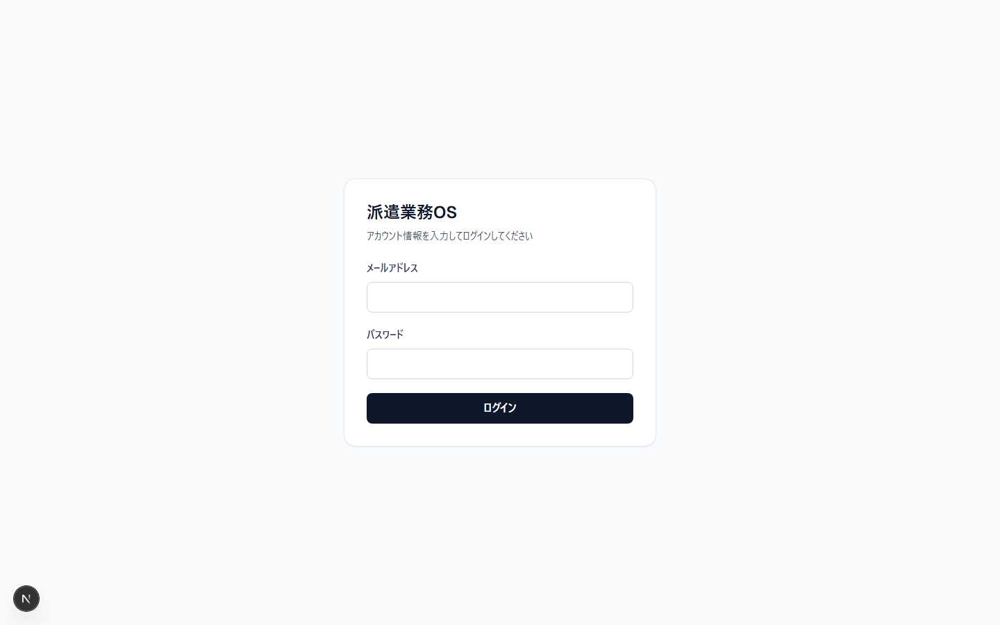

### SCR-AUTH-002 — アカウントエラー

- Route: `/auth/error?reason=inactive`
- State: inactive
- Viewport: `1440x900`
- Role: Public
- Fixture: inactive auth context
- Filename: `auth-error-inactive-desktop.png`
- Priority: Conditional
- Status: **CAPTURED**

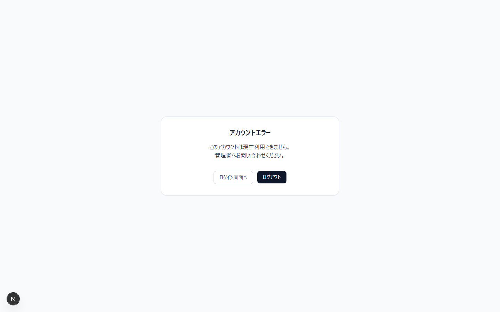

## Admin Screens

### SCR-A-001 — 管理ホーム / Dashboard

- Route: `/admin`
- State: populated
- Viewport: `1440x900`
- Role: Manager
- Fixture: dashboard operations
- Filename: `admin-dashboard-desktop.png`
- Priority: Required
- Status: **CAPTURED**

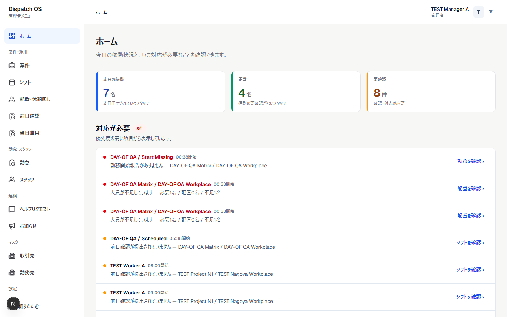

### SCR-A-002 — 案件一覧

- Route: `/admin/projects`
- State: default
- Viewport: `1440x900`
- Role: Manager
- Fixture: projects
- Filename: `admin-projects-list-desktop.png`
- Priority: Required
- Status: **CAPTURED**

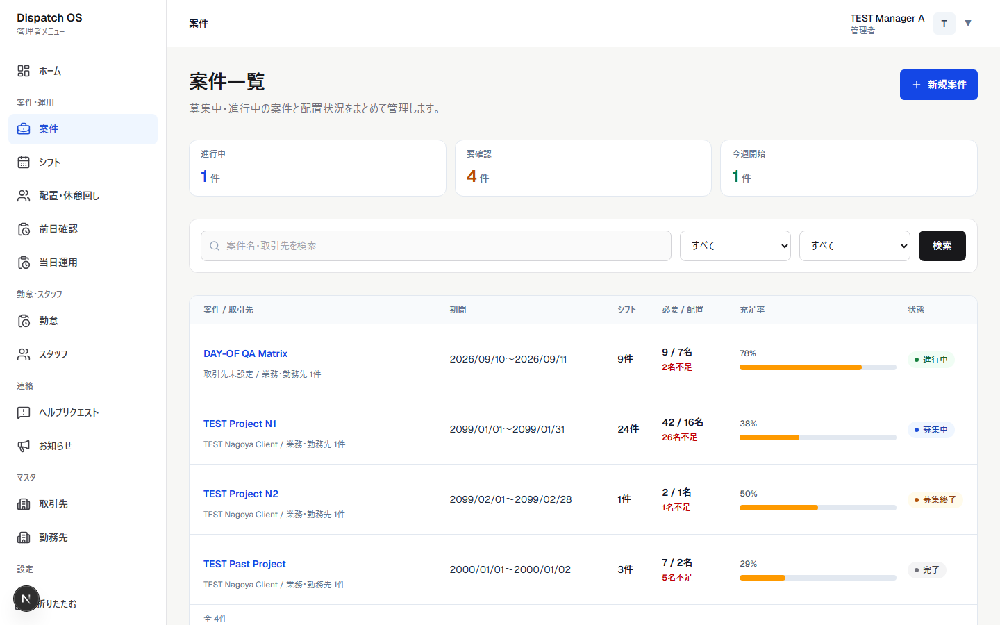

### SCR-A-002 — 案件一覧

- Route: `/admin/projects`
- State: empty/filtered
- Viewport: `1440x900`
- Role: Manager
- Fixture: empty or unmatched filter
- Filename: `admin-projects-empty-desktop.png`
- Priority: Conditional
- Status: **CAPTURED**

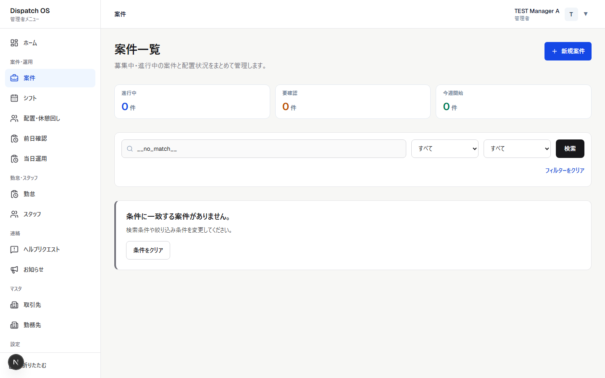

### SCR-A-003 — 新規案件作成

- Route: `/admin/projects/new`
- State: default
- Viewport: `1440x900`
- Role: Manager
- Fixture: active Client/branch/options
- Filename: `admin-project-new-desktop.png`
- Priority: Required
- Status: **CAPTURED**

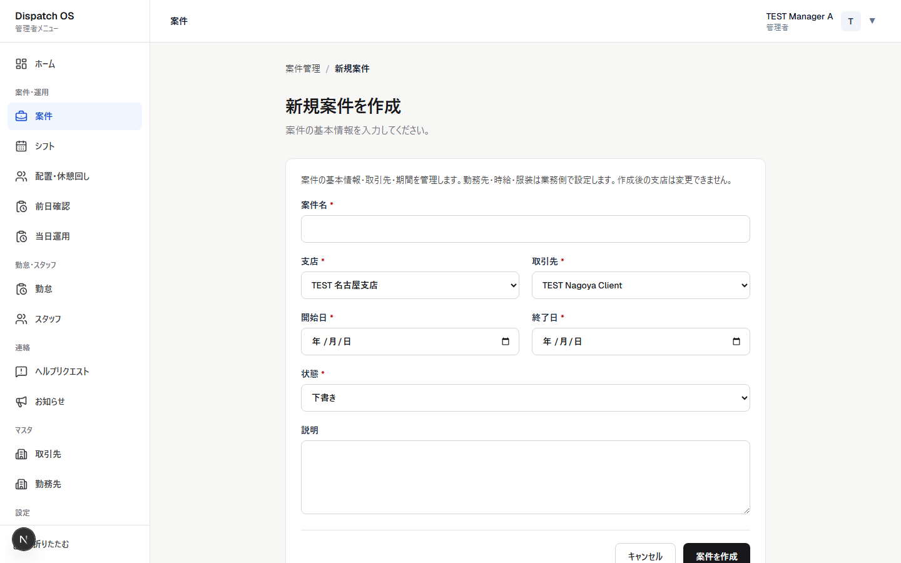

### SCR-A-004 — 案件詳細 / Management Hub

- Route: `/admin/projects/[projectId]`
- State: populated hub
- Viewport: `1440x900`
- Role: Manager
- Fixture: rich Project
- Filename: `admin-project-detail-desktop.png`
- Priority: Required
- Status: **CAPTURED**

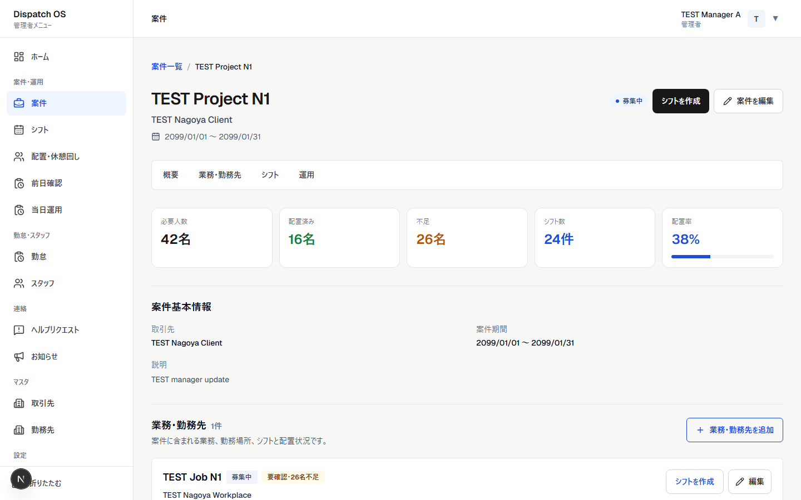

### SCR-A-004 — 案件詳細 / Management Hub

- Route: `/admin/projects/[projectId]`
- State: edit drawer
- Viewport: `1440x900`
- Role: Manager
- Fixture: editable Project
- Filename: `admin-project-edit-drawer-desktop.png`
- Priority: Conditional
- Status: **CAPTURED**

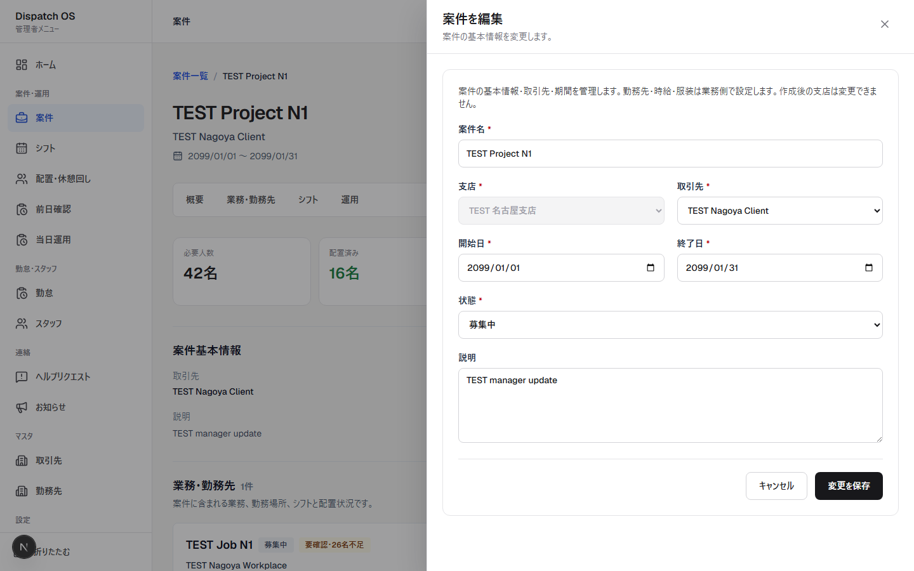

### SCR-A-005 — 業務・勤務先追加

- Route: `/admin/projects/[projectId]/jobs/new`
- State: default fallback
- Viewport: `1440x900`
- Role: Manager
- Fixture: Project + options
- Filename: `admin-job-new-desktop.png`
- Priority: Conditional
- Status: **CAPTURED**

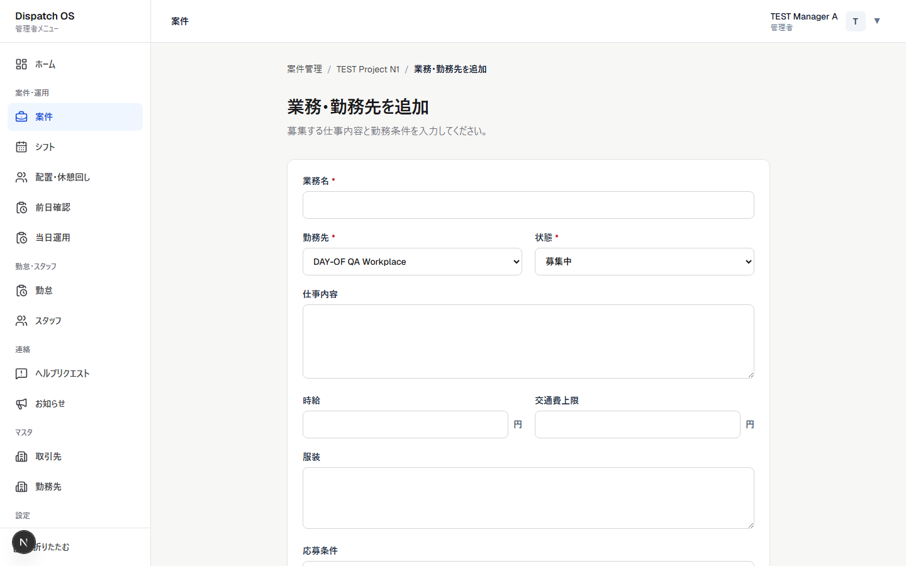

### SCR-A-006 — シフト作成

- Route: `/admin/projects/[projectId]/jobs/[jobId]/shifts/new`
- State: preview
- Viewport: `1440x900`
- Role: Manager
- Fixture: Project/Job/options
- Filename: `admin-shift-new-preview-desktop.png`
- Priority: Required
- Status: **CAPTURED**

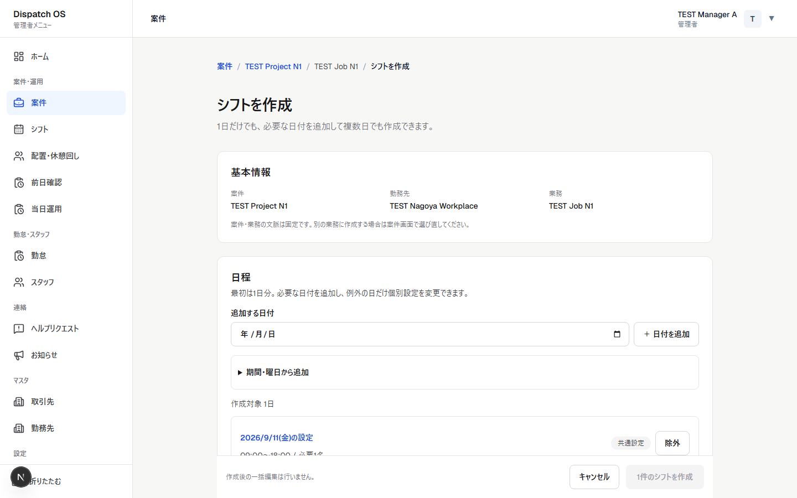

### SCR-A-008 — シフト一覧

- Route: `/admin/shifts`
- State: list
- Viewport: `1440x900`
- Role: Manager
- Fixture: mixed Shifts
- Filename: `admin-shifts-list-desktop.png`
- Priority: Required
- Status: **CAPTURED**

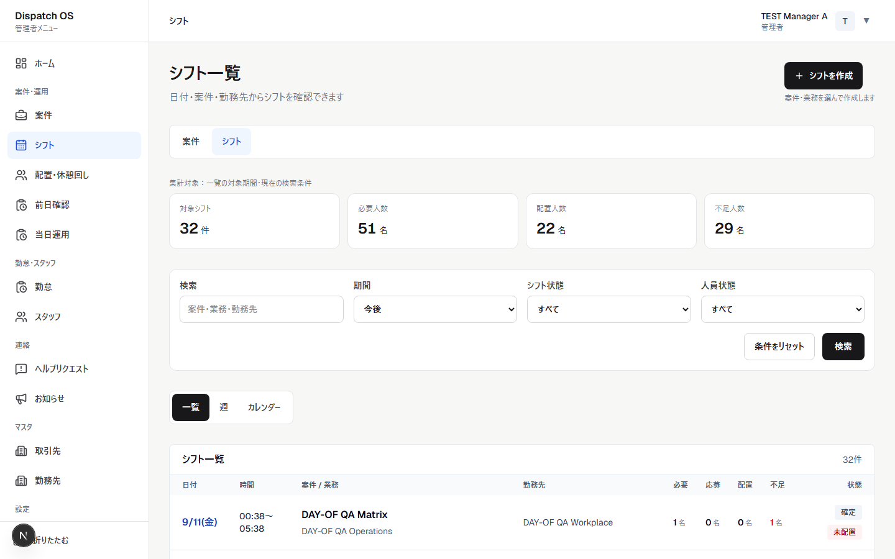

### SCR-A-008 — シフト一覧

- Route: `/admin/shifts?view=calendar`
- State: calendar
- Viewport: `1440x900`
- Role: Manager
- Fixture: month Shifts
- Filename: `admin-shifts-calendar-desktop.png`
- Priority: Conditional
- Status: **CAPTURED**

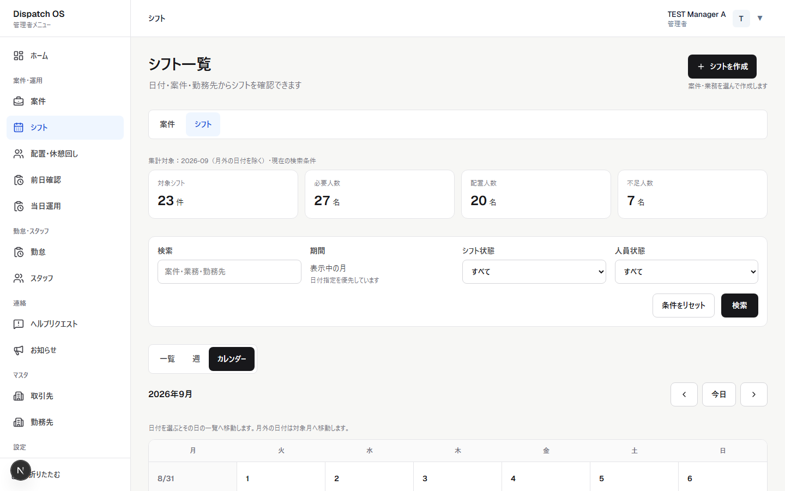

### SCR-A-009 — シフト詳細

- Route: `/admin/shifts/[shiftId]`
- State: staffing detail
- Viewport: `1440x900`
- Role: Manager
- Fixture: rich Shift
- Filename: `admin-shift-detail-desktop.png`
- Priority: Required
- Status: **CAPTURED**

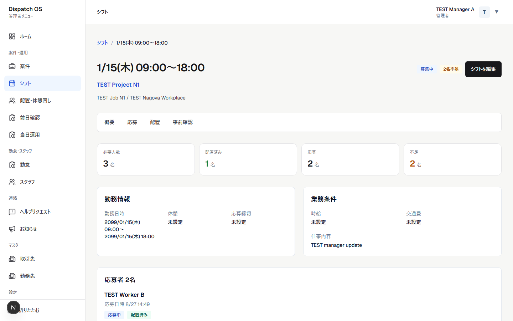

### SCR-A-009 — シフト詳細

- Route: `/admin/shifts/[shiftId]`
- State: edit drawer
- Viewport: `1440x900`
- Role: Manager
- Fixture: editable Shift
- Filename: `admin-shift-edit-drawer-desktop.png`
- Priority: Conditional
- Status: **CAPTURED**

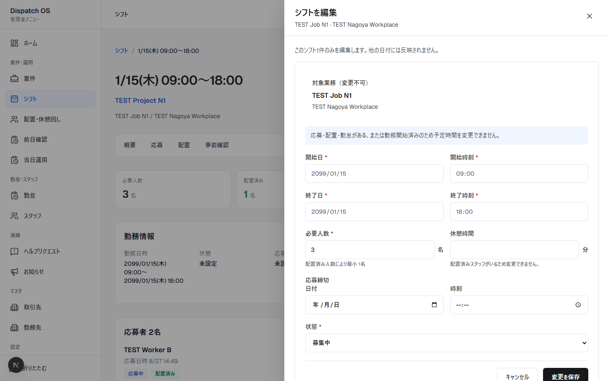

### SCR-A-010 — 配置・休憩回し

- Route: `/admin/placement`
- State: board
- Viewport: `1440x900`
- Role: Manager
- Fixture: placement matrix
- Filename: `admin-placement-board-desktop.png`
- Priority: Required
- Status: **CAPTURED**

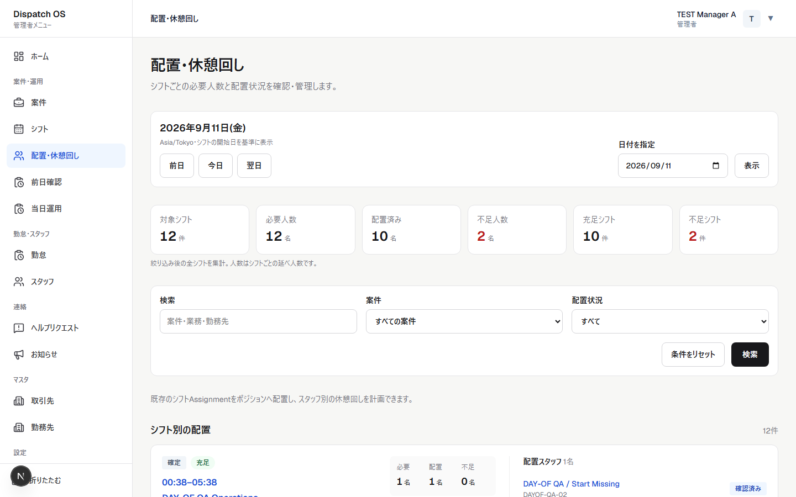

### SCR-A-010 — 配置・休憩回し

- Route: `/admin/placement?shift=[shiftId]`
- State: editor open
- Viewport: `1440x900`
- Role: Manager
- Fixture: Shift plan + staff/breaks
- Filename: `admin-placement-editor-desktop.png`
- Priority: Required
- Status: **CAPTURED**

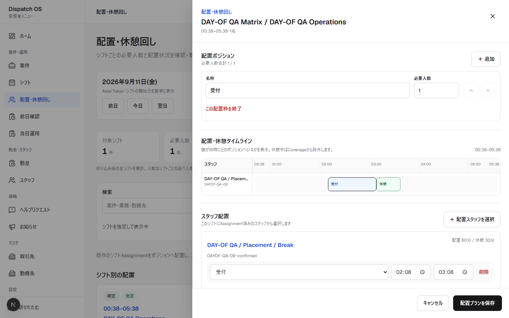

### SCR-A-010 — 配置・休憩回し

- Route: `/admin/placement?shift=[shiftId]`
- State: conflict/error
- Viewport: `1440x900`
- Role: Manager
- Fixture: stale revision
- Filename: `admin-placement-conflict-desktop.png`
- Priority: Conditional
- Status: **BLOCKED**

Reason: stale revisionを発生させるには同一配置計画へ並行する保存mutationが必要で、baseline撮影のためだけにcanonical planへ競合更新を加えることは安全でないため。

Impact on later review: placement editorの通常状態は取得済みだが、競合messageのvisual比較はできない。

Recommended retry condition: 専用のisolated placement-conflict fixtureを安全に作成・cleanupできるPhaseで再撮影する。

Unsafe workaround avoided: 既存配置計画のversionを直接改変すること。

### SCR-A-011 — 前日確認

- Route: `/admin/pre-shift`
- State: mixed statuses
- Viewport: `1440x900`
- Role: Manager
- Fixture: pre-shift matrix
- Filename: `admin-pre-shift-desktop.png`
- Priority: Required
- Status: **CAPTURED**

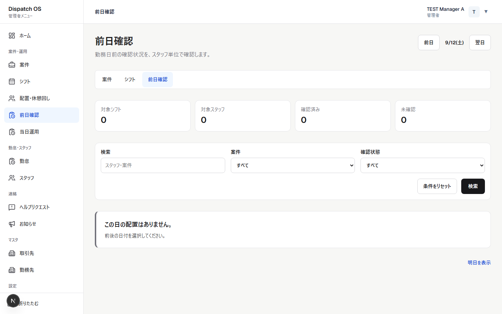

### SCR-A-011 — 前日確認

- Route: `/admin/pre-shift?assignment=[assignmentId]`
- State: drawer open
- Viewport: `1440x900`
- Role: Manager
- Fixture: selected Assignment
- Filename: `admin-pre-shift-drawer-desktop.png`
- Priority: Conditional
- Status: **CAPTURED**

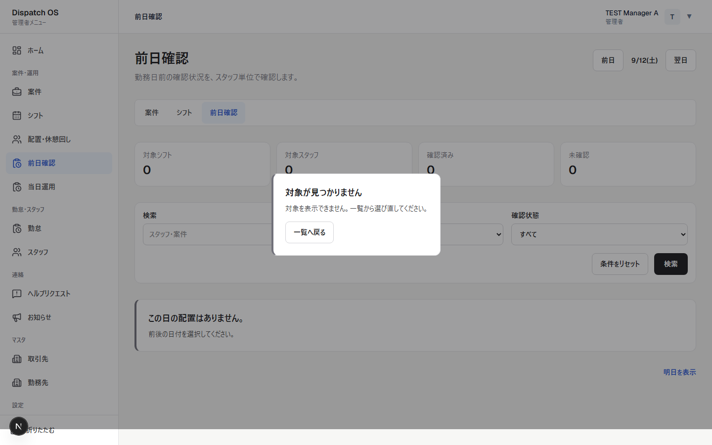

### SCR-A-012 — 当日運用

- Route: `/admin/day-of`
- State: mixed operations
- Viewport: `1440x900`
- Role: Manager
- Fixture: day-of matrix
- Filename: `admin-day-of-desktop.png`
- Priority: Required
- Status: **CAPTURED**

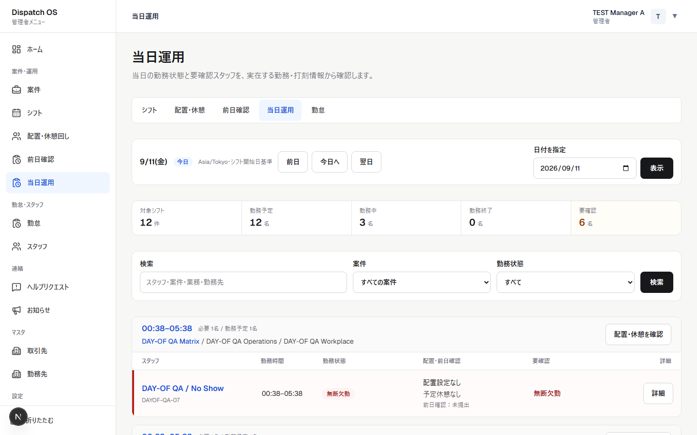

### SCR-A-012 — 当日運用

- Route: `/admin/day-of?assignment=[assignmentId]`
- State: drawer/Incident
- Viewport: `1440x900`
- Role: Manager
- Fixture: attention Assignment
- Filename: `admin-day-of-drawer-desktop.png`
- Priority: Conditional
- Status: **CAPTURED**

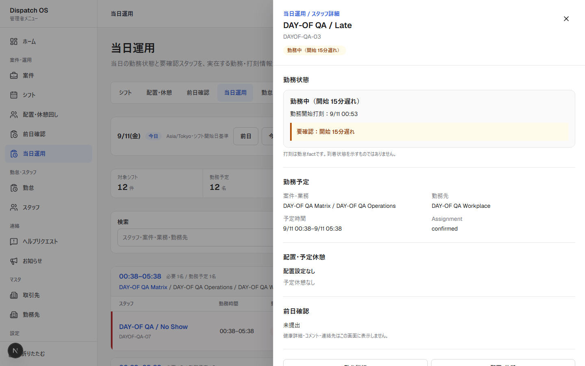

### SCR-A-013 — 勤怠一覧

- Route: `/admin/attendance`
- State: mixed states
- Viewport: `1440x900`
- Role: Manager
- Fixture: attendance matrix
- Filename: `admin-attendance-list-desktop.png`
- Priority: Required
- Status: **CAPTURED**

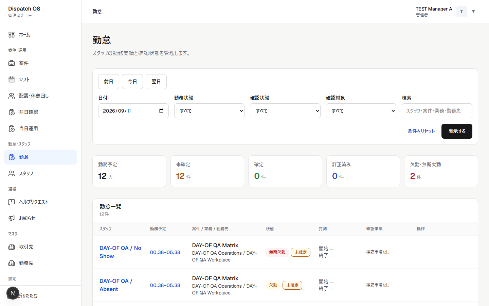

### SCR-A-014 — 勤怠詳細・確定・訂正

- Route: `/admin/attendance/[assignmentId]`
- State: confirmed + history
- Viewport: `1440x900`
- Role: Manager
- Fixture: attendance facts/revision
- Filename: `admin-attendance-detail-desktop.png`
- Priority: Required
- Status: **CAPTURED**

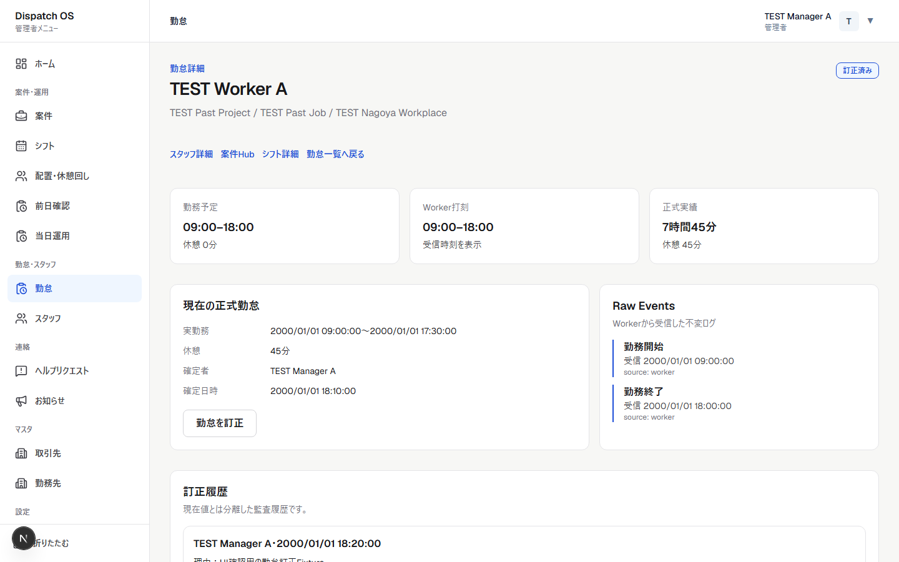

### SCR-A-014 — 勤怠詳細・確定・訂正

- Route: `/admin/attendance/[assignmentId]`
- State: revision dialog
- Viewport: `1440x900`
- Role: Manager
- Fixture: confirmed attendance
- Filename: `admin-attendance-revision-dialog-desktop.png`
- Priority: Conditional
- Status: **CAPTURED**

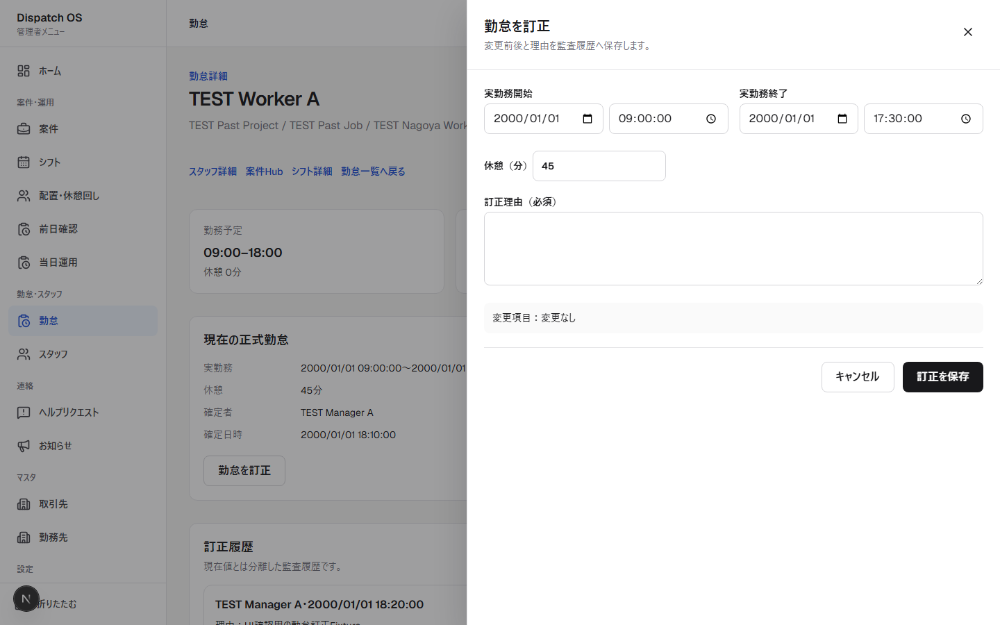

### SCR-A-015 — スタッフ一覧

- Route: `/admin/workers`
- State: default
- Viewport: `1440x900`
- Role: Manager
- Fixture: active/inactive Workers
- Filename: `admin-workers-list-desktop.png`
- Priority: Required
- Status: **CAPTURED**

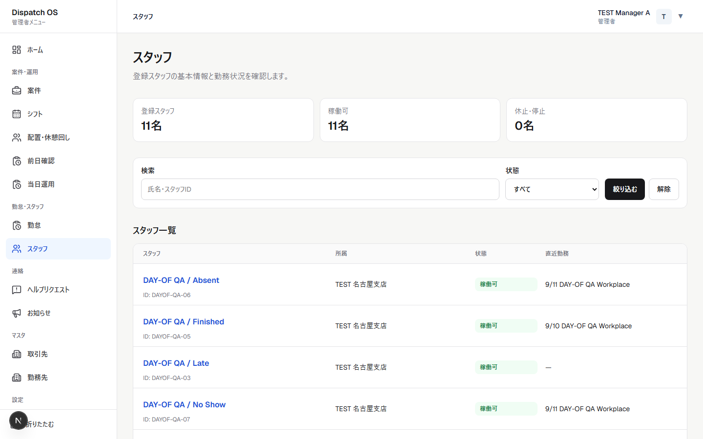

### SCR-A-016 — スタッフ詳細

- Route: `/admin/workers/[workerId]`
- State: overview
- Viewport: `1440x900`
- Role: Manager
- Fixture: visible Worker
- Filename: `admin-worker-detail-desktop.png`
- Priority: Required
- Status: **CAPTURED**

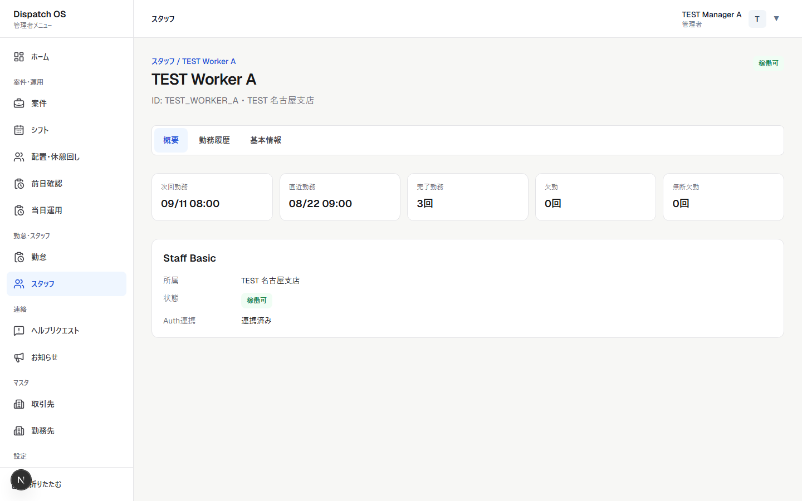

### SCR-A-016 — スタッフ詳細

- Route: `/admin/workers/[workerId]?tab=history`
- State: history
- Viewport: `1440x900`
- Role: Manager
- Fixture: Worker history
- Filename: `admin-worker-history-desktop.png`
- Priority: Conditional
- Status: **CAPTURED**

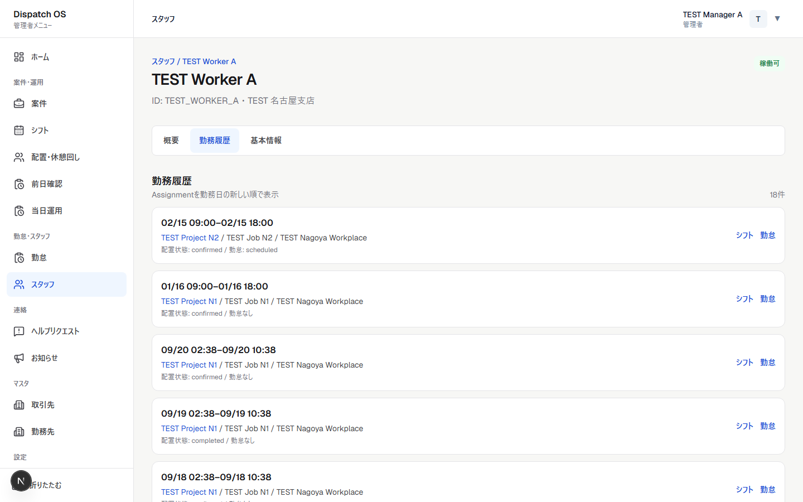

### SCR-A-017 — ヘルプリクエスト一覧・対応

- Route: `/admin/incidents`
- State: unresolved list
- Viewport: `1440x900`
- Role: Manager
- Fixture: mixed Incidents
- Filename: `admin-incidents-list-desktop.png`
- Priority: Required
- Status: **CAPTURED**

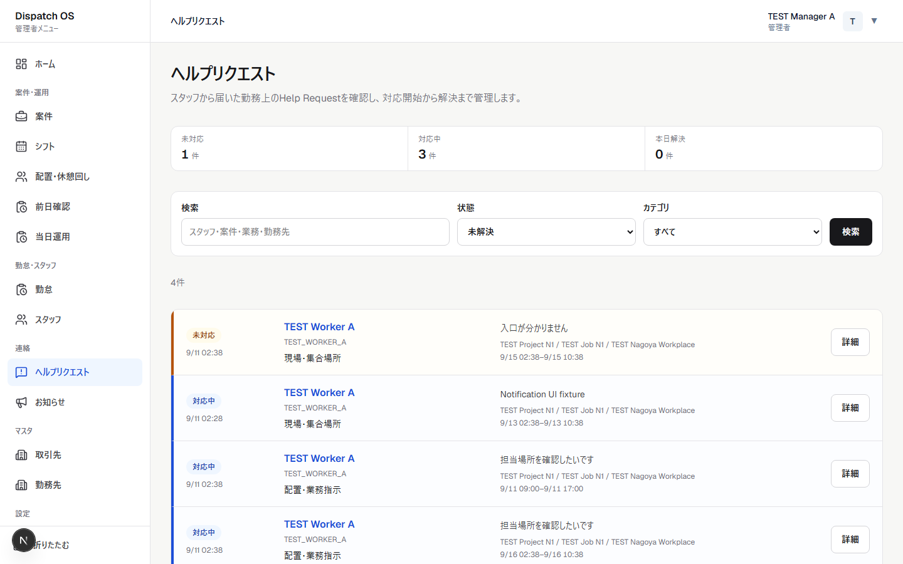

### SCR-A-017 — ヘルプリクエスト一覧・対応

- Route: `/admin/incidents?incident=[incidentId]`
- State: drawer open
- Viewport: `1440x900`
- Role: Manager
- Fixture: selected Incident/events
- Filename: `admin-incident-drawer-desktop.png`
- Priority: Required
- Status: **CAPTURED**

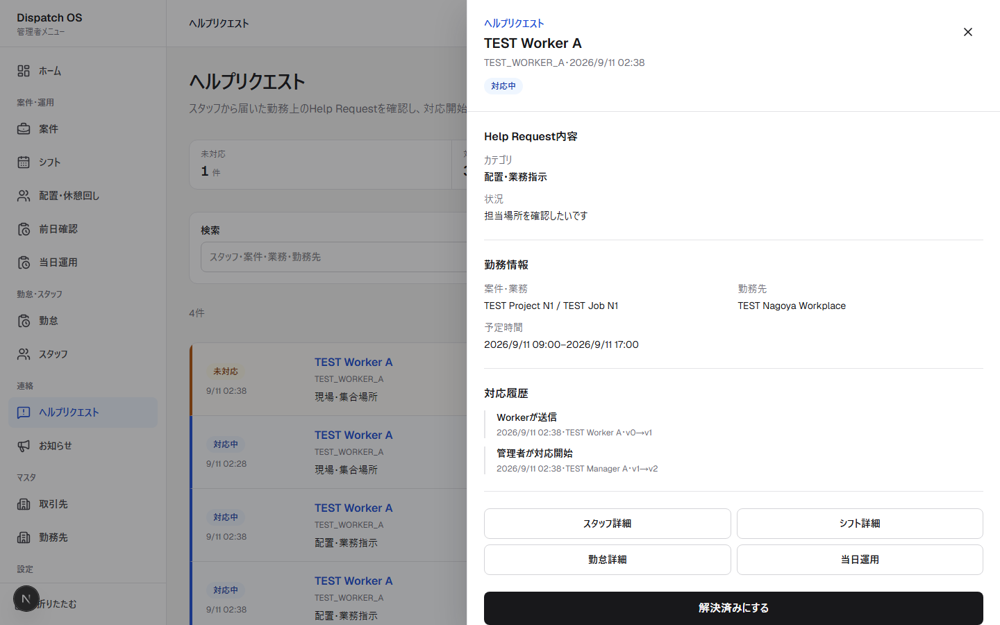

### SCR-A-018 — お知らせ一覧

- Route: `/admin/announcements`
- State: mixed lifecycle
- Viewport: `1440x900`
- Role: Manager
- Fixture: draft/published/archived
- Filename: `admin-announcements-list-desktop.png`
- Priority: Required
- Status: **CAPTURED**

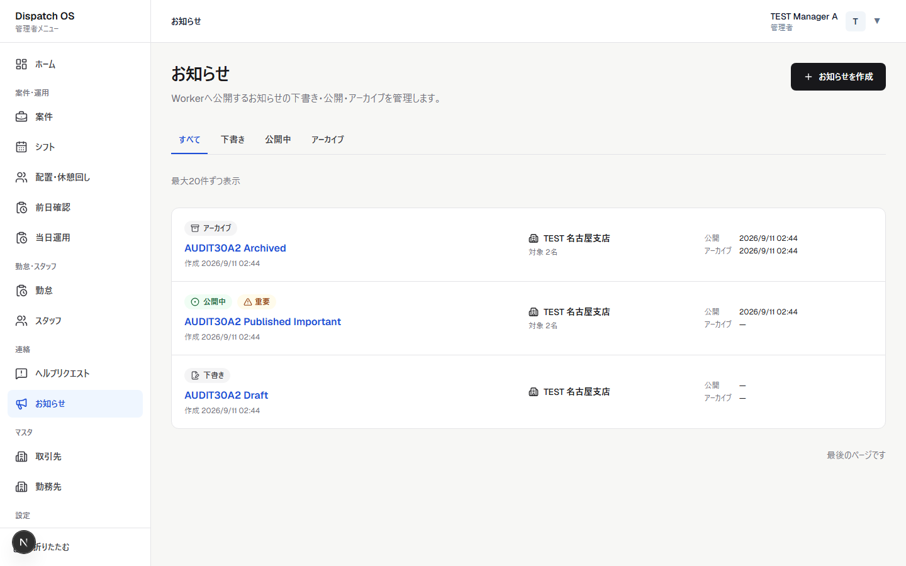

### SCR-A-018 — お知らせ一覧

- Route: `/admin/announcements`
- State: empty
- Viewport: `1440x900`
- Role: Manager
- Fixture: no visible Announcement
- Filename: `admin-announcements-empty-desktop.png`
- Priority: Conditional
- Status: **CAPTURED**

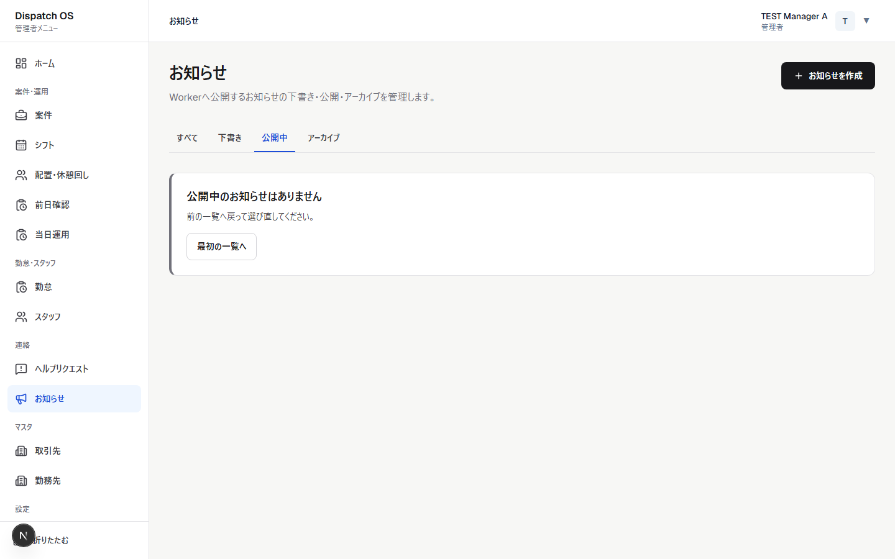

### SCR-A-019 — お知らせ下書き作成

- Route: `/admin/announcements/new`
- State: completed preview
- Viewport: `1440x900`
- Role: Manager
- Fixture: Manager scope
- Filename: `admin-announcement-new-desktop.png`
- Priority: Required
- Status: **CAPTURED**

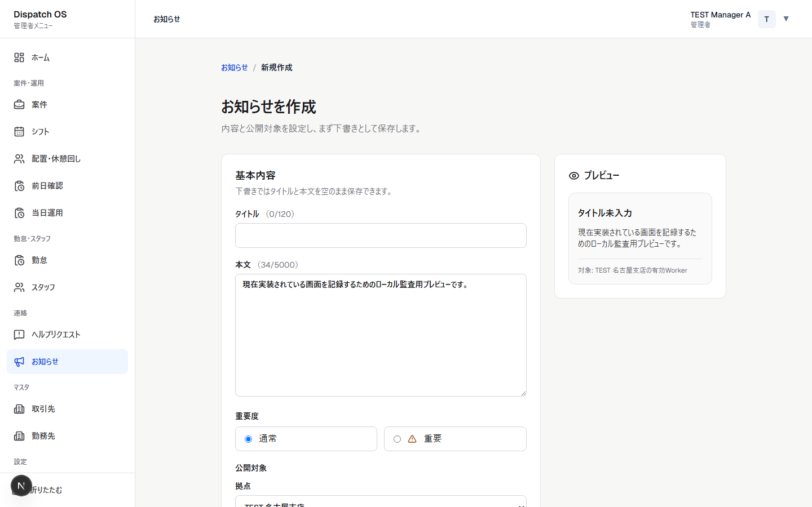

### SCR-A-020 — お知らせ詳細・下書き編集

- Route: `/admin/announcements/[announcementId]`
- State: published read-only
- Viewport: `1440x900`
- Role: Manager
- Fixture: published Announcement
- Filename: `admin-announcement-published-desktop.png`
- Priority: Required
- Status: **CAPTURED**

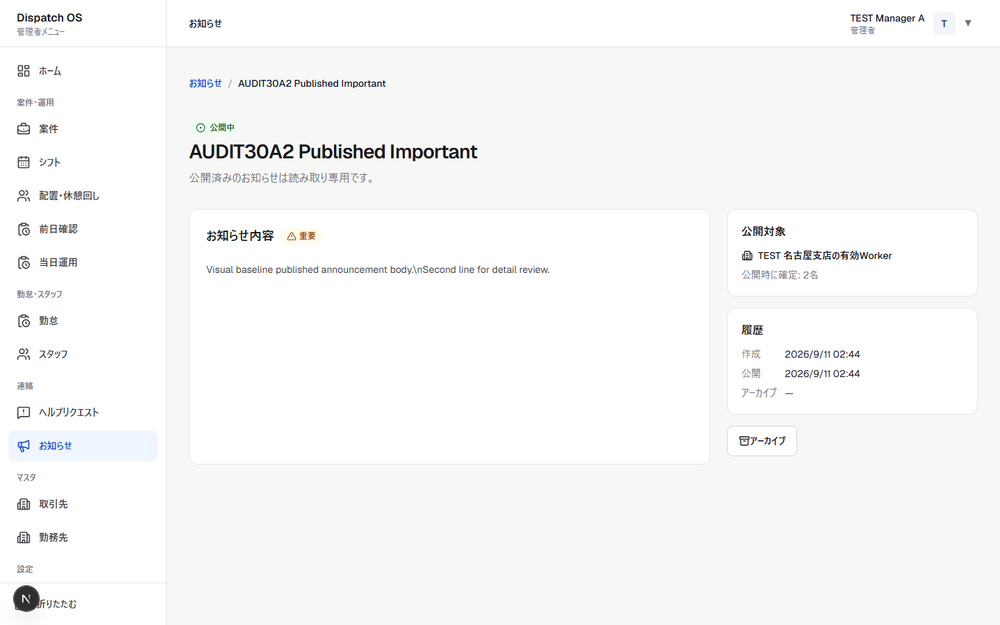

### SCR-A-020 — お知らせ詳細・下書き編集

- Route: `/admin/announcements/[announcementId]?edit=1`
- State: draft edit
- Viewport: `1440x900`
- Role: Manager
- Fixture: draft Announcement
- Filename: `admin-announcement-draft-edit-desktop.png`
- Priority: Conditional
- Status: **CAPTURED**

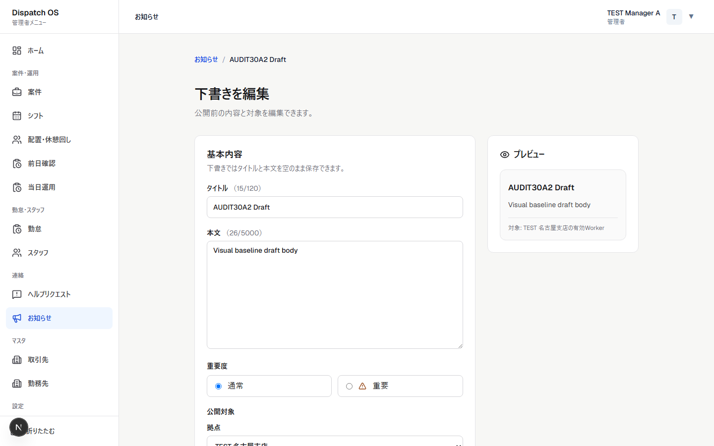

### SCR-A-020 — お知らせ詳細・下書き編集

- Route: `/admin/announcements/[announcementId]`
- State: archived read-only
- Viewport: `1440x900`
- Role: Manager
- Fixture: archived Announcement
- Filename: `admin-announcement-archived-desktop.png`
- Priority: Conditional
- Status: **CAPTURED**

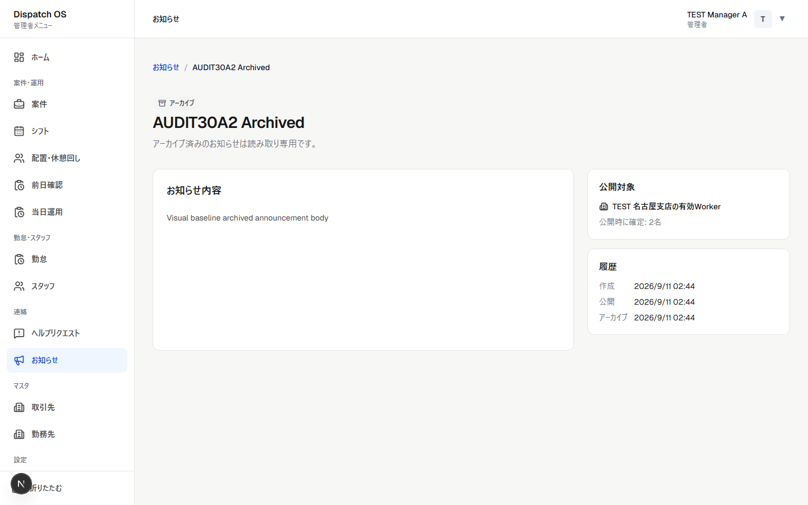

### SCR-A-021 — 取引先一覧・編集

- Route: `/admin/clients`
- State: default
- Viewport: `1440x900`
- Role: Manager
- Fixture: Client records
- Filename: `admin-clients-list-desktop.png`
- Priority: Required
- Status: **CAPTURED**

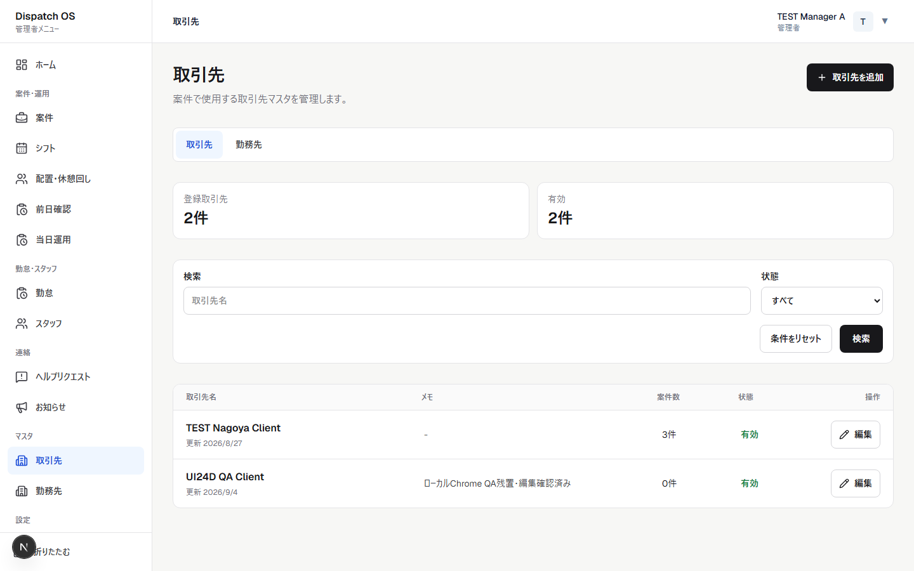

### SCR-A-021 — 取引先一覧・編集

- Route: `/admin/clients`
- State: editor open
- Viewport: `1440x900`
- Role: Manager
- Fixture: branches / editable Client
- Filename: `admin-client-editor-desktop.png`
- Priority: Conditional
- Status: **CAPTURED**

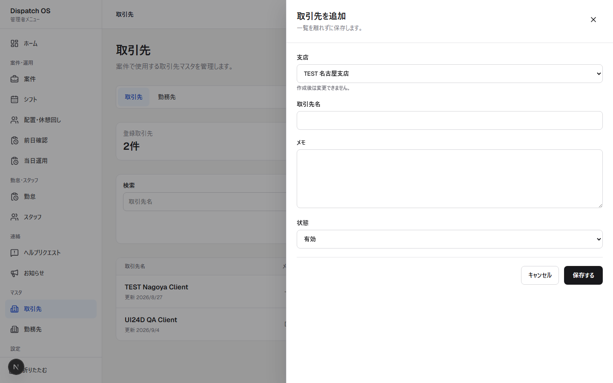

### SCR-A-022 — 勤務先一覧・編集

- Route: `/admin/workplaces`
- State: default
- Viewport: `1440x900`
- Role: Manager
- Fixture: Workplace records
- Filename: `admin-workplaces-list-desktop.png`
- Priority: Required
- Status: **CAPTURED**

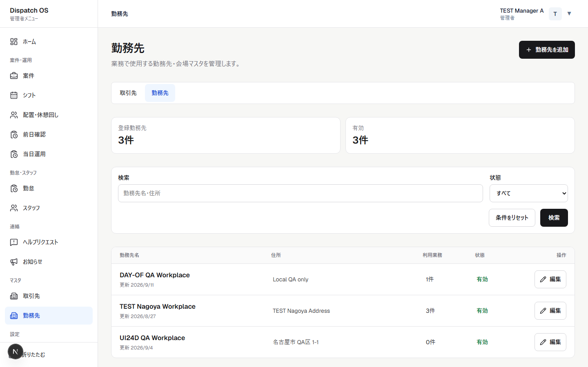

### SCR-A-022 — 勤務先一覧・編集

- Route: `/admin/workplaces`
- State: editor open
- Viewport: `1440x900`
- Role: Manager
- Fixture: branches / editable Workplace
- Filename: `admin-workplace-editor-desktop.png`
- Priority: Conditional
- Status: **CAPTURED**

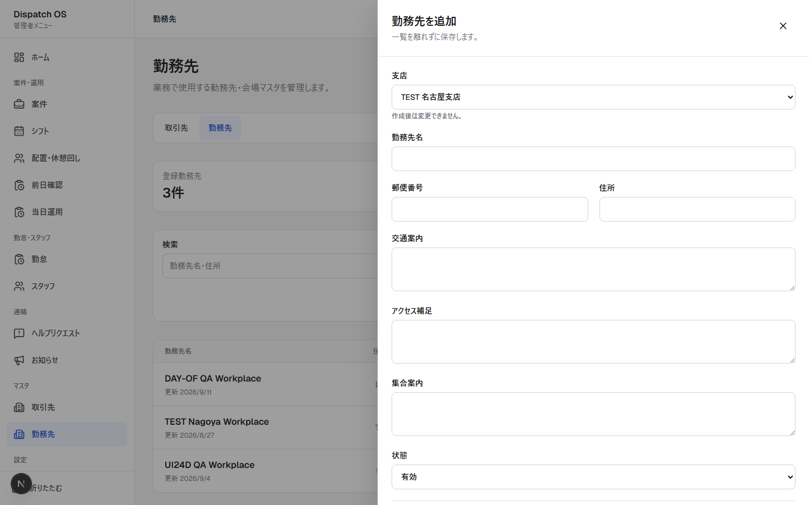

## Worker Screens

### SCR-W-001 — ワーカーホーム / 次の勤務

- Route: `/worker`
- State: assignments
- Viewport: `390x844`
- Role: Worker
- Fixture: own upcoming Assignments
- Filename: `worker-home-mobile.png`
- Priority: Required
- Status: **CAPTURED**

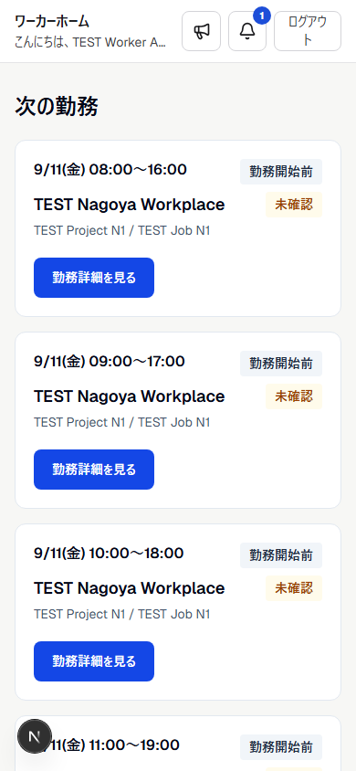

### SCR-W-001 — ワーカーホーム / 次の勤務

- Route: `/worker`
- State: desktop spot-check
- Viewport: `1440x900`
- Role: Worker
- Fixture: same
- Filename: `worker-home-desktop.png`
- Priority: Conditional
- Status: **CAPTURED**

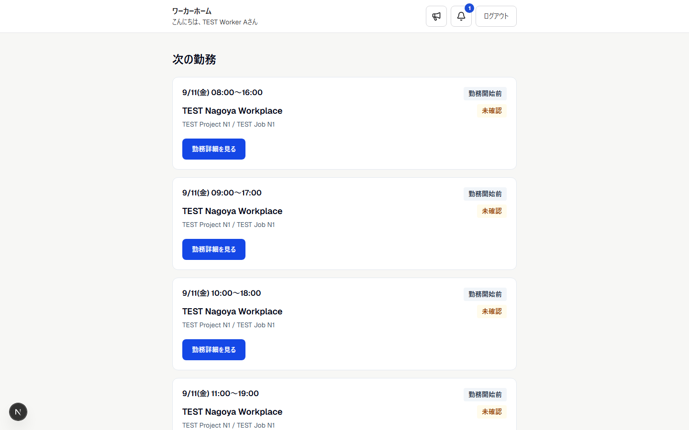

### SCR-W-002 — 勤務詳細・前日確認・勤怠・Help Request

- Route: `/worker/assignments/[assignmentId]`
- State: actionable detail
- Viewport: `390x844`
- Role: Worker
- Fixture: own active Assignment
- Filename: `worker-assignment-detail-mobile.png`
- Priority: Required
- Status: **CAPTURED**

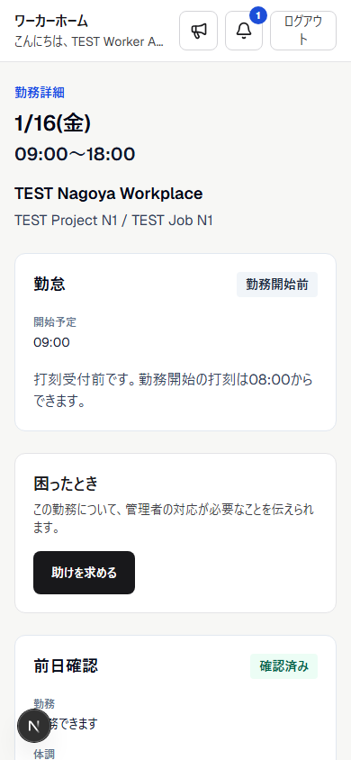

### SCR-W-002 — 勤務詳細・前日確認・勤怠・Help Request

- Route: `/worker/assignments/[assignmentId]`
- State: Help Request open
- Viewport: `390x844`
- Role: Worker
- Fixture: own open Incident
- Filename: `worker-help-request-open-mobile.png`
- Priority: Conditional
- Status: **CAPTURED**

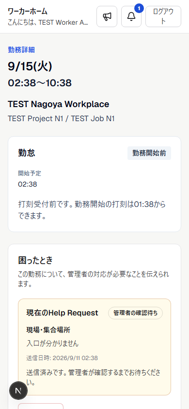

### SCR-W-003 — 通知一覧・詳細

- Route: `/worker/notifications`
- State: mixed unread/read
- Viewport: `390x844`
- Role: Worker
- Fixture: Incident + Announcement Notifications
- Filename: `worker-notifications-mobile.png`
- Priority: Required
- Status: **CAPTURED**

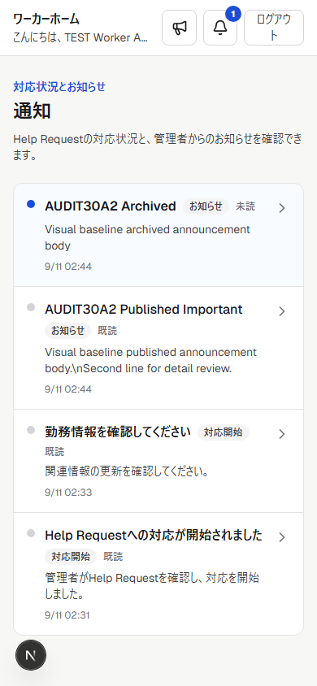

### SCR-W-003 — 通知一覧・詳細

- Route: `/worker/notifications`
- State: Incident detail open
- Viewport: `390x844`
- Role: Worker
- Fixture: own Incident Notification
- Filename: `worker-notification-incident-detail-mobile.png`
- Priority: Conditional
- Status: **CAPTURED**

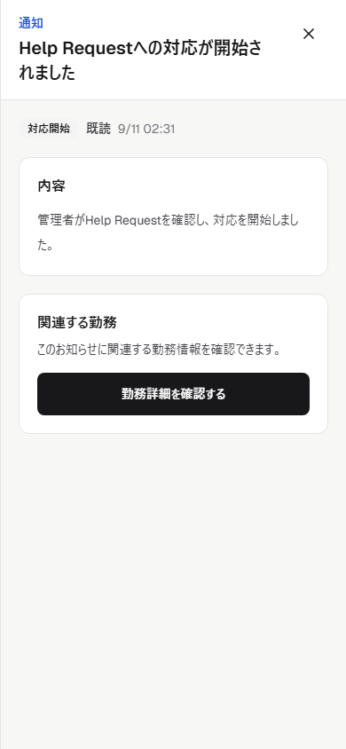

### SCR-W-003 — 通知一覧・詳細

- Route: `/worker/notifications`
- State: Announcement detail open
- Viewport: `390x844`
- Role: Worker
- Fixture: own Announcement Notification
- Filename: `worker-notification-announcement-detail-mobile.png`
- Priority: Conditional
- Status: **CAPTURED**

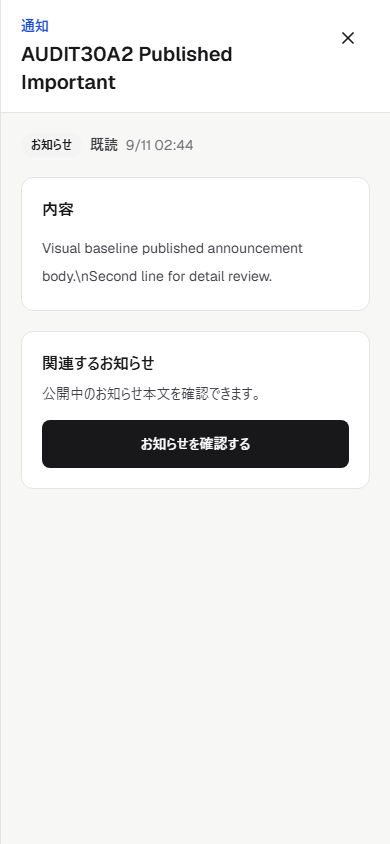

### SCR-W-003 — 通知一覧・詳細

- Route: `/worker/notifications`
- State: source unavailable
- Viewport: `390x844`
- Role: Worker
- Fixture: archived Announcement Notification
- Filename: `worker-notification-source-unavailable-mobile.png`
- Priority: Conditional
- Status: **CAPTURED**

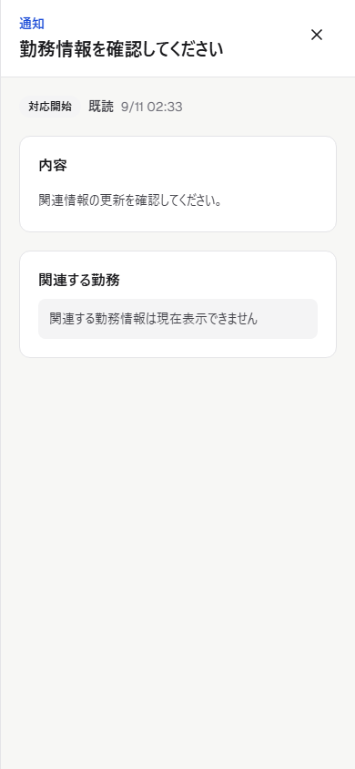

### SCR-W-004 — お知らせ一覧

- Route: `/worker/announcements`
- State: published list
- Viewport: `390x844`
- Role: Worker
- Fixture: targeted Announcements
- Filename: `worker-announcements-list-mobile.png`
- Priority: Required
- Status: **CAPTURED**

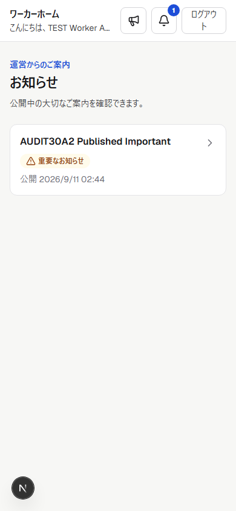

### SCR-W-004 — お知らせ一覧

- Route: `/worker/announcements`
- State: empty
- Viewport: `390x844`
- Role: Worker
- Fixture: no published targeted source
- Filename: `worker-announcements-empty-mobile.png`
- Priority: Conditional
- Status: **CAPTURED**

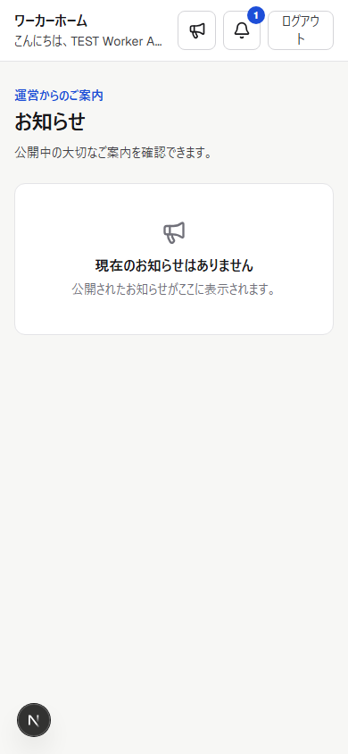

### SCR-W-005 — お知らせ詳細

- Route: `/worker/announcements/[announcementId]`
- State: important detail
- Viewport: `390x844`
- Role: Worker
- Fixture: targeted important Announcement
- Filename: `worker-announcement-detail-mobile.png`
- Priority: Required
- Status: **CAPTURED**

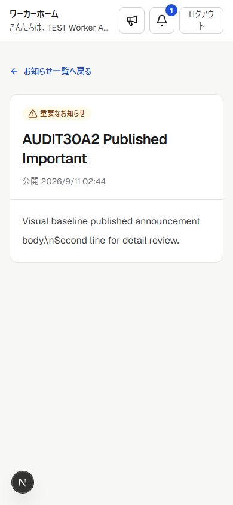

### SCR-W-005 — お知らせ詳細

- Route: `/worker/announcements/[announcementId]`
- State: safe unavailable
- Viewport: `390x844`
- Role: Worker
- Fixture: archived/foreign UUID
- Filename: `worker-announcement-unavailable-mobile.png`
- Priority: Conditional
- Status: **CAPTURED**

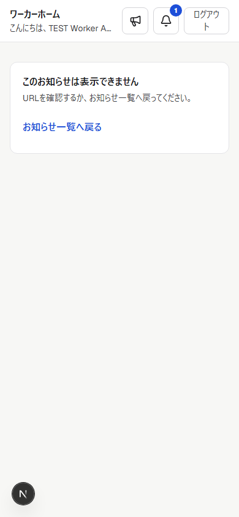

## Conditional States

Conditional 23件のうち22件を撮影した。唯一のgapは `admin-placement-conflict-desktop.png`。Required 28件は全件撮影済み。

## Capture Failures / Skips

- SKIPPED: 0
- BLOCKED: 1
- `admin-placement-conflict-desktop.png`: 上記の安全上の理由によりBLOCKED。

## Observed Runtime Findings

| Screen ID | Type | Observation |
| --- | --- | --- |
| all captured | Console | Application console errors observed during capture: 0 |
| all captured | React | React warnings observed during capture: 0 |
| all captured | Hydration | Hydration warnings observed during capture: 0 |

Priority評価やFigma比較は実施していない。スクリーンショットへのannotationも加えていない。

## File Integrity

- Planned filenames: 51
- Captured PNG files: 50
- Missing: 1 (documented BLOCKED)
- Unexpected: 0
- Duplicate filenames: 0
- Orphan debug screenshots: 0
- PNG signature failures: 0
- Dimension mismatches: 0
- Embedded captured images: 50 / 50

## Fixture Cleanup

Captureに使用したtemporary fixture:

- Day-of / Placement matrix
- Admin Incident states
- Worker Help Request states
- Worker Notification states
- AUDIT30A2 Announcement draft / published / archived roots, recipients, projection receipts, notifications

Cleanup結果:

- Day-of / Placement fixture total: 0
- Admin Incident fixture roots: 0
- Worker Help Request fixture roots: 0
- Worker Notification fixture roots: 0
- AUDIT30A2 Announcement roots / recipients / command receipts / projection receipts / notifications: 0
- Existing seed preserved: yes

## Handoff to AUDIT-3.0A-3

50枚の実装baselineはFigma mappingに利用可能。Placement conflictの1件は局所gapとして引き継ぐ。

- `AUDIT-3.0A-2: COMPLETE WITH CAPTURE GAPS`
- `AUDIT-3.0A-3: READY`
