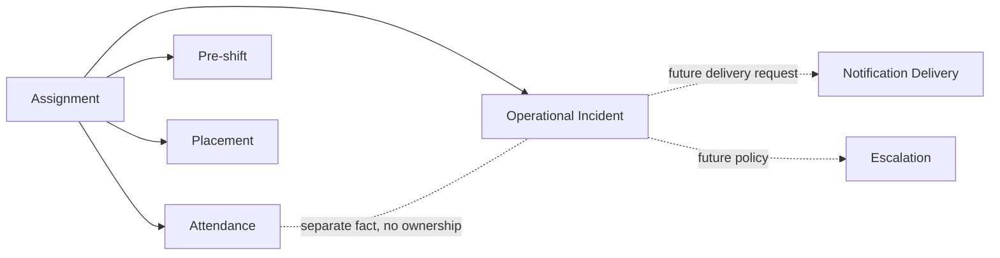

# Future Operations Domain Discovery v1

## 1. Executive Summary

Day-of Operations v1はAttendance、Assignment、Pre-shift、Placementの既存FactだけでFreeze済みである。Future Operationsの最初のDomainには、Assignment-centricな **Operational Incident / Help Request** を推薦する。Workerが「対応が必要な問題」を明示的に作成し、Managerが認知し、解決したFactを残せるため、Attendanceでは埋められない現在の最大Gapを直接解消する。

「SOS」は緊急専用のDomain名ではなく、Help Requestを起票する高視認性UI actionまたはcategoryとして扱う。AcknowledgementとResolutionはIncidentのlifecycle Factであり、Notification readとは分離する。Notificationはsource Domainの正本ではなくdelivery side effectである。EscalationはIncident + Notification + policyとして後続設計する。

ArrivalはAttendanceの勤務開始とは別Factになり得る。ただし初期DBには`attendance_events.arrive`等のlatent schemaがある一方、安全なwrite command、UI、運用定義がない。到着報告で管理者が行う具体的判断と確認方式が確定するまでLaterとする。GPS、continuous location、external notification、call logはMVPに含めない。

## 2. Current Domain Baseline

- Shift: 勤務予定時間、Job、Workplace、必要人数を所有する。
- Assignment: WorkerとShiftの関係およびassigned / confirmed / cancelled / absent / no_show / completedを所有する。
- Attendance: immutable raw eventとofficial recordを所有する。production write pathは勤務開始・勤務終了のnarrow RPCのみ。
- Pre-shift: Assignment単位の勤務可否、健康状態、予定起床・出発、commentを所有する。
- Placement: Shift plan、Position、Assignment segment、予定休憩、revisionを所有する。
- Worker / Profile: Worker identityとaccount roleを分離する。Workerに個人電話・emailは現行schema上存在しない。
- Contact: Branchに`phone` / `emergency_phone`、Workplaceに住所・地図・アクセス情報はあるが、誰へ何の目的で連絡するかを表すDomainはない。
- Communications / Notification: product table、route、action、delivery providerは存在しない。
- Latent check-in fields: 初期`attendance_events`はwake_up / depart / arriveと位置列を許容するが、現在のsafe RPC / UI / Day-of projectionは利用しない。これは完成Domainではない。

## 3. Figma Future Capability Inventory

| Capability | Figma evidence | Existing Fact | Classification |
| --- | --- | --- | --- |
| Arrival | Day-of / Drawerに到着、起床、出発 | latent attendance event only | UNCLEAR / domain definition required |
| SOS | Inbox、detail、Day-of priority card | none | NEW DOMAIN REQUIRED |
| Notification | broadcast、Push / LINE、delivery history | none | NEW DELIVERY DOMAIN, after source |
| Escalation | 未対応、経過時間、担当、優先度 | none | POLICY over Incident / Delivery |
| GPS | Day-of future copy、attendance location columns | no operational workflow | FUTURE, high privacy |
| Departure | Day-of future copy、latent depart event | planned departure exists in Pre-shift | UNCLEAR / likely check-in or travel concern |

Figma `109:2` / `110:2`はSOSと通常問い合わせ、未対応・対応中・解決、担当、時系列、連絡actionを描く。`116:2` / `117:*` / `118:2` / `119:2`は一斉通知、お知らせ、配信結果、閲覧を描くが、すべてBackend未実装と明記される。UIはvaluable hypothesisであり現在のDomain SOTではない。

### Figma Gap Table

| Figma Element | Existing Fact | Derived? | New Domain? | Candidate Owner |
| --- | --- | --- | --- | --- |
| 未出勤 / 遅刻 | Attendance + Shift | yes | no | Attendance |
| SOS受信 | none | no | yes | Operational Incident |
| 未対応 / 対応中 / 解決 | none | no | yes | Operational Incident lifecycle |
| 管理者通知 | none | no | yes | Notification Delivery |
| LINE返信 / 電話 | contact/provider未整備 | no | later | Communications action |
| 到着 | latent arrive event | not safely | definition required | Arrival candidate |
| 配信済み / 失敗 | none | no | yes | Notification Delivery |
| 既読 | none | no | yes | Notification Inbox / Delivery |
| お知らせ | none | no | yes | Announcement, not Incident |

## 4. Existing Domain Overlap

| Candidate | Existing Domain | Overlap | Missing Fact | New Domain Needed? |
| --- | --- | --- | --- | --- |
| Arrival | Attendance | assignment/time/source/location-shaped columns | arrival meaning, safe command, confirmation/correction | maybe; business decision first |
| SOS | Pre-shift | health concern may be reported before work | day-of help request and handling lifecycle | yes |
| Incident | Attendance | lateness/absence can be attention signals | reported operational problem, ack, resolution | yes |
| Notification | none / future Communications | UI concepts only | recipient delivery/read facts | yes, after source domain |
| Emergency Contact | Branch / Workplace / Worker | limited branch phone and workplace context | verified contact target/purpose | action may reuse; new data decision needed |
| Escalation | Incident | urgency and unacknowledged state | routing/timing policy and delivery attempt | not as standalone first domain |
| Location | Workplace / attendance columns | workplace coordinates and optional event position shape | consent, capture policy, retention, access | only if validated use case |

## 5. Terminology

- Attendance: 勤務開始・終了とofficial実働のFact。Arrivalを意味しない。
- Arrival: 指定された勤務場所または集合場所へ着いたという独立Fact。定義が確定するまでUI語に留める。
- Presence: ある時点で現場に存在するという継続的主張。単発Arrivalから導出できない。
- SOS: WorkerがHelp Requestを開始するUI actionまたは緊急category候補。単一booleanではない。
- Incident: 特定Assignmentを中心に、対応が必要な運用上の問題が報告されたFactとそのlifecycle。
- Acknowledgement: 権限ある担当者が対応対象として認識したFact。「画面を読んだ」とは異なる。
- Resolution: 問題への対応が終了したと判断したFact。通知配信成功とは異なる。
- Notification: source Domainの変化をrecipientへ知らせる要求またはin-app item。
- Delivery: channelへの送信試行と結果。
- Escalation: 条件に基づき担当・通知先・注目度を広げるpolicy/action。
- 「確認」: pre-shift回答、notification read、incident acknowledgement、admin confirmationを必ず修飾して区別する。

## 6. Candidate: Arrival / Presence

- Problem: 勤務開始前に「現場にはいるが打刻前」と「まだ来ていない」を区別したい可能性。
- Business fact: WorkerまたはManagerが、Assignmentに定義された集合地点へ到着したと報告／確認した。
- Actor: MVP候補はWorker self-report。Manager confirmationは別Factとして必要性を検証する。
- Relationship: Assignment単位が第一候補。WorkplaceだけではWorkerのその日の勤務と結び付かない。
- Attendance overlap: start_workは勤務開始、arrivalは場所到着。相互に自動生成せず順序制約も置かない。
- Confirmation: self-reportだけで業務判断可能かが未決。ackをIncidentと共通化しない。
- GPS: 不要でも成立する。GPS必須化はしない。
- Correction: hard deleteでなくretract/correctionを監査する候補。
- Audit: actor、server-received time、任意client time、sourceが必要。
- Security: Workerはown active Assignmentのみ。Managerはown branch read/confirm候補。anon/foreign branchは不可。
- Privacy: GPSを添付しない場合は中。precise location添付で高。
- Value: 開始未報告になる前の早期判断に使えるが、現行運用で誰がどのactionを取るか未確認。
- Recommendation: Later。既存`arrive`列をそのまま公開せず、business definitionとsafe commandを先に設計する。

Options: A Attendanceのみ（現状）、B Worker self-report、C self-report + Manager confirmation、D arrival時GPS補助、E geofence auto-arrival。現時点はAを維持し、需要確認後にBまたはCを再評価する。D/Eは非推薦。

## 7. Candidate: Operational Incident / SOS

- Problem: Attendance/Pre-shiftでは、集合場所不明、責任者不在、勤務継続困難、配置不明など「今、対応が必要」を表せない。
- Business fact: Actorが特定Assignmentに関する運用上のHelp Requestを作成した。
- Scope: MVPはAssignment必須。Shift / Worker / Project / WorkplaceはAssignmentから参照し、重複SOTにしない。
- Actor: Worker create、own-branch Manager read/ack/resolve。System Adminはaudit/support。automation createは後続。
- Lifecycle: 最小はopen → acknowledged → resolved、誤送信はretracted候補。大量のstatusを作らない。
- Acknowledgement: Incident内のappend-only Fact。最初の担当者の認知を記録し、同時ackはidempotentに扱う。
- Resolution: 必須。ackだけでは問題が終了したか分からない。
- Category: 小さな固定集合 + other候補だが、名称はbusiness確認が必要。Attendance/healthの詳細診断を複製しない。
- Severity: MVPの汎用low/medium/high/criticalは見送る。UIの「緊急Help」入口とcategory/経過時間で優先表示する。
- Message: optional bounded text候補。medical detailを求めないguidance、max length、閲覧scopeが必要。
- Audit: created / acknowledged / resolved / retractedのactorとserver timeを保持する。
- Idempotency: client-generated request keyをAssignment + actor boundaryで一意化する候補。
- Concurrency: ack/resolve commandはcurrent versionまたはexpected stateでstale transitionを拒否し、再試行は同じ結果を返す。
- Security: Workerはown Assignment create/read。Managerはown branch read/ack/resolve。System Adminはcross-branch read/actionを明示。anon/foreign managerは不可。
- Privacy: Worker identityとfree textを含む。健康詳細・連絡先・位置はMVPで収集しない。
- Day-of integration: unresolved Incident count/reasonを既存attentionへread-only統合。Attendance stateを書き換えない。
- Worker integration: Worker Homeまたはtoday Assignment detailに「助けを求める」と状態確認を置く。
- Recommendation: First Domain。

## 8. Candidate: Notification

- Business fact: 特定source eventを特定recipient/channelへ届ける要求・試行・結果。
- Source domain: Incident created / acknowledged / resolved、Shift change、Announcement等。
- Channel: MVP Incidentではin-app表示またはrefresh可能なread modelで開始可能。email / Push / SMS / LINEは別Phase。
- Delivery: requested / attempted / delivered / failedを必要になったchannelだけで持つ。
- Read: notificationを閲覧したFact。Incident acknowledgementとは別。
- Acknowledgement difference: ackは対応責任の認知、readは表示閲覧。
- Failure: delivery failureでIncident createをrollbackしない。
- External provider: provider、credential、retry、rate limit、delivery callbackが必要になるため後続。
- Realtime: first Incident MVPではmanual refreshまたはbounded pollingでよい。critical SLA要件が出ればRealtimeを再評価。
- Recommendation: Second。Incidentのsource factsが確立後、in-appから段階導入。external deliveryにはtransactional outboxを検討する。

## 9. Candidate: Emergency Contact / Call Log

- Existing contacts: Branch `phone` / `emergency_phone`のみ。Workplaceは住所・map/access note、Worker/Profileに電話・emailはない。
- Contact action: 既存の検証済み番号があれば`tel:` action自体に新Domainは不要。
- New domain needed: Worker本人、Workplace責任者、案件担当、緊急連絡先を区別するverified contact modelは別途必要。
- Call log: 誰が誰へいつ連絡し結果が何かを監査する要件が確定した場合のみIncident関連Factとして追加。
- Incident relationship: standalone電話帳よりIncident action/historyとしての価値が高い。
- Privacy: contact dataは高privacy。通話内容録音・監視は対象外。
- Recommendation: MVPでは追加しない。まずverified contact ownershipと閲覧権限をbusiness decisionにする。

## 10. Candidate: Escalation

- Definition: 未ack等の条件により対応対象・通知先・注目度を広げること。
- Domain vs policy: standalone SOTではなくIncident lifecycle + Notification delivery + policy。
- Trigger: category、明示緊急action、ack timeout等が候補だが数値SLAは未決。
- Timeout: 勝手に「5分」等を決めない。
- Automatic: MVPはmanual attention / assignmentで開始可能。
- Infrastructure: automatic化にはscheduler/queue/outbox/retry/observabilityが必要。
- Recommendation: Later。最初のIncident利用データと業務SLAを得てから設計する。

## 11. Candidate: GPS / Location

- Use case: 到着証明または現場誘導。continuous worker trackingは別問題。
- Precision: precise locationが本当に必要か未確定。Workplace登録地点との照合だけならcoarse/one-shot代替を評価する。
- Consent: explicit permission、拒否時fallback、収集タイミングの説明が必須。
- Retention: 未決。勝手な保持期間を定めない。
- Security: own Assignment action、branch-limited Manager read、purpose-limited System Admin accessが必要。
- Continuous tracking: 非推薦。
- Alternatives: GPSなし、arrival button、arrival時のみ任意位置、coarse location、continuous trackingの順で評価。
- Recommendation: Not Recommended Yet。Arrivalの価値が確定してもone-shot optionalから検討する。

## 12. Security

Operational Incident MVP候補のsecurity matrix:

| Actor | Create | Read | Acknowledge | Resolve | Correct |
| --- | --- | --- | --- | --- | --- |
| Worker | own active Assignment | own | no | no | retract own open候補 |
| Manager own branch | optional later | branch | yes | yes | audited correction only |
| Manager foreign branch | no | no | no | no | no |
| System Admin | policy次第 | cross-branch | yes | yes | audited correction |
| anon | no | no | no | no | no |

将来実装時はServer authorization + RLS + narrow commandを重ね、`TO authenticated`だけで許可しない。Worker identityは`workers.auth_profile_id`、Manager scopeは既存branch access、System Adminは`profiles.account_type`を正本にする。client入力のrole / branch / worker IDを信頼しない。

## 13. Privacy

| Candidate | Personal | Health | Location | Free text | Risk |
| --- | --- | --- | --- | --- | --- |
| Arrival | yes | no | optional | no | medium; high with GPS |
| Incident / SOS | yes | possible | no in MVP | optional | medium-high |
| Notification | yes | inherited | inherited | content | medium-high |
| Emergency Contact | yes | no | no | possible result | high |
| Escalation | yes | inherited | inherited | no | inherited |
| GPS | yes | no | precise | no | very high |

Incident messageにはmedical diagnosis、個人連絡先、不要な位置情報を入力させない。Manager一覧にはbounded summaryのみを表示し、詳細scopeを分離する。

## 14. Audit / Retention

- Assignment completed: Incident historyは保持し、read-onlyにする候補。
- Assignment cancelled: 過去Incidentを削除しない。create可否はactive statusで制約する。
- Shift cancelled: open Incidentを自動resolveしない。運用policyをOPENとする。
- Corrections: updateで痕跡を失わず、retract/correct eventを残す。
- Hard delete: operational audit factには原則提供しない。法的/privacy削除要件は別policy。
- Audit: actor、server time、source、transition前後、任意reason。
- Retention: Incident / free text / location / call logごとにbusiness・privacy reviewで決定。年数は未設定。

## 15. Realtime / Delivery

- Required now: Incident persistenceとack/resolutionの正確性が先。RealtimeはDomain成立条件ではない。
- Polling: Day-ofのbounded pollingはMVP候補。
- Supabase Realtime: SLAや同時利用要件が確認された場合に、RLS付きsubscriptionを別Phaseで評価。
- External delivery: provider失敗、callback、retry、credential管理が必要。
- Outbox: external deliveryではIncident transactionとdeliveryを分離するため採用候補。
- Deferred: Push / SMS / email / LINE、automatic escalation、delivery analytics。

## 16. Candidate Comparison Matrix

Scale: 1=low、5=high。Value/Gap/Testabilityは高いほど有利、Overlap/Complexity/Privacy/Dependencyは高いほどコストまたは重複が大きい。

| Candidate | Value | Gap | Overlap | Complexity | Privacy | Dependency | Recommendation |
| --- | ---: | ---: | ---: | ---: | ---: | ---: | --- |
| Arrival | 3 | 2 | 4 | 3 | 2 without GPS | 2 | Later |
| Incident / SOS | 5 | 5 | 1 | 3 | 3 | 1 | First |
| Notification | 4 | 4 | 1 | 4 | 3 | 5 external | Second, in-app first |
| Emergency Contact / Call Log | 3 | 3 | 2 | 4 | 5 | 3 | Later |
| Escalation | 4 | 3 | 5 | 5 | 3 | 5 | Later policy |
| GPS / Location | 2 | 2 | 2 | 5 | 5 | 4 | Not recommended yet |

Expanded decision matrix:

| Candidate | Operational Value | Gap | Overlap | Complexity | Privacy | Dependency | Testability | Priority |
| --- | ---: | ---: | ---: | ---: | ---: | ---: | ---: | --- |
| Arrival | 3 | 2 | 4 | 3 | 2 | 2 | 4 | Later |
| Incident / SOS | 5 | 5 | 1 | 3 | 3 | 1 | 5 | First |
| Notification | 4 | 4 | 1 | 4 | 3 | 5 | 3 | Second |
| Emergency Contact | 3 | 3 | 2 | 4 | 5 | 3 | 3 | Later |
| Escalation | 4 | 3 | 5 | 5 | 3 | 5 | 3 | Later |
| GPS | 2 | 2 | 2 | 5 | 5 | 4 | 2 | Not now |

## 17. Recommendation

First DomainはOperational Incident / Help Request。今必要なのは「Workerが困っている」というexisting Domainにない明示Factと、Managerが認知・解決した監査可能なlifecycleである。GPSや外部providerなしで独立して価値を出せ、Day-of attentionへ自然に統合できる。

Arrivalを先にしない理由は、既存Attendanceとの運用価値重複が大きく、到着の定義・actor・confirmationが未決だから。Notificationを先にしない理由は、届けるsource Factがまだないから。GPSを先にしない理由は、現行Gapに対してprivacyと実装負担が過大だから。

## 18. Recommended MVP

### Include

- Workerがown active AssignmentへHelp Requestを一件作成
- Assignment-centric relation
- 最小category（business decision後）
- optional bounded message（business decision後）
- open / acknowledged / resolvedの最小lifecycle
- created / acknowledged / resolved actor + server timestamp
- retry-safe idempotency key
- optimistic/concurrent transition guard
- Worker own read、Manager own-branch read/ack/resolve、System Admin audit
- unresolved IncidentをDay-of attentionへread-only統合
- Workerへack/resolvedの状態を表示

### Exclude

- SMS / email / Push / LINE
- GPS / attachments / call recording
- chat / arbitrary comment thread
- automatic escalation / SLA engine / scheduler
- generic severity scale
- Manager assignment/ownership workflow
- Arrival / Departure / Presence
- Announcement / broadcast / delivery analytics

## 19. Open Business Decisions

| ID | Question | Recommendation | Blocking | Reason |
| --- | --- | --- | --- | --- |
| OPS-01 | Worker SOSは何に紐づくか | active own Assignment必須 | BLOCKING NEXT PHASE | authorizationとhistorical contextの根幹 |
| OPS-02 | Manager acknowledgementは必要か | 必須 | BLOCKING NEXT PHASE | 未対応と認知済みを分ける価値が中核 |
| OPS-03 | Resolutionは必要か | 必須 | BLOCKING NEXT PHASE | Incidentをnotificationで終わらせないため |
| OPS-04 | Workerはresolvedを見られるか | 見られる | BLOCKING NEXT PHASE | feedback loopと問い合わせ重複防止 |
| OPS-05 | categoryは必要か | 3-5個の小集合 + other | BLOCKING NEXT PHASE | triageとprivacy guidanceに必要 |
| OPS-06 | free-textは必要か | optional / bounded | BLOCKING NEXT PHASE | valueとsensitive data riskの両方に影響 |
| OPS-07 | ArrivalはAttendanceと別に必要か | use-case検証までLater | NON-BLOCKING | Incident MVPと独立 |
| OPS-08 | Arrival actor | Worker self-report第一候補 | FUTURE | confirmation設計に影響 |
| OPS-09 | GPS必須か | 必須にしない | FUTURE | refusal fallbackとprivacy負担 |
| OPS-10 | Notification channel | in-app first | NON-BLOCKING | external providerを分離できる |
| OPS-11 | Notification readとIncident ack | 別Fact | NON-BLOCKING | business actionと閲覧を混同しない |
| OPS-12 | 自動escalationはMVPか | いいえ | NON-BLOCKING | SLA・scheduler根拠がない |
| OPS-13 | Emergency call history | MVPでは不要 | FUTURE | contact ownershipとretentionが未決 |
| OPS-14 | Shift cancel時のopen Incident | 自動resolveしない、業務確認 | BLOCKING NEXT PHASE | historyと対応責任に影響 |
| OPS-15 | Incident retention | business/privacy reviewで決定 | BLOCKING BEFORE PRODUCTION | free textの保持に影響 |

Discovery上の推薦は示したが、OPS-01〜06、14は次のdetailed designでbusiness ownerの承認が必要である。

## 20. Proposed Phase Roadmap

- DOMAIN-2.7B: Operational Incident / Help Request detailed design。lifecycle、category、message、historical rules、RLS/action matrixを確定。
- DB-2.7C: Incident core migration / RLS / GRANT / narrow commands / audit tests。
- UI-2.7D: Worker Help Request action + own status。
- UI-2.7E: Admin Incident monitor + Day-of read integration。
- DOMAIN-2.8A: Notification / Announcement boundary discovery。
- DB/UI-2.8B+: in-app notification、必要ならoutboxとexternal providerを段階導入。
- Later: Arrival business validation → GPSなしMVP評価 → optional one-shot location。

First: Incident / SOS。Second: in-app Notification。Later: Arrival、Emergency Contact、Escalation policy。Not Recommended Yet: GPS / continuous location、external delivery、Call Log。
