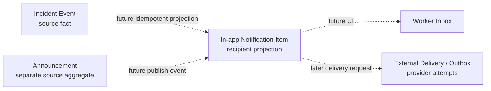

# Notification / Announcement Boundary Discovery v1

## 1. Executive Summary

NotificationはBusiness Domainの正本ではない。Incident、Shift、Assignment、AnnouncementなどのSource Domainで成立したimmutableなeventを、特定account recipientへ知らせるrecipient-facing projectionである。Notificationのreadは閲覧Factであり、Incident acknowledgementやresolutionを一切変更しない。

AnnouncementはAdminが作成・対象指定・公開する共有情報そのもので、独立したcontent aggregateである。NotificationはAnnouncementの公開を知らせることはできるが、Announcement本文や公開lifecycleの正本にはならない。

最初のMVPには、Worker本人向けのin-app Incident lifecycle notificationを推薦する。sourceは`operational_incident_events`の`acknowledged`と`resolved`、recipientはAssignmentのWorkerに結び付くauth profileである。Admin向けcreated通知は既存の`/admin/incidents`とDay-of attentionがあるためSecondとする。Announcement、external delivery、Realtime、preference、broadcastは別Phaseへ分離する。

点線はすべて候補または将来integrationであり、現行実装ではない。

## 2. Current Product Baseline

- Operational Incident / Help Request v1はWorker create、Admin discover/acknowledge/resolve、Worker state/history、Day-of attentionまでE2E Freeze済み。
- Adminは`/admin/incidents`とDay-ofからunresolved Incidentを発見できる。
- WorkerはAssignment detailでopen / acknowledged / resolved / retractedを確認できる。
- Notificationなしでもsource workflowは成立している。Notificationが改善するのはdiscoverability、状態変化への気付き、心理的確信、確認までの時間である。
- Notificationは便利だがIncident成立条件ではない。Incident成功をNotification失敗で取り消してはならない。

## 3. Existing Schema / Runtime Audit

repo内の`notification(s)`, `announcement(s)`, `notice(s)`, `message(s)`, `inbox`, `broadcast`, `delivery`, `push`, `email`, `line`, `read_at`, `seen_at`, `opened_at`をschema、route、action、component、scriptから検索した。

| Object | Result | Classification |
| --- | --- | --- |
| Notification table / RPC / RLS | なし | NOT IMPLEMENTED |
| Announcement table / RPC / RLS | なし | NOT IMPLEMENTED |
| Delivery / outbox table | なし | NOT IMPLEMENTED |
| Notification / announcement route | なし | NOT IMPLEMENTED |
| Push / Email / SMS / LINE provider | なし | NOT IMPLEMENTED |
| Realtime subscription | なし | NOT IMPLEMENTED |
| Incident `message` | optional bounded source content | ACTIVE INCIDENT DOMAIN; notificationではない |
| Figma Communications | visual/product hypothesisのみ | UI ONLY / FUTURE |
| Initial attendance `arrive`/location shape | notificationとは無関係 | LATENT, UNUSED |

既存Domainとの重複はない。新規設計時にもIncident event tableをdelivery queueとして直接更新・消費せず、append-only audit責務を保持する。

## 4. Figma Capability Inventory

### Figma Gap Table

| Capability | Node | Existing Fact | Classification |
| --- | --- | --- | --- |
| SOS / inquiry inbox | `109:2` | Incident queueのみ実装済み | PARTIAL VISUAL OVERLAP; generic inquiryは未実装 |
| SOS detail / admin notification | `110:2` | Incident detail/auditのみ | FUTURE UI; assignee、priority、LINE等は未実装 |
| Broadcast creation | `116:2` | なし | NEW DOMAIN REQUIRED |
| Announcement create/edit | `117:2`, `117:233` | なし | NEW SOURCE DOMAIN REQUIRED |
| Delivery/read history | `118:2` | なし | NEW DELIVERY DOMAIN REQUIRED |
| Announcement list | `119:2` | なし | NEW SOURCE DOMAIN REQUIRED |
| Notification / announcement nav | `602:86` | Help Request navのみ | FUTURE IA |
| Push / LINE | `116:2`–`119:2` | provider/account linkageなし | FUTURE EXTERNAL DELIVERY |

Figmaの件数、既読率、平均時間、配信成功、未読フォローはfake dataで、Backend contractには採用しない。

## 5. Terminology

- **Notification**: source eventをaccount recipientへ知らせるrecipient-facing object。
- **Notification Item**: in-app inboxに永続化される一人分の通知行。
- **Read / Unread**: recipientがitemを明示的に開いたか。業務処理状態ではない。
- **Announcement**: Admin-authored content、target、publish lifecycleを所有するsource aggregate。
- **Broadcast**: 一つのsource contentを複数recipientへ展開する操作。Announcementと同義ではない。
- **Delivery**: channelへの送信試行と結果。
- **Delivered**: provider/channelが定義する到達結果。readを意味しない。
- **Source Event**: source Domainが成立させたimmutable event。
- **Recipient**: notification itemを所有する認証account/profile。
- **Outbox**: source transaction後に非同期処理へ渡す耐久的なintegration event記録。
- **Realtime**: persisted Factを低遅延でclientへ伝えるtransport。正本ではない。

## 6. Notification vs Source Domain

Source Domainは「何が起きたか」を所有し、Notificationは「誰に知らせるitemを用意したか」を所有する。Notificationを削除・readにしてもsource eventは変わらない。source detailを開くときはsource DomainのRLSを再評価する。

Content候補は`notification_type + source_event_id + safe title/summary snapshot + source route`。毎回sourceからrenderする方式は現在情報には強いが、source削除・名称変更・権限変更で過去表示が不安定になる。free-form payloadはprivacyとschema driftを招く。MVPは小さなtyped snapshotを採り、Incident message全文は複製しない。

## 7. Notification vs Incident Acknowledgement

### Read vs Acknowledgement

| Property | Notification read | Incident acknowledgement |
| --- | --- | --- |
| Meaning | recipientが通知itemを開いた | AdminがHelp Requestを対応対象として認知した |
| Actor | item recipient | 権限あるManager / System Admin |
| Aggregate | Notification | Operational Incident |
| State effect | `read_at`初回設定のみ | open → acknowledged |
| Shared across managers | しない。個人recipient単位 | Incident全体に一回 |
| Resolution effect | なし | なし |

read、delivered、acknowledged、resolvedを相互に自動変換しない。

## 8. Notification vs Announcement

| Property | Notification | Announcement |
| --- | --- | --- |
| Source | 他Domainのevent | Admin-authored aggregate自身 |
| Author | system projection | Manager / System Admin |
| Recipient | account一人ごとのitem | publish target集合 |
| Content SOT | safe summary snapshotのみ | title/body/category/publish期間 |
| Read state | recipient itemごと | generated notification/read projection側 |
| Delivery | in-app item。externalは別 | publish後にnotification生成可能 |
| Lifecycle | unread → read | draft → scheduled/published → ended候補 |

AnnouncementはNotification MVPと同時に作らない。authoring、targeting、preview、schedule、revision、publish取消が独立した設計課題だからである。

## 9. Notification Item Candidate

- Recipient: `profiles.id`相当のaccount identity。Worker domain idやbranch shared inboxをrecipient SOTにしない。
- Source: immutable `operational_incident_events.id`を第一source keyとする。
- Duplicate prevention: source event + recipientに一件。
- Content: controlled notification type、短い安全なtitle/summary snapshot、source route。Incident message、health detail、連絡先、位置をコピーしない。
- State: delivery状態を混ぜず、`read_at IS NULL` / timestampのみ。
- Mutability: read transition以外はimmutable。source内容更新の追従はしない。
- Delete / archive: MVPなし。hard delete UIも提供しない。

## 10. Read / Unread Semantics

- Inboxの一覧に表示されただけではreadにしない。
- recipientがnotification itemを明示的に開いた時、またはそのitemのsource CTAを起動した時にreadとする。
- `read_at`はserver timeでfirst readのみ。複数tabの同時readは同じ結果へ収束させる。
- Source navigationに失敗してもnotification itemを開いたFactはreadとしてよい。source権限は別途再検証する。
- Mark unread、bulk read、既読取消はMVPに含めない。

## 11. Recipient Model

### Recipient Matrix

| Candidate | Ownership | Shared read | MVP | Reason |
| --- | --- | --- | --- | --- |
| Worker account | own profile | なし | YES | lifecycle結果を本人へ知らせる |
| Individual Manager account | own profile | なし | Second | Admin queueが既にある |
| Manager role | dynamic membership | 曖昧 | NO | 過去recipientが不安定 |
| Branch shared inbox | branch | shared state必要 | NO | Incident queueと重複 |
| System Admin | support/audit | 不要 | NO | notification本文閲覧を自動許可しない |

Auth未連携Workerはin-app recipientではないためskip / not applicableとする。Notification欠落でIncident transitionは失敗させない。将来accountが連携されても過去itemを自動生成するかはFUTURE。

## 12. Incident Integration

### Source Event Matrix

| Source Event | Recipient | Value | MVP |
| --- | --- | --- | --- |
| Incident created | Admin individualまたはshared queue | awareness短縮 | No; queue/Day-ofと重複 |
| Incident acknowledged | Assignment Worker account | 管理者が対応中だと気付ける | Yes |
| Incident resolved | Assignment Worker account | 対応完了を見逃さない | Yes |
| Shift changed | assigned Worker候補 | 高いがchange semantics未設計 | Later |
| Announcement published | target accounts | shared content discoverability | Separate Announcement phase |

- source keyはevent row ID。root IDだけではacknowledgedとresolvedを区別できない。
- recipientはevent/Incident → Assignment → Worker → auth profileをserver-sideで導出する。client payloadのrecipientを信頼しない。
- idempotent projectionによりreplayや二重実行でも一itemに収束させる。
- Admin created通知はSecond。Incident queueをbranch inbox代わりに保つ。

## 13. Announcement Candidate

- Business fact: Adminが対象者へ共有する情報を作成し、公開した。
- Author: own-branch ManagerまたはSystem Admin候補。境界は詳細設計で確定する。
- Target: 最初から全社・支店・案件・Shift・個人・role・tagを全部入れない。最初の候補はbranchまたは特定Shiftのどちらか一つ。
- Lifecycle: draft / published / endedの最小候補。schedule、revision、pin、re-notifyは別判断。
- Notification relation: publish eventからrecipient itemsを生成可能だが、Announcement本文と公開可否はAnnouncement側が正本。
- Recommendation: DOMAIN-2.9Aで独立設計。Notification 2.8に混在させない。

## 14. External Delivery

Email、Push、SMS、LINEはLater。provider、credential、opt-in/consent、rate limit、retry、idempotency、provider message ID、callback、bounce/failure、observability、lock-screen privacyが必要である。`requested / attempted / accepted / delivered / failed`等はchannel固有のdelivery attemptへ持たせ、Notification itemへ混ぜない。provider/productは今回選定しない。

## 15. Realtime

MVP必須ではない。Inbox navigation時のserver readとaction後refreshで正確性は成立する。bounded pollingも初期要件にしない。通知到達時間のSLO、バックグラウンド即時性、同時利用量が確認された時にRLS付きSupabase Realtimeをtransportとして評価する。Realtime eventを永続化の代用にしない。

## 16. Transaction / Outbox Boundary

- Incident commandはroot/event commitを正本として維持する。
- Notification生成失敗でIncident acknowledgement/resolutionをrollbackしない。
- 最初のin-app MVPは、immutable eventを入力にした**非同期可能なidempotent projection**を推薦する。Server Action後のbest-effort投影だけに依存せず、再走査/reconciliation可能にする。
- `operational_incident_events`をqueueとしてclaim/updateしない。audit tableはsource readに限定する。
- exactly-once deliveryは要求しない。at-least-once processing + `(source_event_id, recipient_profile_id)` uniquenessでobservable itemをeffectively-onceにする。
- External delivery、retry、provider callbackを導入する時点でseparate transactional outbox / delivery attemptを追加する。In-app itemだけのMVPにprovider outboxを先行導入しない。

## 17. Security

### Security Matrix

| Actor | Read | Mark Read | Create | Delete | Admin Inspect |
| --- | --- | --- | --- | --- | --- |
| Worker | own accountのみ | own unreadのみ | no | no | no |
| Manager | MVPではnone | none | no client create | no | default no |
| System Admin | default none | none | no client create | no | explicit support要件が出た時だけ |
| anon | no | no | no | no | no |
| trusted projection | derived recipientへのみ | no | narrow command | no | n/a |

将来tableがData APIへ露出される場合はGRANTとRLSを別々に設計する。`TO authenticated`だけでは不可。creationはclient direct INSERTを許さず、source eventとrecipientを検証・導出するnarrow server/DB commandとする。IDOR、foreign recipient、recipient差替え、source route権限を必須テストにする。

## 18. Privacy

### Privacy Matrix

| Data | Notification | Announcement | External Delivery | Risk |
| --- | --- | --- | --- | --- |
| Worker identity | recipient自身に必要最小限 | target生成で使用 | address/channelに必要 | medium |
| Incident category | generic copy候補 | 原則なし | lock screen露出注意 | medium |
| Incident message | コピーしない | なし | 送らない | high |
| Health detail | コピーしない | authoring規約必要 | lock screen禁止候補 | high |
| Location | コピーしない | 必要時はWorkplace情報のみ | provider漏洩リスク | high |
| Contact | item本文に保存しない | 原則なし | channel addressはdelivery側 | high |
| Announcement body | sourceに保持 | SOT | channel用safe snapshot候補 | medium-high |

Notification titleは「Help Requestへの対応が開始されました」「Help Requestが解決されました」程度に留める。source linkは毎回source RLSを再評価し、URL保持だけでアクセスを許可しない。

## 19. Retention

- Notification itemと`read_at`は当面同じ期間保持する候補。
- recipient hard delete/archive UIはMVPなし。法的削除は別policy。
- exact retention期間はproduction前のbusiness/privacy decision。local DB core detailed designを始めるblockerではないが、production rollout gateである。
- sourceがretentionや権限変更で見えなくなった場合、safe snapshotは残しCTAを利用不能として扱う。

## 20. Candidate Decision Matrix

Scale: 1=low、5=high。Value/Gap/Testabilityは高いほど有利、Complexity/Privacy/Infra/Dependencyは高いほど負担。

| Candidate | Value | Gap | Complexity | Privacy | Infra | Dependency | Testability | Recommendation |
| --- | ---: | ---: | ---: | ---: | ---: | ---: | ---: | --- |
| Worker Incident Notification | 5 | 4 | 2 | 2 | 2 | 1 | 5 | First MVP |
| Admin Incident Notification | 3 | 2 | 3 | 3 | 2 | 2 | 4 | Second |
| Generic Notification Infra | 3 | 3 | 4 | 3 | 3 | 4 | 3 | Scope narrowly in 2.8B |
| Announcement | 4 | 4 | 5 | 3 | 3 | 3 | 3 | Separate 2.9A |
| External Delivery | 4 | 3 | 5 | 5 | 5 | 5 | 2 | Later |
| Realtime | 2 | 1 | 3 | 3 | 3 | 3 | 3 | Not now |

## 21. Recommended First MVP

- Domain: recipient-owned in-app Notification Item。
- Recipient: Assignment Workerのlinked account一人。
- Source events: Incident acknowledged / resolvedのみ。
- Why: source event、recipient、source routeが既に確定し、Workerの状態変化見逃しを最小scopeで減らせる。
- Why now: Help Request lifecycleがE2E Freezeし、delivery projectionがsource SOTを侵食せず追加できる。
- Why not Admin first: `/admin/incidents`とDay-of attentionが既にcanonical discoveryを提供する。
- Why not Announcement: content/publish/target lifecycleが別Aggregate。
- Why not External: provider・credential・retry・privacyが未決。
- Why not Realtime: transportはpersistence/read semanticsの成立条件ではない。

### MVP Include

- own-account inbox
- typed acknowledged / resolved notification
- immutable incident event reference
- safe title/summary snapshot
- server-derived recipient
- source route
- created timestamp / first `read_at`
- idempotent projection and duplicate prevention
- own-recipient RLS and narrow mark-read command
- source inaccessible / recipient missing / concurrent read tests

### MVP Exclude

- Incident created Admin notification
- Push / Email / SMS / LINE
- Announcement authoring / broadcast / targeting
- preference center
- mark unread / bulk read / delete / archive
- attachments / rich HTML
- delivery state / analytics / SLA
- Realtime / polling
- external provider / escalation

### Failure Modes

| Scenario | Expected |
| --- | --- |
| duplicate source event processing | unique source event + recipientで一item、replay success |
| recipient missing | skip/not applicable。source transactionは成功維持 |
| concurrent read | first server timestampへ収束、replay success |
| source inaccessible | safe summary表示、CTAは権限エラーを安全表示 |
| generation failure | sourceをrollbackせず再投影可能にする |
| privacy-sensitive source | free textをsnapshotへコピーしない |
| foreign recipient access | RLS + command authorizationでnot found相当 |

## 22. Explicit Exclusions

DB/UI implementation、Migration、RLS、GRANT、RPC、trigger、Auth変更、Notification provider、Push、Email、SMS、LINE、Realtime、Announcement実装、broadcast、preference、escalation、SLA、delivery analytics、rich contentを行わない。

## 23. Open Business Decisions

### Open Decisions

| ID | Question | Recommendation / Decision | Classification |
| --- | --- | --- | --- |
| NOTIF-01 | First recipient | Worker own account | BLOCKING NEXT DB PHASE: DECIDED |
| NOTIF-02 | First source | Incident acknowledged / resolved event | BLOCKING NEXT DB PHASE: DECIDED |
| NOTIF-03 | Admin created通知 | MVP不要、Secondで実測評価 | NON-BLOCKING |
| NOTIF-04 | Worker ack通知 | MVPに含める | BLOCKING NEXT DB PHASE: DECIDED |
| NOTIF-05 | Worker resolved通知 | MVPに含める | BLOCKING NEXT DB PHASE: DECIDED |
| NOTIF-06 | read timing | item openまたはsource CTA activation | BLOCKING NEXT DB PHASE: DECIDED |
| NOTIF-07 | mark unread | 不要 | NON-BLOCKING |
| NOTIF-08 | delete/archive | MVP不要 | NON-BLOCKING |
| NOTIF-09 | Announcement同Domainか | 別source aggregate | BLOCKING NEXT DB PHASE: DECIDED |
| NOTIF-10 | Announcement targeting | 2.9Aでbranch対Shiftを決定 | FUTURE |
| NOTIF-11 | Realtime | MVP不要 | NON-BLOCKING |
| NOTIF-12 | External delivery | MVP外 | NON-BLOCKING |
| NOTIF-13 | source atomicity | source優先、非rollback、idempotent projection | BLOCKING NEXT DB PHASE: DECIDED |
| NOTIF-14 | Outbox | in-app MVP不要、external delivery時に導入 | NON-BLOCKING |
| NOTIF-15 | Auth未連携Worker | notification対象外、source成功維持 | BLOCKING NEXT DB PHASE: DECIDED |
| NOTIF-16 | Retention | production前に決定 | NON-BLOCKING OPEN |

次DB Phaseを阻害するbusiness decisionは残っていない。exact retentionだけが非blocking openである。

## 24. Proposed Roadmap

1. **DOMAIN-2.8B**: Worker In-app Notification detailed design。item/read schema、projection command、RLS、idempotency、reconciliationを確定。
2. **DB-2.8C**: Notification core persistence / narrow commands / local security tests。
3. **UI-2.8D**: Worker Notification Inbox / unread badge / mark read / source navigation。
4. **INT-2.8E**: Incident event projection integration、failure/replay E2E Freeze。
5. **DOMAIN-2.9A**: Announcement aggregate / targeting / publish lifecycleを独立設計。
6. **Later**: Admin notificationの価値計測後、external delivery + outbox、provider、Realtimeを必要要件に応じて設計。

DOMAIN-2.8A: COMPLETE WITH NON-BLOCKING OPEN DECISIONS
