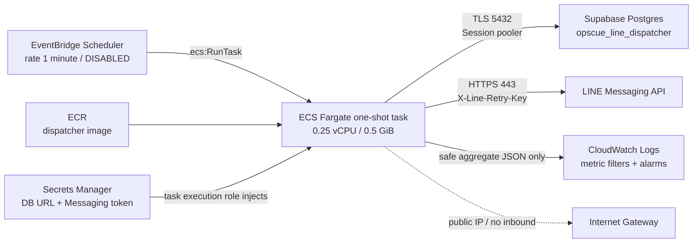

# OCV1-07C2-05 — AWS Trusted LINE Dispatcher Result

Status: `IMPLEMENTED / NOT DEPLOYED`

This phase adds a deployable but deliberately disabled AWS foundation. No AWS resource, remote database, or real LINE endpoint was changed or invoked.

## Changed files

- `infra/bin/opscue-line-delivery.ts`, `infra/lib/opscue-line-delivery-stack.ts`, `infra/cdk.json`: CDK application and stack.
- `infra/test/opscue-line-delivery-stack-test.ts`: synthesized-template safety assertions.
- `Dockerfile.line-dispatcher`, `scripts/build-line-dispatcher.mjs`, `scripts/line-delivery-dispatcher.ts`: production one-shot image and bounded entry point.
- `lib/line/delivery-db.ts`, `lib/line/dispatcher.ts`, `lib/line/dispatcher-core.ts`, `lib/line/push.ts`, `lib/line/push-core.ts`: C2-04 adapter/runtime reused by the container, with TLS/session-pooler and aggregate result support.
- `scripts/integration/worker-line-dispatcher-container-test.mjs`, `scripts/integration/worker-line-push-adapter-test.ts`: provider mock and local container/security verification.
- `supabase/migrations/20260929155711_ocv1_line_delivery_dispatcher_role.sql`: dedicated LOGIN role and claim/finalize-only authority from C2-04.
- `package.json`, `package-lock.json`: CDK/build/runtime dependencies and commands.
- This result document.

## Architecture and data flow

The Scheduler may only run the exact task definition on the exact cluster. The ECS execution role pulls the exact repository image, retrieves the two exact secrets, and writes the exact log group. The application task role intentionally has no AWS API permissions. The security group has no ingress and permits only outbound TCP 443, TCP 5432, and VPC DNS.

The one-shot process checks `LINE_DELIVERY_ENABLED` before loading DB/provider configuration. Its default is `false`; when false it emits one safe disabled record and performs zero claims and zero provider calls. When enabled, one run claims at most 4 deliveries (hard maximum 20), uses an 8-second provider timeout and a 55-second process watchdog, then exits. Scheduler retry is limited to one retry and a 120-second event age.

## Supabase connection and effective authority

- Secret `opscue/line/dispatcher/database-url` must contain the Supabase shared **Session mode** pooler URL on port 5432 for the dedicated LOGIN role. For a custom role the username must use the provider-required role/project reference form; the exact production host, project reference, password, and URL remain deployment inputs.
- The driver uses TLS `verify-full`; production has no switch that disables certificate verification. The only insecure setting is test-only, gated by both `NODE_ENV=test` and `OPSCUE_ALLOW_INSECURE_LOCAL_DISPATCHER_DB=true` for the local Supabase container test.
- Every command opens a transaction and executes `SET LOCAL ROLE opscue_line_dispatcher` before the existing private claim/finalize RPC. The role has no table DML and only the two RPC EXECUTE grants established in C2-04.
- `prepare: false` preserves pooler compatibility. Session mode was selected because the one-shot connection and role semantics do not rely on transaction-pooler behavior.

Before C2-06, production must prove that a connection authenticated as the dedicated role can run both RPCs through the selected pooler while direct private/public table access remains denied.

## IAM and secrets

| Principal | Allowed authority |
| --- | --- |
| Scheduler role | `ecs:RunTask` for the exact task definition/cluster; `iam:PassRole` only for the two ECS roles and only to `ecs-tasks.amazonaws.com` |
| Task execution role | ECR authorization and pull for the exact repository; read the two exact Secrets Manager ARNs; write the exact log group |
| Task role | No AWS API permissions |

Secret resources are declared without `SecretString` or generated values. Populate them only after account/region/project decisions:

1. `opscue/line/dispatcher/database-url`
2. `opscue/line/messaging-channel-access-token`

The LINE Login access token is never used. Neither secret, the LINE destination ID, notification body, nor provider response body is logged.

## Observability

CloudWatch retains dispatcher logs for 30 days. Logs contain aggregate counters and controlled failure categories only. Alarms cover:

- provider authentication failures (401/403 classification),
- three consecutive failed dispatcher runs,
- Scheduler target errors,
- dropped Scheduler invocations.

No alarm action/SNS destination is assumed; the production account owner must select it before canary activation. ECS Container Insights is enabled for task-start/runtime evidence.

## Cost drivers (planning estimate)

The design has no NAT Gateway or load balancer. At a one-minute cadence there are about 43,200 task starts in a 30-day month. If every task consumes the full 55-second watchdog, the upper planning envelope is about 660 task-hours, or 165 vCPU-hours plus 330 GiB-hours at the configured task size. Actual Fargate cost follows real task duration and Tokyo Linux/x86 rates.

Other material items are ECR image storage/scanning, two Secrets Manager secrets (published base price is USD 0.40 per secret-month plus API calls), CloudWatch log ingestion/storage, Container Insights, four alarms, and public IPv4/data-transfer charges. Scheduler's 43,200 monthly invocations are below the published 14 million invocation free tier, subject to the AWS account's eligibility and aggregate usage. Final currency estimate must be produced in AWS Pricing Calculator with the target account, Tokyo prices, observed task duration, log volume, and public IPv4 policy.

## Verification evidence

| Check | Result |
| --- | --- |
| CDK synth, `ap-northeast-1` | PASS |
| CDK assertions: disabled schedule, public IP, no NAT/ingress, roles, secrets without values, alarms | PASS |
| Production multi-stage Docker build | PASS |
| Container disabled gate: zero DB claim and zero provider call | PASS |
| Container mock: claim → LINE-shaped push → finalize | PASS |
| Stable retry key and controlled message/URL | PASS |
| Dedicated container fixture cleanup | PASS, remainder 0 |
| C2-04 push adapter | PASS, 26 assertions |
| C2-03 claim/lease/finalize | PASS, 38 assertions |
| C2-02 persistence/enqueue | PASS, 16 assertions |
| C1 identity/consent | PASS, 44 assertions |
| C1 boundary/source | PASS, 18 assertions |
| Reminder evaluator | PASS, 28 assertions |
| Trusted reminder invocation | PASS, 22 assertions |
| Notification domain | PASS, 40 assertions |
| Focused ESLint | PASS |
| `npx tsc --noEmit` | PASS |
| Next.js production build | PASS |
| Local Supabase DB lint | PASS, 0 issues |
| Local Supabase security advisor | PASS, 0 issues |

No real LINE request, AWS deployment, or remote DB query was made.

## C2-06 canary checklist

1. Confirm AWS account ID, CDK bootstrap state, deployment owner, billing alarms, and `ap-northeast-1` availability.
2. Confirm the production OpsCue origin and replace the deliberately invalid placeholder.
3. Create/rotate the dedicated DB role password through an approved remote migration/runbook; do not reuse an application or postgres credential.
4. Build the Session pooler URL with the confirmed project reference and role username, then verify TLS hostname/certificate and RPC-only effective privileges from a disposable trusted client.
5. Populate the two Secrets Manager values outside CloudFormation; inspect ECS task-definition output and logs for absence of values.
6. Build, scan, and push an immutable image tag/digest; replace `c2-05-placeholder` in an approved deployment input before task execution.
7. Keep the Scheduler `DISABLED` and `LINE_DELIVERY_ENABLED=false`; run one manual ECS task and confirm the disabled log plus zero DB/provider activity.
8. Select one consented, linked, available test Worker and one newly-created reminder Notification; verify no unrelated pending delivery is claimable.
9. Temporarily deploy a canary task definition with `LINE_DELIVERY_ENABLED=true`, batch size 1, and a hard one-task operator window. Run it manually, not through Scheduler.
10. Confirm one LINE delivery, one immutable attempt result, stable retry key, Notification unread state unchanged, and no Journey/Attendance/Attention mutation.
11. Test controlled provider failure/retry without exceeding the canonical attempt schedule. Inspect alarms/log redaction and restore the flag to false.
12. Only after written canary acceptance should a separate phase enable the Scheduler. Enabling it is explicitly outside C2-05.

## Unresolved deployment inputs

- AWS account, CDK bootstrap qualifier, deployment pipeline, alarm action/SNS destination, and tagging/cost-allocation standard.
- Exact Supabase project reference, session-pooler hostname, dedicated role password lifecycle, and whether the production plan/account permits the required concurrent session behavior.
- Production OpsCue origin, immutable ECR image tag/digest policy, and whether public IPv4 charges or organization SCPs alter the design.
- LINE token rotation owner and emergency disable procedure.
- Dependency security gate: `npm audit --omit=dev` currently reports a critical advisory for the repository's existing Next.js 16.3.1 and a high advisory in transitive `sharp`. C2-05 did not change product framework versions; production promotion requires a separately reviewed upgrade (the audit currently proposes Next.js 16.3.7) and full regression.

## Explicit non-changes

No Scheduler was enabled; no secret value was registered; no AWS resource was created or changed; no remote database was touched; no real LINE send occurred. Notification read state, C1 identity/consent, Journey, Attendance, Attention, canonical reminder eligibility, retry semantics, and existing dirty worktree/log files were not reinterpreted or removed.
