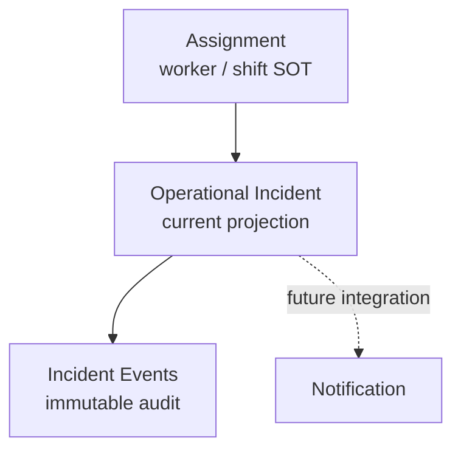
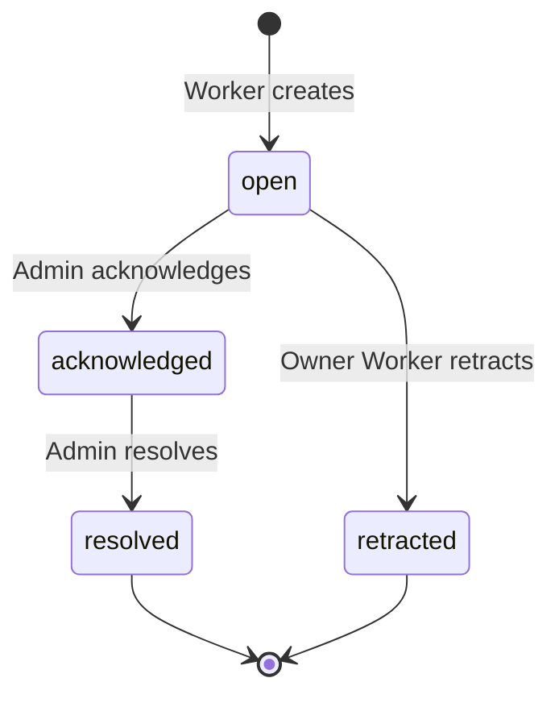

# Operational Incident / Help Request Domain Design v1

Status: **PROPOSED / IMPLEMENTATION READY**  
DB implementation: **Not implemented**

## 1. Executive Summary

Operational Incident は、Worker が自分の特定 Assignment について、Manager の対応を必要とする運用上の問題を明示的に報告した Fact である。ユーザー向けの主概念は「Help Request / 助けを求める」とし、SOS は Domain root、状態、severity にしない。

MVP は Assignment を親とする現在状態 projection と append-only audit event で構成する。Worker だけが作成し、Manager または System Admin が acknowledge 後に resolve する。誤送信は Worker が open の間だけ retract する。DB-2.7C を止める Business Decision は残っていない。

## 2. Business Decisions Freeze

- Incident は Assignment 必須で、Worker 自身の `assigned | confirmed` Assignment にだけ作成できる。
- Shift が `cancelled` の場合、新規作成できない。任意の時刻 window は設けない。
- 1 Assignment の unresolved Incident は最大1件。unresolved は `open | acknowledged`。
- category は必須の固定5種、message は任意・正規化後最大500文字。作成後は編集しない。
- acknowledge と resolve は必須。`open -> resolved`、reopen、任意状態更新は禁止する。
- Worker は自身の `open | acknowledged | resolved | retracted` を読め、own `open` だけ retract できる。
- Assignment/Shift の後続状態変化で Incident を自動終了・削除しない。
- Manager ownership、Manager/System Admin による作成、resolution note は持たない。

## 3. Terminology

- **Operational Incident**: 内部 Domain 名。管理対応を必要とする Assignment 単位の報告 Fact。
- **Help Request / 助けを求める**: Worker 向け主概念と primary action。
- **SOS**: 将来の高視認性 presentation または urgent entry 候補。永続 Domain 名や severity ではない。
- **Acknowledgement**: 権限ある Admin が対応対象として認識した Fact。通知の既読ではない。
- **Resolution**: acknowledged Incident の対応完了 Fact。
- **Retraction**: Worker による、未 acknowledge の誤送信取消 Fact。削除ではない。
- **Admin**: 本書の lifecycle 文脈では、許可された Manager または System Admin。

## 4. Business Fact

Incident は「Worker が、自分の特定 Assignment について、管理者による対応が必要な運用上の問題を明示的に報告した」ことを表す。Attendance、健康記録、位置情報、問い合わせスレッド、通知ではない。category が `schedule_transport` や `health_safety` でも他 Domain の状態は変更しない。

## 5. Aggregate Boundary

Aggregate root は `operational_incidents`、lifecycle audit は `operational_incident_events`。Worker、Shift、Project、Job、Workplace、Branch は Assignment から辿り、root に重複保存しない。actor の正本は event とし、root に `acknowledged_by` や `resolved_by` を置かない。

## 6. Creation Eligibility

作成者は active profile に結び付いた active Worker に限る。`auth.uid() -> profiles.id -> workers.auth_profile_id` をサーバー側で解決し、payload の actor/worker は信用しない。

作成には次をすべて要求する。

- Assignment が存在し、現在の Worker 自身に属する。
- Assignment status が `assigned` または `confirmed`。
- 親 Shift status が `cancelled` ではない。
- 同じ Assignment に unresolved Incident がない。

`completed | cancelled_by_worker | cancelled_by_company | absent | no_show` は不適格。既存の generic active projection は流用しない。Shift 前日・移動中の需要を妨げないため時刻制限は設けない。

## 7. Categories

| Code | Label | Purpose | Must Not Do |
| --- | --- | --- | --- |
| `site_access` | 現場・集合場所 | 集合場所、入口、現場担当者の所在 | GPSやArrival Factを保存しない |
| `assignment_instruction` | 配置・業務指示 | 担当場所、作業、配置指示の不明点 | PlacementやAssignmentを変更しない |
| `schedule_transport` | 時間・移動 | 交通遅延、到着困難、移動上の問題 | Attendance状態を変更しない |
| `health_safety` | 体調・安全 | 勤務継続困難、安全上の問題 | 診断・病名を求めず健康記録化しない |
| `other` | その他 | 上記に収まらない運用Help | 汎用問い合わせ・chatに拡張しない |

generic severity は持たない。優先表示は category、state、経過時間、UI entry から導出する。

## 8. Message / Privacy

`message` は任意。サーバーで trim し、空文字は `NULL`、非NULLは `char_length <= 500` とする。repo に共通の短文 operational message 上限がないため500文字を固定する。category/message は作成後不変で、訂正は retract 後の新規作成とする。

UI は必要最小限の状況だけを求め、病名等の詳細医療情報、個人電話番号、private address、不要な位置情報、password/credential を入力しないよう案内する。返信、comment、chat thread は作らない。

## 9. Lifecycle

初期状態は `open`。terminal は `resolved | retracted`。reopen、`open -> resolved`、acknowledged 後の retract、Manager retract、任意 correction を禁止する。

## 10. Lifecycle Transition Matrix

| From | Command | Actor | To | Version |
| --- | --- | --- | --- | --- |
| none | create | own active Worker | `open` | `0 -> 1` |
| `open` | acknowledge | branch Manager / System Admin | `acknowledged` | `n -> n+1` |
| `acknowledged` | resolve | branch Manager / System Admin | `resolved` | `n -> n+1` |
| `open` | retract | owner Worker | `retracted` | `n -> n+1` |

表にない遷移はすべて `STATE_CONFLICT`。最初の acknowledge だけが成功し、ack actor と resolve actor は異なってよい。

## 11. Historical Behavior

作成後に Assignment が `completed | cancelled_by_worker | cancelled_by_company | absent | no_show` になっても root/events を保持する。Shift が `cancelled` になっても同様である。自動 resolve/retract/delete は行わない。

own open Incident の Worker retract は Assignment/Shift が後から inactive/cancelled でも許可する。Manager/System Admin は既存 open を acknowledge、acknowledged を resolve できる。Worker は terminal を含む own history を読める。

## 12. Aggregate Data Model Candidate

`public.operational_incidents`:

| Field | Candidate type / rule |
| --- | --- |
| `id` | `uuid primary key default gen_random_uuid()` |
| `assignment_id` | `uuid not null`, Assignment FK, `on delete restrict` |
| `category` | `text not null`, fixed check |
| `message` | nullable text, normalized, max 500 |
| `state` | `text not null default 'open'`, fixed check |
| `version` | `bigint not null default 1`, `>= 1` |
| `created_at` | `timestamptz not null default now()` |
| `acknowledged_at` | nullable server timestamp |
| `resolved_at` | nullable server timestamp |
| `retracted_at` | nullable server timestamp |
| `updated_at` | `timestamptz not null default now()` |

Index candidates: partial unique on `assignment_id WHERE state IN ('open','acknowledged')`; Admin unresolved read on `(state, created_at, id)`; Assignment history on `(assignment_id, created_at desc, id)`.

## 13. Audit Event Model Candidate

`public.operational_incident_events`:

| Field | Candidate type / rule |
| --- | --- |
| `id` | `uuid primary key default gen_random_uuid()` |
| `incident_id` | `uuid not null`, root FK, `on delete restrict` |
| `event_type` | `created | acknowledged | resolved | retracted` |
| `actor_profile_id` | `uuid not null`, profile FK, `on delete restrict` |
| `version_from` / `version_to` | bigint, `version_from >= 0`, `version_to = version_from + 1` |
| `idempotency_key` | trimmed bounded opaque text, max 128 |
| `request_snapshot` | accepted canonical fields only |
| `created_at` | `timestamptz not null default now()` |

Unique candidates are `(incident_id, version_to)` と `(actor_profile_id, idempotency_key)`。events は lifecycle/audit と idempotency receipt を兼ねるが、汎用 Event Sourcing は行わない。

## 14. Constraints

- Root category/state checks、`version >= 1`、message の trim済み非空/500文字、state timestamp 整合をDBで保証する。
- Timestamp: `open` は lifecycle timestamp 全NULL、`acknowledged` は acknowledged のみ非NULL、`resolved` は acknowledged/resolved が非NULLかつ `resolved_at >= acknowledged_at`、`retracted` は retracted のみ非NULL。
- `created_at <=` 各 lifecycle timestamp、`updated_at >= created_at`。
- partial unique により unresolved は Assignment 当たり最大1件。
- Event type と遷移を対応させ、created は `0 -> 1`、他は root version を1増加させる。
- root/event の direct INSERT/UPDATE/DELETE は拒否し、成功 command は同一transactionで root insert/update と event 1件 append を行う。

## 15. Idempotency

全 mutation で trim済み1〜128文字の opaque `idempotency_key` を必須とし、UI は `crypto.randomUUID()` を使える。scope は event 全体の `(actor_profile_id, idempotency_key)`。

`request_snapshot` は command 名と受理済み canonical fields だけを格納する。create は assignment/category/normalized message、transition は incident/expected version。任意 client JSON、secret、端末情報は保存しない。

同一 actor/key/snapshot は元の成功結果を replay し、root/event/version を増やさない。同一keyで異なる snapshot は `IDEMPOTENCY_CONFLICT`。認可対象をlock/確認した後、stale version 判定より前に replay を判定する。過去に成功していない失敗は receipt として保存しない。

## 16. Concurrency

Command は actorを確定し、対象関係を一定順序で lock する。候補順は Assignment、Shift、Incident root、既存 idempotency event。実装時はquery planに依存しない明示的な順序と concurrent integration test で deadlock safety を確定する。

- create race: Assignment/Shift をlockし、partial uniqueを最終防御とする。1件だけ成功し、敗者は `ACTIVE_INCIDENT_EXISTS`。
- acknowledge race: 同じ expected version の1件だけ成功し、敗者は `VERSION_CONFLICT` または再読後 `STATE_CONFLICT`。
- retract vs acknowledge: 同じ root lock/versionで直列化し、1件だけ成功。
- resolve race/stale update: expected version一致時だけ成功。
- response loss: 同一 key/snapshot の再送で成功結果を replay。

## 17. Command Contracts

すべて typed parameter の narrow RPC とし、generic transition RPC や generic JSON payload は作らない。actor は常に `auth.uid()` から解決する。

### Create

`create_operational_incident(p_assignment_id uuid, p_category text, p_message text, p_idempotency_key text) -> jsonb`

own active Worker、create eligibility、category/message、Shift、unresolved有無を検証する。Assignment/Shiftをlockし、root `version=1/state=open` と `created 0->1` event を原子的に作成する。成功結果は `ok, incident_id, state, version, event_id, replayed`。

### Acknowledge

`acknowledge_operational_incident(p_incident_id uuid, p_expected_version bigint, p_idempotency_key text) -> jsonb`

branch Manager/System Admin、`open`、versionを検証する。rootを `acknowledged` に更新し server timestamp を設定、eventを1件追記する。

### Resolve

`resolve_operational_incident(p_incident_id uuid, p_expected_version bigint, p_idempotency_key text) -> jsonb`

branch Manager/System Admin、`acknowledged`、versionを検証する。rootを `resolved` に更新し server timestamp を設定、eventを1件追記する。resolution note はない。

### Retract

`retract_operational_incident(p_incident_id uuid, p_expected_version bigint, p_idempotency_key text) -> jsonb`

作成元 Assignment の owner Worker、`open`、versionを検証する。現在の Assignment/Shift status は再適格性条件にせず、rootを `retracted` に更新してeventを追記する。

## 18. Error Contract

| Code | Meaning | Write result |
| --- | --- | --- |
| `INVALID_INPUT` | null、型/長さ/形式、key、versionが不正 | 0 writes |
| `NOT_FOUND` | actorに開示可能な対象が存在しない | 0 writes |
| `FORBIDDEN` | 認証済みだがrole/scope/ownership不許可 | 0 writes |
| `ASSIGNMENT_NOT_ELIGIBLE` | own Assignmentだがcreate対象状態でない | 0 writes |
| `SHIFT_CANCELLED` | own create対象の親Shiftがcancelled | 0 writes |
| `ACTIVE_INCIDENT_EXISTS` | 新規keyでunresolvedが既にある | 0 writes; safeな既存incident idは返却可 |
| `INVALID_CATEGORY` | 固定5種以外 | 0 writes |
| `VERSION_CONFLICT` | expectedとcurrent versionが不一致 | 0 writes; current version返却可 |
| `STATE_CONFLICT` | current stateからcommandを実行不可 | 0 writes; current state/version返却可 |
| `IDEMPOTENCY_CONFLICT` | 同一actor/keyでcanonical requestが異なる | 0 writes |

UI contract に raw SQLSTATE、table/constraint名、内部例外を出さない。foreign Assignment/Incident は existence を漏らさないよう `NOT_FOUND` を優先する。予期しないDB errorはサーバーで記録し、clientには汎用失敗として扱わせる。

## 19. Authorization

| Actor | Create | Root Read | Audit Read | Ack | Resolve | Retract |
| --- | --- | --- | --- | --- | --- | --- |
| own active Worker | eligible ownのみ | own Assignment全履歴 | none | no | no | own `open` |
| foreign Worker | no | no | no | no | no | no |
| branch Manager | no | own branch | own branch | `open` | `acknowledged` | no |
| foreign-branch Manager | no | no | no | no | no | no |
| System Admin | no | all | all | `open` | `acknowledged` | no |
| anon / inactive profile | no | no | no | no | no | no |

Manager のbranch scopeは IncidentのAssignmentから Shift -> Job -> Project -> Branch を辿る。System Admin もcreate/retractはできない。

## 20. RLS / GRANT Strategy

- 両tableでRLSをenableし、root SELECTだけを Worker own Assignment、Manager branch、System Admin に許可する。
- events SELECTはManager branch/System Adminだけ。Workerはroot projectionで状態とtimestampを読む。
- authenticated/anon にroot/eventsの直接 INSERT/UPDATE/DELETE をgrantしない。eventsのupdate/delete policyも作らない。
- narrow RPCだけ `authenticated` にexecuteをgrantし、PUBLIC/anonからrevokeする。
- RPCは direct DMLを閉じたまま原子更新するため `SECURITY DEFINER` 候補。`set search_path=''`、全参照schema修飾、active profile/account type/ownership/branchの再検証、payload actor禁止を必須化する。
- `TO authenticated` だけを認可条件にせず、既存 `private.current_worker_id()`、`private.has_assignment_branch_access()`、`private.is_system_admin()` と同等の実体確認を行う。

## 21. Privacy

Worker の本人性は Auth/profile/worker mappingから導出する。Worker root readにManager actor IDやrequest snapshotを含めず、eventsを読ませない。messageは管理対応に必要な関係者だけにRLSで限定する。health categoryでも診断情報を要求せず、contact/location専用列は追加しない。ログやerrorにmessageを不用意に複製しない。

## 22. Retention

MVPではroot/eventsを自動削除せず、product hard-delete commandも提供しない。FKは `ON DELETE RESTRICT` としてauditを保護する。production release前に法務・業務・privacyを含むexact retention periodと、期間満了時の匿名化/削除手順を決める必要があるが、DB-2.7C core実装の blocker ではない。

## 23. Day-of Integration Contract

Day-of は表示対象 Assignment IDs に対して unresolved rootをbatch readし、Assignmentごとに `0 | 1` 件へ結合する。N+1 queryは禁止する。

- `open`: 最上位のattention facet。「助けを求めています」。
- `acknowledged`: 対応中としてattentionを維持する。
- `resolved | retracted`: main attentionから除外し、必要時historyに表示する。
- Incident は Attendance state/labelを上書きせず、独立した `incidentAttention` facetとして返す。
- UI Phaseで再検証するsort候補は open Incident、`no_show/absent/start_missing`、acknowledged Incident、late/early/pre-shift unavailable の順。

## 24. Worker Integration Contract

将来のWorker画面は eligible Assignmentから「助けを求める」を開き、category必須、message任意で作成する。active Incidentがある間はcreate CTAを状態表示に置き換える。

- `open`: 「送信済み / 管理者の確認待ち」
- `acknowledged`: 「確認済み / 対応中」
- `resolved`: 「解決済み」
- `retracted`: 「取り下げ済み」

Workerには acknowledged/resolved timestampを見せられるが、Manager identityは見せない。open retractは確認操作を伴わせる。編集、返信、severity入力は提供しない。

## 25. Admin Integration Contract

Day-of に unresolved badge/attentionを統合し、将来のIncident monitorはrootから state/category/message preview/timestamps を一覧取得する。audit drawer/detailはeventsをbatchまたはlazy readする。専用 `/admin/incidents` route の要否はUI Phaseで決め、routeをDomain SOTにしない。通常問い合わせは別Domainのまま混在させない。

## 26. Notification Boundary

DB-2.7Cでは通知trigger、outbox、external delivery、Realtime、SLA/escalation side effectを作らない。Incident transactionはroot/eventだけをcommitし、通知失敗でrollbackする設計にしない。Notification統合は別Phaseでdelivery/retry/privacy契約を設計する。MVP UI更新はmanual refreshまたは後続で定めるbounded pollingを候補とする。

## 27. Failure Modes

| Scenario | Expected |
| --- | --- |
| double create | partial uniqueとlockで1件のみ成功、敗者は `ACTIVE_INCIDENT_EXISTS` |
| response lost | 同一key/snapshot再送で元の成功をreplay、追加writeなし |
| simultaneous ack | 1件だけ成功、他方はversion/state conflict |
| retract vs ack | root lock/versionで1件だけ成功、他方はconflict |
| stale resolve | `VERSION_CONFLICT`、0 writes、再読を促す |
| Assignment inactive after create | history保持、open retractとAdmin lifecycle継続 |
| Shift cancelled after create | history保持、new create不可、Admin lifecycle継続 |
| foreign branch/assignment | `NOT_FOUND`/`FORBIDDEN`を一貫運用しexistenceを漏らさず0 writes |
| invalid category/message | 安定error code、0 writes |
| event insert failure | transaction全体rollback、rootだけ進めない |
| unexpected DB exception | 内部詳細をclientに出さずtransaction rollback |

## 28. DB-2.7C Test Matrix

- **Create**: own assigned/confirmed success、全不適格status拒否、cancelled Shift拒否、Manager/Admin/foreign/inactive/anon拒否、時刻非依存。
- **Category/message**: 5種success、未知category拒否、NULL/trim-empty、500 success/501 reject、sensitive列不存在。
- **One active**: open/acknowledged時の再作成拒否、resolved/retracted後の新規作成、同時create 1 success。
- **Ack/resolve/retract**: 許可遷移、open->resolve禁止、ack後retract禁止、no reopen、別Manager resolve、Manager retract拒否。
- **Historical**: Assignment全inactive statusおよびShift cancelled後もrows/events/read/Admin transition保持。
- **Idempotency**: 全4commandのsame request replay、異なるrequest conflict、actor scope、追加event/versionなし、replay-before-stale。
- **Version/concurrent**: expected mismatch、同時ack、同時resolve、ack-vs-retract、root/event一貫性、deadlockなし。
- **Audit**: 成功1回につきevent exactly one、actor/type/version/snapshot/timestamp、created `0->1`、append-only。
- **RLS/GRANT**: own/foreign Worker、branch/foreign Manager、System Admin、inactive、anon。Worker event readなし。
- **Direct DML**: authenticated/anonのroot/event INSERT/UPDATE/DELETE拒否、PUBLIC/anon RPC execute拒否。
- **Integrity**: state timestamp、fixed checks、FK restrict、partial uniqueを直接SQLでも破れない。
- **Regression**: Assignment、Attendance、Pre-shift、Placement、Day-of既存testsが不変。通知/Realtime side effectなし。

## 29. Explicit Exclusions

Arrival、GPS/continuous tracking、Notification/outbox/external delivery、automatic escalation/SLA、chat/comments、attachments、Manager ownership/assignee、Manager/System Admin create、generic severity、resolution note、reopen、generic correction、Attendance/Assignment/Pre-shift/Placement mutation、通常問い合わせDomainは対象外。

## 30. Remaining Open Decisions

| Question | Blocking DB-2.7C | Recommendation |
| --- | --- | --- |
| exact retention period / expiry処理 | No | production release前に法務・業務・privacyで決定 |
| Realtimeかbounded pollingか | No | DB-2.7C後のUI/transport Phaseで決定 |
| external notification channel | No | Notification Domainでdelivery/retry込みで設計 |
| 専用Admin route | No | Day-of統合を先に検証してUI Phaseで決定 |
| SOS secondary copy | No | Figma比較を伴うUI Phaseで決定 |
| Arrival/GPS/escalation/attachments/resolution note/Manager create | No | MVP evidence収集後に個別Phase化 |

Blocking Business Decision: **0**。

## 31. Proposed Next Phases

1. **DB-2.7C Operational Incident Persistence**: 新規migrationでroot/events、constraints、indexes、RLS/GRANT、4 narrow RPC、local integration testsを実装する。
2. **UI-2.7D Worker Help Request + Admin Day-of Integration**: DB契約を利用し、Figmaと実画面を比較してWorker create/status/retractとAdmin attention/auditを実装する。
3. **DOMAIN-2.7E Notification Design**: Incident commitから分離したin-app notification/outbox/delivery/retry/privacyを設計する。

DB-2.7Cでは既存migrationを書き換えず、新規incremental local-only migrationと再現可能なsecurity/concurrency testに限定する。remote apply、Auth mutation、Notification/UI実装は含めない。
