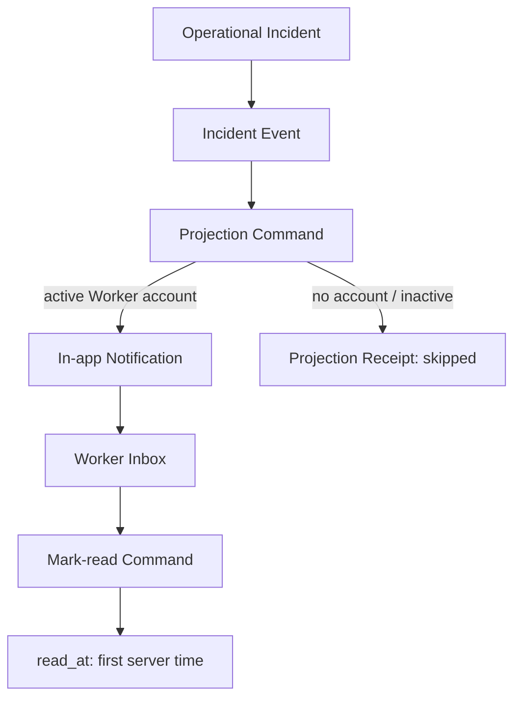
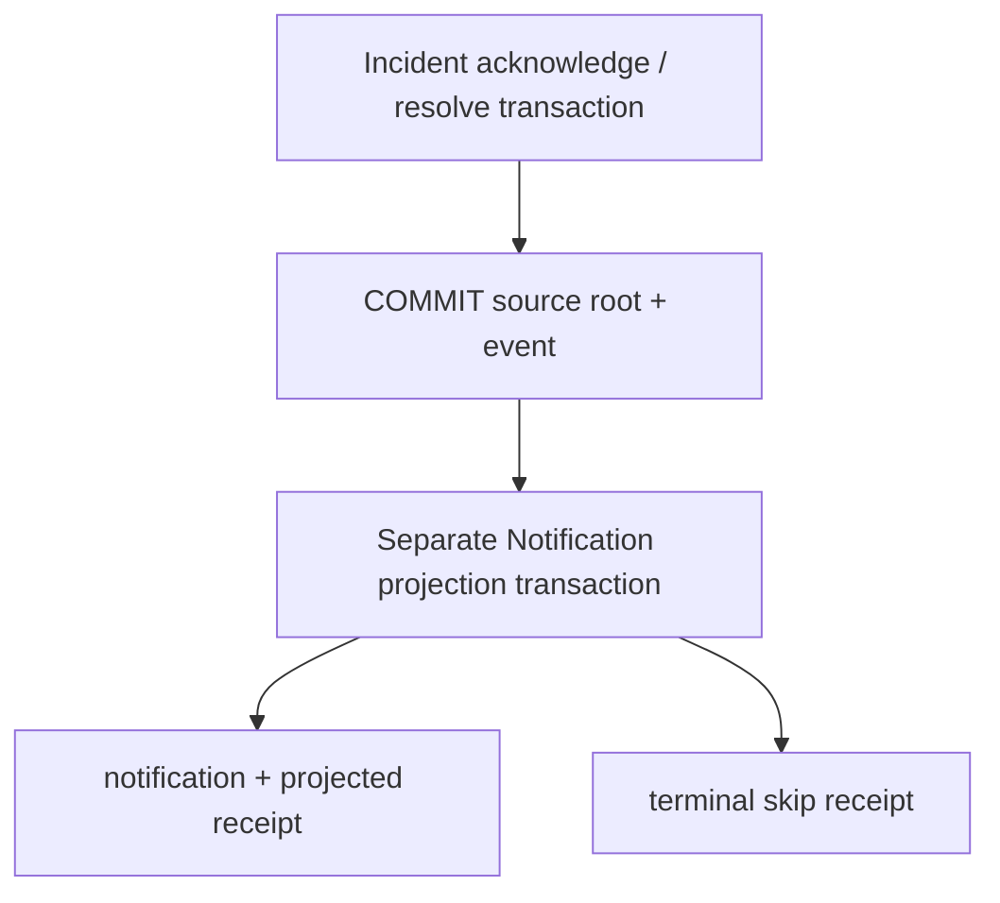

# Worker In-app Notification Domain Design v1

Status: **PROPOSED / IMPLEMENTATION READY**  
DB implementation: **Not implemented**

## 1. Executive Summary

First MVPは、Operational Incidentの`acknowledged` / `resolved` eventを、Assignment Workerのactive login accountへ知らせるrecipient-owned in-app Notificationである。Source SOTはIncident eventのまま維持し、Notification readはIncident stateを変更しない。

Logical aggregate名は **Worker In-app Notification Item**、物理table候補は`public.in_app_notifications`とする。sourceは`public.operational_incident_events.id`への明示FK、recipientは`public.profiles.id`。type、recipient、title、summary、sourceはprojection commandがserver-sideで導出し、client入力を受けない。

重複防止と「後日account連携後に古い通知を生成しない」を両立するため、`private.incident_notification_projection_receipts`を採用する。通知生成とterminal skip receiptは同一projection transactionで確定する。Incident transactionは先にcommitし、projection失敗でIncidentをrollbackしない。



DB-2.8Cを止めるBusiness / Domain Decisionは0。exact retention期間のみ非blocking openとする。

## 2. Source Baseline

- `operational_incidents`はAssignment-centric root。
- `operational_incident_events`は`created / acknowledged / resolved / retracted`のappend-only auditで、event UUIDを返す。
- acknowledge / resolve RPCはroot transitionとevent insertをatomicに行い、resultへ`event_id`を返す。
- Workerはown Incident rootを読めるがevent tableは読めない。Managerはown branch、System Adminはcross-branch eventを読める。
- `workers.auth_profile_id`はnullable unique FK → `profiles.id`。Worker stateは`active / inactive / suspended`、Profileは`is_active`と`account_type`を持つ。
- Worker source routeは`/worker/assignments/[assignmentId]`で、source authorizationを毎回再評価できる。
- 現行Notification / Announcement / Delivery schema、runtime、routeは存在しない。Figmaの通知・お知らせ・既読・Push・LINEはFuture visual hypothesisである。

## 3. Business Decisions Freeze

| ID | Decision |
| --- | --- |
| D01 | Notificationはsource Factの正本ではなくrecipient projection |
| D02 | Logical aggregateはWorker In-app Notification Item |
| D03 | Physical tableは`public.in_app_notifications` |
| D04 | Sourceは`operational_incident_events.id`への明示FK |
| D05 | 対象eventは`acknowledged`, `resolved`のみ |
| D06 | Recipientは`profiles.id`のactive Worker account |
| D07 | typeは`incident_acknowledged`, `incident_resolved`のみ |
| D08 | safe controlled title / summaryをsnapshot、Incident messageは保存しない |
| D09 | private projection receiptを採用 |
| D10 | accountなし／inactiveはterminal skip |
| D11 | 後日account link後のhistorical backfillなし |
| D12 | idempotent projection primitive + bounded reconciliation |
| D13 | readはfirst `read_at`だけのnarrow command |
| D14 | Manager / System AdminにNotification item read権限なし |
| D15 | recipient account ownershipをRLSの正本にする |
| D16 | recipient history index + unread partial index |
| D17 | exact retentionのみproduction前OPEN |

## 4. Terminology

- Notification Item: account recipientがin-appで読むimmutable presentation snapshot。
- Projection: immutable source eventからrecipient/type/contentを導出しitemまたはskip receiptを作る処理。
- Projection Receipt: source eventの投影結果を一度だけ固定するprivate internal record。delivery outboxではない。
- Read: recipientがitemを明示的に開いたFact。
- Replay: 同一source eventの再投影／既読commandが既存結果を返すこと。
- Reconciliation: receiptのないeligible source eventsをboundedに再投影するrepair処理。

## 5. Notification Item Boundary

Notification itemはrecipient、type、source event、safe title/summary、created time、first read timeだけを所有する。Incident state、category、message、actor、delivery status、priority、severity、archive、delete stateを所有しない。read以外はimmutable。

## 6. Source Event Boundary

- Table: `public.operational_incident_events`
- Identity: `id uuid`
- FK: `source_incident_event_id uuid not null references public.operational_incident_events(id) on delete restrict`
- Eligible: `acknowledged`, `resolved`
- Ineligible: `created`, `retracted`
- root Incident IDだけではevent種別を一意に表せないためsource keyにしない。
- event retentionはIncident audit policyに従う。Notification都合でeventをdelete/update/claimしない。

## 7. Recipient Model

- Identity: `recipient_profile_id = profiles.id`。
- Mapping: event → Incident → Assignment → Worker → `auth_profile_id` → Profile。
- Eligibility: `workers.status = 'active'`、linked Profileが存在、`profiles.is_active = true`、`profiles.account_type = 'worker'`。
- Missing account: `skipped_no_recipient` receipt。Incident成功維持。
- Worker inactive/suspended、Profile inactive、role不一致: `skipped_inactive_recipient` receipt。
- recipient / worker / branchはpayloadで受けない。
- receipt確定後のaccount再link、reactivation、role修正で過去通知を自動生成しない。
- First integrationはsource command成功直後に投影を試行し、その時点のeligibilityをterminalに記録する。receiptのないunexpected failureだけがreconciliation対象。

## 8. Notification Types

| Type | Source Event | Title | Summary |
| --- | --- | --- | --- |
| `incident_acknowledged` | `acknowledged` | Help Requestへの対応が開始されました | 管理者がHelp Requestを確認し、対応を開始しました。 |
| `incident_resolved` | `resolved` | Help Requestが解決されました | Help Requestが解決済みになりました。 |

任意`custom / message / alert / warning / system`は追加しない。

## 9. Safe Content Snapshot

- `title`: controlled text、1–120 chars。
- `summary`: controlled text、1–240 chars。
- DB-2.8C command内のtype mappingからのみ生成する。
- Incident message、category、health detail、Manager identity、phone、email、住所、lat/lng/GPSを含めない。
- rich HTML / arbitrary JSON / template variablesを保存しない。
- source contextが必要な場合はUI read modelでauthorized sourceから勤務日等をderiveする。

## 10. Source Navigation

- Canonical routeは`/worker/assignments/{assignment_id}`。
- route文字列は永続化せず、Notification → source event → Incident → AssignmentからUIが生成する。
- source contextはlist pageでrelation batch取得する。itemごとのN+1は禁止。
- sourceが削除・保持期限・権限変更で見えない場合もsafe title/summary/timeは表示し、CTAは「勤務詳細を開けません」と安全に扱う。
- notification ownershipだけでsourceへのアクセスを許可せず、Assignment/Incident RLSを再評価する。

## 11. Aggregate Data Model Candidate

### `public.in_app_notifications`

| Column | Candidate |
| --- | --- |
| `id` | uuid PK default `gen_random_uuid()` |
| `recipient_profile_id` | uuid NOT NULL FK `profiles(id)` ON DELETE CASCADE |
| `notification_type` | text NOT NULL check exact two types |
| `source_incident_event_id` | uuid NOT NULL FK event ON DELETE RESTRICT |
| `title` | text NOT NULL, trimmed, 1–120 |
| `summary` | text NOT NULL, trimmed, 1–240 |
| `read_at` | timestamptz NULL |
| `created_at` | timestamptz NOT NULL default `now()` |

Constraints:

- unique `(source_incident_event_id, recipient_profile_id)`
- type/event compatibilityはprojection commandで検証し、DB checkはtype集合と文字列normalizationを保証する。
- `read_at is null or read_at >= created_at`
- `updated_at`、delivery state、priority、severity、payload JSONは置かない。

## 12. Projection Receipt Decision

Receiptは**必要**。物理候補は`private.incident_notification_projection_receipts`。Data APIへ公開しない。

| Column | Candidate |
| --- | --- |
| `source_incident_event_id` | uuid PK/FK event ON DELETE RESTRICT |
| `outcome` | text: `projected / skipped_no_recipient / skipped_inactive_recipient` |
| `notification_id` | uuid NULL FK notification ON DELETE RESTRICT |
| `recipient_profile_id` | uuid NULL FK profiles ON DELETE SET NULL |
| `processed_at` | timestamptz NOT NULL default `now()` |

Integrity:

- `projected`はnotification/recipient必須。
- skipはnotificationなし。no-recipientはrecipient null、inactiveは判明したrecipientを保持可能。
- source event一件につきreceipt一件。
- transient/unexpected failure時はnotificationとreceiptを同一transactionでrollbackし、terminal skipを誤記録しない。
- receiptにretry count、claimed state、provider stateは置かない。これはoutboxではない。

## 13. Projection Command

Name candidate:

```text
public.project_incident_in_app_notification(
  p_source_incident_event_id uuid
) returns jsonb
```

- Caller: own-branch active Managerまたはactive System Admin。Worker/anon不可。
- Input: source event IDのみ。recipient、type、content、branch、Workerは受けない。
- Authorization: `auth.uid()`からactive Profile roleを確認し、Managerはsource Assignment branch accessを確認する。
- Derivation: event type、Incident、Assignment、Worker、Profileをlock/readしてtype/recipient/contentを生成する。
- Writes: eligible active recipientならnotification + `projected` receipt。非対象recipientならskip receipt。
- Result: `{ok:true,outcome,source_event_id,notification_id?,replayed}`。
- created/retracted: `{ok:false,code:'NOT_APPLICABLE'}`でwriteなし。
- existing receipt: stored outcomeを`replayed:true`で返す。
- conflicting existing notification/receipt: `PROJECTION_CONFLICT`。raw SQL errorはcontractにしない。

Stable error contract:

- `INVALID_INPUT`
- `NOT_FOUND`
- `FORBIDDEN`
- `NOT_APPLICABLE`
- `NO_ACTIVE_RECIPIENT`はsuccess terminal outcomeの補助code候補で、system failureではない
- `PROJECTION_CONFLICT`

## 14. Projection Idempotency

- Identity: source event UUID + derived recipient。
- Receipt PKはsource eventを一度だけterminal processingする。
- Notification uniqueはsource + recipientを二重防御する。
- sequential replayは既存receipt resultを返す。
- concurrent replayはinsert conflict後にreceiptを再読し同じresultへ収束する。
- client-generated idempotency keyは不要。source event ID自体がidempotency identity。
- observable notification itemはeffectively-once。workerへexactly-once deliveryを主張しない。

## 15. Source Transaction Boundary



- Incident transaction失敗時はprojectionしない。
- Incident transaction成功後、Server Actionはreturned `event_id`を使いprojectionを呼ぶ。
- Notification projection失敗でIncident state/eventをrollbackしない。
- response loss/replayは同じevent IDで安全に再実行する。

## 16. Reconciliation

- Purpose: unexpected errorやintegration interruptionでreceiptがないeligible eventを修復する。
- Eligible source: `acknowledged / resolved`かつfeature activation cursor以後、receiptなし。
- Missing detection: event left join private receipt where receipt is null。
- Bounds: 1 call最大100、created_at + id keyset cursor、古い順。
- Authorization: active System Adminのみ。Managerのcross-branch bulk repairは禁止。
- Candidate primitive: private/internal bounded DB functionをlocal/backend scriptから呼ぶ。public generic batch RPCは作らない。
- SchedulerはMVP必須でない。manual local/managed repair commandで開始可能。
- source eventへprocessed/claimed/retry columnsを追加しない。
- later-linked protection: immediate projectionでskip receiptを固定する。reconciliationはreceiptなしfailureのみ処理し、任意のhistorical backfill modeを持たない。

## 17. Account-link Historical Behavior

- feature導入前eventは自動backfillしない。
- event処理時にaccountがなければ`skipped_no_recipient`でterminal。
- inactive/suspendedなら`skipped_inactive_recipient`でterminal。
- 後日のlink/reactivationでreceiptを削除・再処理しない。
- support操作による個別backfill RPCはMVPに作らない。

## 18. Read / Unread Semantics

### Read Matrix

| Interaction | Mark Read |
| --- | --- |
| Inbox list shown | No |
| Row focused | No |
| Row visible | No |
| Hover | No |
| Item opened | Yes |
| Source CTA activated | Yes |

`read_at`はserverのfirst timestamp。readはIncident acknowledge/resolve、delivery success、source visit履歴ではない。mark unread、bulk read、delete、archiveなし。

## 19. Mark-read Command

```text
public.mark_in_app_notification_read(
  p_notification_id uuid
) returns jsonb
```

- Actor: authenticated active Worker profile。
- Authorization: row recipient must equal `auth.uid()`。foreign IDは存在を漏らさず`NOT_FOUND`。
- First read: `read_at = now()`を条件付き更新しtimestampを返す。
- Already read: stored first timestampを`replayed:true`で返す。
- Concurrent: `read_at is null` conditional update + rereadで同一timestampへ収束。
- version / expected version / idempotency keyは不要。
- Stable errors: `INVALID_INPUT`, `NOT_FOUND`、unexpected internal failure。raw SQL errorをUIへ返さない。

## 20. Authorization

| Actor | Read Own | Read Others | Project | Mark Read | Direct DML |
| --- | --- | --- | --- | --- | --- |
| Worker active | Yes | No | No | Own only | No |
| Manager own branch | No | No | Own branch source event | No | No |
| System Admin | No | No | Any eligible source event | No | No |
| anon | No | No | No | No | No |

System Adminにもrecipient notification内容のreadを既定許可しない。support/audit要件は別Phaseで明示設計する。

## 21. RLS / GRANT Strategy

- `in_app_notifications`はRLS enabled。
- SELECT policy: `recipient_profile_id = (select auth.uid())`かつactive Worker Profile。Worker ownのみ。
- table privilege: anonからall revoke、authenticatedからall revoke後にSELECTだけgrant。
- INSERT / UPDATE / DELETE policyなし。direct DML grantなし。
- receiptは`private` schema、authenticated/anonへUSAGE/SELECTなし。
- projection RPCとmark-read RPCはPUBLIC/anonからEXECUTE revoke、authenticatedへ必要なものだけgrant。
- 2026 Data API default変更に依存せず、table/functionのexposureとgrantをmigrationで明示する。

## 22. Concurrency

- Duplicate projection: receipt PKとnotification unique、lock/insert conflict rereadで一件。
- Mark-read tabs: first conditional updateのみtimestamp設定、全tab同じtimestamp。
- Source RPC replay:同じevent IDを返すため同じprojection result。
- Receiptとnotificationは同一transaction。片方だけcommitしない。
- 矛盾した既存rowはsilent repairせず`PROJECTION_CONFLICT`。

## 23. Privacy

### Privacy Matrix

| Data | Persist in Notification | UI derive from source | Notes |
| --- | --- | --- | --- |
| controlled title/summary | Yes | No | fixed safe copy |
| Incident message | No | detail route only | free text/health risk |
| Incident category | No | optional later | severity推測防止 |
| Assignment ID | indirect via event | Yes | route生成 |
| Worker/profile ID | recipient only | No | ownership |
| Manager actor | No | No | Worker通知に不要 |
| Contact / location | No | No | scope外 |

Database/server logsへnotification summary以上のsource free textを追加出力しない。エラー結果へforeign identifiersやraw snapshotを含めない。

## 24. Retention

- Item、read_at、receiptは同一retention familyとして扱う候補。
- exact期間はproduction rollout前に決定する。
- DB-2.8C local implementation blockerではない。
- receiptだけ先に消すとhistorical backfill防止が壊れるため、itemより短くしない。
- source event FKのRESTRICTと整合するdelete order/policyをproduction前に定義する。

## 25. Query / Index Contract

- Inbox: recipient own、`created_at DESC, id DESC`、keyset pagination、default 20、max 50。
- Unread count: same recipient + `read_at IS NULL`のexact count。全row fetchで数えない。
- Source context: page内source event/Incident/Assignment IDsをbatch relation read。N+1なし。
- Indexes:
  - `(recipient_profile_id, created_at DESC, id DESC)` history
  - partial `(recipient_profile_id, created_at DESC, id DESC) WHERE read_at IS NULL` unread
  - unique `(source_incident_event_id, recipient_profile_id)`
  - receipt PK `(source_incident_event_id)`

## 26. UI-2.8D Integration Contract

- Worker inbox routeとWorker shellの通知入口を設計する。
- Itemはtype label、safe title/summary、created time、unread text/indicator、source CTAを表示。
- list render/focus/visibilityではreadにしない。item openまたはCTA actionがmark-readを呼ぶ。
- unread badgeはserver count。optimistic zeroingでsource stateを変更しない。
- source contextはbounded batch。source inaccessibleはsafe state表示。
- navigation refreshで成立させ、Realtime/pollingなし。

## 27. INT-2.8E Integration Contract

- Admin acknowledge/resolve RPC resultの`event_id`をServer Actionが受け取る。
- source success後にprojection commandを別transactionで呼ぶ。
- Incident success responseをprojection failureでfailureへ書き換えない。内部observabilityとreconciliation対象にする。
- retryは同一event IDで安全。
- E2E: Admin ack → Worker unread item → open/read → Incident unchanged、Admin resolve → second unread item → read、duplicate 0。

## 28. External Delivery Boundary

Push、Email、SMS、LINE、provider delivery attempt、callback、retry、credential、outboxは対象外。将来external deliveryを追加する場合もin-app itemの`read_at`へsent/delivered/failedを混ぜない。

## 29. Announcement Boundary

Announcementはtitle/body/target/publish lifecycleを所有する別source aggregate。Notification item schemaを今からpolymorphic化せず、DOMAIN-2.9Aでsource mapping/generalizationを再設計する。

## 30. Failure Modes

### Projection Result Matrix

| Source | Recipient | Existing Projection | Result |
| --- | --- | --- | --- |
| acknowledged | active | none | projected + item + receipt |
| resolved | active | none | projected + item + receipt |
| acknowledged/resolved | active | existing receipt | replay、write 0 |
| acknowledged/resolved | no account | none | skipped_no_recipient receipt |
| acknowledged/resolved | inactive | none | skipped_inactive_recipient receipt |
| created/retracted | active | none | NOT_APPLICABLE、write 0 |
| eligible foreign Manager | any | none | FORBIDDEN、write 0 |

### Failure Matrix

| Scenario | Expected |
| --- | --- |
| duplicate projection | existing terminal resultを返す |
| concurrent projection | notification/receipt各一件へ収束 |
| recipient missing | terminal skip、Incident成功維持 |
| recipient inactive | terminal skip、Incident成功維持 |
| later account link | receiptを尊重しbackfillなし |
| projection DB failure | projection transaction rollback、reconciliation対象 |
| receipt failure | notificationもrollback |
| source inaccessible | item表示、CTA safe unavailable |
| concurrent read | first timestampへ収束 |
| foreign read | zero rows / safe not found |
| privacy-sensitive Incident | message/category/actorをコピーしない |

## 31. DB-2.8C Test Matrix

- Schema: columns、checks、FK actions、RLS enabled、no generic payload/state。
- Projection: ack/resolved mapping、controlled copy、event compatibility。
- Recipient: active Worker、missing link、inactive/suspended Worker、inactive/non-worker Profile。
- Duplicate: sequential replay、same event concurrent、unique enforcement。
- Receipt: projected/skip integrity、terminal replay、notificationとのatomicity、later-link protection。
- Read RLS: own Worker only、foreign Worker/Manager/System Admin/anon denied。
- Mark read: first read、replay、concurrent tabs、foreign ID nondisclosure。
- Direct DML: authenticated/anon INSERT/UPDATE/DELETE denied。
- Projection auth: own-branch Manager success、foreign Manager denied、System Admin success、Worker/anon denied。
- Reconciliation: bounds/cursor、eligible only、receipt exclusion、source mutation 0。
- Privacy: Incident message/category/actor/request snapshot/contact/location absent。
- Regression: Operational Incident 47/47、Worker Help Request 18/18、Admin UI/Day-of unchanged。

## 32. Explicit Exclusions

- Admin Incident-created notification
- Announcement / broadcast
- Push / Email / SMS / LINE
- Supabase Realtime / browser notification
- provider outbox / delivery attempt
- preference center
- mark unread / bulk read
- delete / archive
- severity / priority / SLA / escalation
- arbitrary JSON / rich HTML / Incident message copy

## 33. Remaining Open Decisions

| Question | Blocking DB-2.8C | Recommendation |
| --- | --- | --- |
| Exact item/read/receipt retention期間 | No | production rollout前にprivacy/operationsで決定 |

Blocking decisions: **0**。

## 34. Proposed Next Phases

1. **DB-2.8C**: `in_app_notifications`、private receipt、projection/mark-read commands、RLS/GRANT、bounded reconciliation、local-only security/concurrency tests。
2. **UI-2.8D**: Worker Inbox、unread badge、item open/read、source navigation。
3. **INT-2.8E**: Incident acknowledge/resolve後projection integration、failure/replay E2E Freeze。
4. **DOMAIN-2.9A**: Announcement aggregateを独立設計。

DOMAIN-2.8B: COMPLETE WITH NON-BLOCKING RETENTION DECISION
